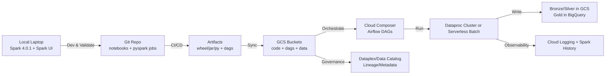
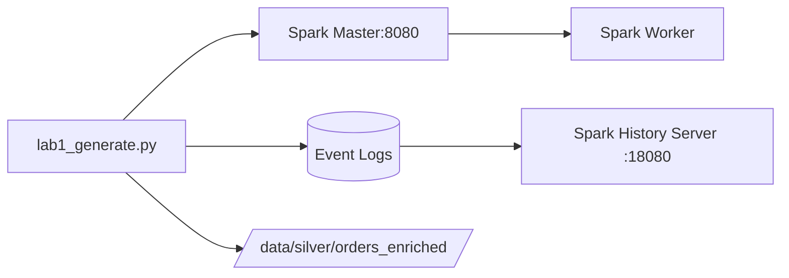

# LAB: SETUP PLAN

Hướng dẫn chuẩn bị môi trường thực hiện spark trên local theo hướng:
- linh động codespace, colab, local
- có thể xem spark UI

---

## 0) Sơ đồ tổng thể lộ trình (local → cloud)



---

## 1) Setup môi trường Spark 4.0.1 trên local (để xem Spark UI)

Đề xuất 2 cách. Cách A (Docker) thường “nhanh gọn – ít lỗi” nhất. Cách B (cài native) phù hợp nếu bạn muốn Spark “thuần máy”.

### Cách A — Docker (khuyến nghị để học + lab)

#### B1. Cài Docker Desktop (macOS/Windows).

#### B2. Tạo docker-compose.yml (Spark master + worker + history server)
- Bạn sẽ chạy Spark local theo chế độ standalone cluster nhỏ, có UI:
-		Spark Master UI: http://localhost:8080
- Spark App UI (khi chạy job): thường http://localhost:4040
- 	Spark History UI: http://localhost:18080

#### B3. Run
- docker compose up -d
- 	Mở UI, đảm bảo Spark Master/Worker “alive”.

#### B4. Dev code
-	Dùng VS Code local + Python venv.
-	Kết nối spark://localhost:7077 (master) hoặc chạy local[*] tùy lab.

---

### Cách B — Cài native (nếu bạn muốn chạy “thuần máy”)

#### B1. Java
- Spark 4.x thường chạy tốt với Java mới (tuỳ build), nhưng để “ổn định cho học” bạn có thể dùng Java LTS.
- 	Cài Java + set JAVA_HOME.

#### B2. Cài Spark 4.0.1
- Download Spark 4.0.1 prebuilt (Hadoop3).
-	Set env:
*	SPARK_HOME
*		PATH=$SPARK_HOME/bin:$PATH

#### B3. PySpark
-	Dùng pip install pyspark==4.0.1 (hoặc đúng version bạn đang luyện).
-	Chạy thử:
*	pyspark
*	hoặc notebook + SparkSession.builder.getOrCreate().

#### B4. Spark UI
-	Khi chạy job: mở http://localhost:4040.

---

## 2) Bộ LAB theo hướng 1 (local-first, có Spark UI)

#### Mỗi lab mình sẽ trình bày đúng format bạn yêu cầu:
1.	Tạo data mẫu
2.	Xử lý
3.	Giải thích
4.	Code demo
5.	Có/không dùng numpy/pandas (dùng khi “đúng chỗ”)
6.	Công cụ, lib thực tế

### Lab 1–6 (nhẹ, nắm nền)
- Lab 1: DataFrame fundamentals + lazy evaluation + explain
-	Lab 2: Partitioning 101 + repartition/coalesce + tác động lên UI
-	Lab 3: Shuffle cơ bản (groupBy, join) + đọc Exchange
-	Lab 4: Join strategies (broadcast vs sort-merge) + when/why
-	Lab 5: Skew fundamentals + detect skew trong UI
-	Lab 6: Cache/persist đúng cách + spill to disk + memory model

### Lab 7–10 (vừa, “bank-like” hơn)
-	Lab 7: Bronze→Silver chuẩn hoá schema + quality checks
-		Lab 8: Silver→Gold aggregation + window functions + incremental
- Lab 9: Idempotent output + atomic commit pattern (write temp → promote)
-	Lab 10: Observability: log + metrics + explain plan snapshot

Các lab này chạy local, và bạn luôn xem Spark UI để hiểu “vì sao”.

---

## 3) Sau lab nhẹ → lab nặng “data thật” (local → GCP, có masking/token + governance)

### Data thật (gợi ý 3 lựa chọn, bạn chọn 1)
1.	NYC TLC Trip Record Data (rất lớn, chuẩn big data)
-	Có nguồn chính thức TLC.  
-	Có cả registry/open data (dễ lấy đường dẫn bucket/object).  
> **Bài toán bank-like:** tạo “travel spending profile”, fraud-ish rules, daily aggregates, late arriving data.

2.	Olist e-commerce (vừa, dễ làm end-to-end)
-	Có repo tổng hợp dataset (thường trỏ về Kaggle).  

> **Bài toán bank-like:** khách hàng/đơn hàng/hoàn tiền, cohort, RFM, merchant performance.

3.	Fraud dataset (IEEE-CIS Fraud Detection)
-	Thường dùng để mô phỏng fraud scoring pipeline.  

> **Bài toán bank-like:** feature engineering, drift checks, lineage.

### Masking/Tokenization “đảm bảo policy”
- Local (on-prem)
-	Mask PII: email/phone/name/address.
-	Tokenization theo deterministic hash (HMAC) để join cross-table vẫn được mà không lộ raw PII.
-	Cloud (GCP)
-	Lưu mapping trong vault/secret manager (tuỳ mức bài).
-	**Trên BigQuery:** dùng view/row-level masking nếu cần (phase sau).

### Governance/Provenance từng bước
1.	**Giai đoạn đầu:**
-	Metadata chuẩn hoá: schema, owner, SLA, tags (PII).
2.	**Giai đoạn lên cloud:**
-	Đưa vào Dataplex / Data Catalog cho quản trị dữ liệu & metadata.  

---

## 4) “Linh hoạt công cụ” (local / codespace / colab)
-	**Local:** lab chính, vì có Spark UI + debug nhanh.
-	**Colab:** chỉ dùng khi cần notebook test nhanh / demo nhỏ (không phụ thuộc UI).
-	**Codespace:** dùng khi cần git workflow tiện, nhưng bạn đang bị quota giới hạn → mình ưu tiên local + colab trước.

---

# SETUP GUIDE

---

## LAB #1 — Local Spark “chuẩn nghề” + Spark UI + tạo data mẫu + explain

### AIM
-	Chạy Spark local mà xem được Spark UI
-		Biết cách bật event log để xem lại trên History Server
- Tạo data mẫu (customers/orders) đúng kiểu, tránh lỗi type như bạn gặp
-	**Làm 1 pipeline mini:** `generate → transform → explain → write parquet`

---

## 1) Setup môi trường local (khuyến nghị nhanh + ít đau đầu)

### Bạn chọn 1 trong 2 cách:

**Cách A (khuyến nghị):** Docker Compose (ổn định, giống production)

**Ưu:** không lệ thuộc Java/Python local; có sẵn Spark UI + History Server

**Nhược:** cần cài Docker Desktop

#### B1 — tạo folder

```bash
mkdir -p spark-lab/{data,warehouse,logs,notebooks}
cd spark-lab
```

#### B2 — tạo file docker-compose.yml

```yaml
services:
  spark-master:
    image: bitnami/spark:latest
    environment:
      - SPARK_MODE=master
      - SPARK_MASTER_WEBUI_PORT=8080
    ports:
      - "8080:8080"
      - "7077:7077"
    volumes:
      - ./data:/data
      - ./warehouse:/warehouse
      - ./logs:/logs

  spark-worker:
    image: bitnami/spark:latest
    depends_on: [spark-master]
    environment:
      - SPARK_MODE=worker
      - SPARK_MASTER_URL=spark://spark-master:7077
    ports:
      - "8081:8081"
    volumes:
      - ./data:/data
      - ./warehouse:/warehouse
      - ./logs:/logs

  spark-history:
    image: bitnami/spark:latest
    command: >
      bash -lc "
      mkdir -p /tmp/spark-events &&
      /opt/bitnami/spark/sbin/start-history-server.sh &&
      tail -f /opt/bitnami/spark/logs/*"
    environment:
      - SPARK_HISTORY_OPTS=-Dspark.history.fs.logDirectory=/logs/spark-events -Dspark.history.ui.port=18080
    ports:
      - "18080:18080"
    volumes:
      - ./logs:/logs
```

#### B3 — chạy

```bash
docker compose up -d
```

#### B4 — mở UI
-	Spark Master UI: http://localhost:8080
-	Spark History UI: http://localhost:18080

> History Server dùng event log của Spark. Spark support event logging và History Server theo docs chính thức.

---

## Cách B: Cài native (nếu bạn muốn “thuần local”)

---

## 2) Tạo notebook / script chạy Spark (local)

**Option chạy nhanh:** dùng spark-submit trong container

Tạo file `lab1_generate.py` trong folder `spark-lab/`:

```python
from pyspark.sql import SparkSession, functions as F

spark = (
    SparkSession.builder
    .appName("lab1-generate")
    # event log để History Server đọc
    .config("spark.eventLog.enabled", "true")
    .config("spark.eventLog.dir", "/logs/spark-events")
    .config("spark.sql.warehouse.dir", "/warehouse")
    .getOrCreate()
)

spark.sparkContext.setLogLevel("WARN")

# -----------------------
# 1) customers (50k)
# -----------------------
n_customers = 50_000
segments = ["MASS", "AFFLUENT", "SME"]
risk = ["LOW", "MED", "HIGH"]

seg_arr = F.array(*[F.lit(x) for x in segments])
risk_arr = F.array(*[F.lit(x) for x in risk])

# element_at cần index kiểu INT (Spark báo lỗi BIGINT như bạn gặp)
seg_idx = (F.pmod(F.col("id"), F.lit(len(segments))) + F.lit(1)).cast("int")
risk_idx = (F.pmod(F.col("id"), F.lit(len(risk))) + F.lit(1)).cast("int")

customers = (
    spark.range(0, n_customers)
    .select(
        (F.col("id") + 1).cast("string").alias("customer_id"),
        F.element_at(seg_arr, seg_idx).alias("segment"),
        F.element_at(risk_arr, risk_idx).alias("risk_tier"),
        (F.current_date() - F.expr("INTERVAL 1 DAYS") - F.pmod(F.col("id"), F.lit(365)).cast("int")).alias("created_date"),
    )
)

# -----------------------
# 2) orders (2M) + skew hot key
# -----------------------
n_orders = 2_000_000
channels = ["POS", "ECOM", "ATM"]
countries = ["VN", "SG", "TH", "ID", "MY"]
statuses = ["SUCCESS", "FAILED", "REVERSED"]

HOT_CUSTOMER = "1"
HOT_RATIO = 0.25

ch_arr = F.array(*[F.lit(x) for x in channels])
cty_arr = F.array(*[F.lit(x) for x in countries])
st_arr = F.array(*[F.lit(x) for x in statuses])

ch_idx = (F.pmod(F.col("id"), F.lit(len(channels))) + F.lit(1)).cast("int")
cty_idx = (F.pmod(F.col("id"), F.lit(len(countries))) + F.lit(1)).cast("int")
st_idx = (F.pmod(F.col("id"), F.lit(len(statuses))) + F.lit(1)).cast("int")

orders = (
    spark.range(0, n_orders)
    .select(
        (F.col("id") + 1).cast("string").alias("order_id"),
        F.when(F.rand(seed=7) < F.lit(HOT_RATIO), F.lit(HOT_CUSTOMER))
         .otherwise((F.pmod(F.col("id") * 17, F.lit(n_customers - 1)) + 2).cast("string"))
         .alias("customer_id"),
        (F.rand(seed=11) * 5000).cast("double").alias("amount"),
        (F.current_timestamp() - (F.pmod(F.col("id"), F.lit(30)).cast("int") * F.expr("INTERVAL 1 DAYS"))).alias("order_ts"),
        F.element_at(ch_arr, ch_idx).alias("channel"),
        F.element_at(cty_arr, cty_idx).alias("country"),
        F.element_at(st_arr, st_idx).alias("status"),
    )
)

customers.cache()
orders.cache()

print("customers =", customers.count())
print("orders    =", orders.count())

customers.show(5, truncate=False)
orders.show(5, truncate=False)

# -----------------------
# 3) mini pipeline
# -----------------------
# NOTE: cố tình tạo 1 join có skew để lab sau xử lý
silver = (
    orders.join(customers, "customer_id", "left")
    .withColumn("amount_bucket", F.when(F.col("amount") < 1000, "LOW")
                              .when(F.col("amount") < 3000, "MID")
                              .otherwise("HIGH"))
)

print("\n=== EXPLAIN (formatted) ===")
silver.explain("formatted")

# write parquet
silver.write.mode("overwrite").parquet("/data/silver/orders_enriched")
print("Wrote: /data/silver/orders_enriched")

spark.stop()
```

#### Chạy job

```bash
docker compose exec spark-master spark-submit /data/../lab1_generate.py
```
Nếu bạn đặt file ở `spark-lab/lab1_generate.py`, thì mount chưa có. *Cách nhanh:* copy file vào container hoặc mount thêm volume.

**Cách dễ nhất:** sửa compose để mount `./:/work` rồi chạy `spark-submit /work/lab1_generate.py`.


## 3) Bạn sẽ quan sát gì trên Spark UI (LAB #1)

**Sau khi chạy:**

1.	Mở http://localhost:8080 → tab Applications → click app lab1-generate
2.	Vào SQL / DAG Visualization / Stages
3.	Bạn sẽ thấy:
-	`count()` tạo jobs
-	`join()` có khả năng tạo Exchange/shuffle
-	`Event log` được ghi → `http://localhost:18080` sẽ xem lại app sau khi job kết thúc

---

## 4) Mermaid sơ đồ lab (để bạn đưa vào doc)



---

## 5) “Thực tế có áp dụng numpy/pandas không?”

**Có, nhưng đúng chỗ:**
-	**Pandas/Numpy:** dùng cho EDA nhỏ, sampling, kiểm tra quality nhanh, feature engineering nhẹ trong notebook.
-	**Spark:** dùng cho dataset lớn, join/agg nặng, pipeline batch/streaming.

Trong LAB #1 này mình chủ động chưa dùng pandas/numpy để bạn nắm Spark core trước. Sang LAB #2 mình sẽ thêm “sampling sang pandas” một cách đúng chuẩn (không làm chết RAM).

---

## 6) Data thật cho chặng #2 (E2E)

Bạn chọn NYC TLC là đúng: có data rất lớn, nhiều file theo tháng. Trang chính thức của TLC cung cấp trip record data và hướng dẫn/structure.

---

Lộ trình lab (đúng theo note “nhẹ → nặng”)

### Nhẹ (local-first)
-	**LAB #1** (xong ở trên): setup + UI + generate + explain + parquet
-	**LAB #2:** partitions & shuffle căn bản (groupBy, explain, spark.sql.shuffle.partitions)
-	**LAB #3:** join strategies (broadcast / sort-merge) + đọc plan “như architect”
-	**LAB #4:** skew thật (HOT key) + AQE + salting
- **LAB #5:** incremental + idempotent output (bank-grade)
-	**LAB #6:** quality checks + logging + metrics (chuẩn production)

### Nặng (data thật + E2E on-prem → GCP)
-	Download NYC TLC → mask/token (mô phỏng SBV policy) → upload GCS → Dataproc/BigQuery → lineage/governance (Dataplex)  

