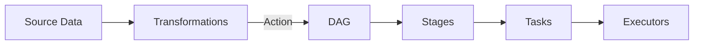
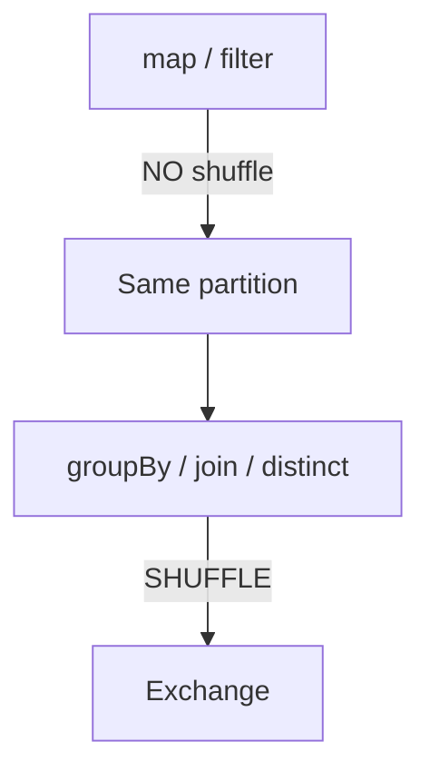
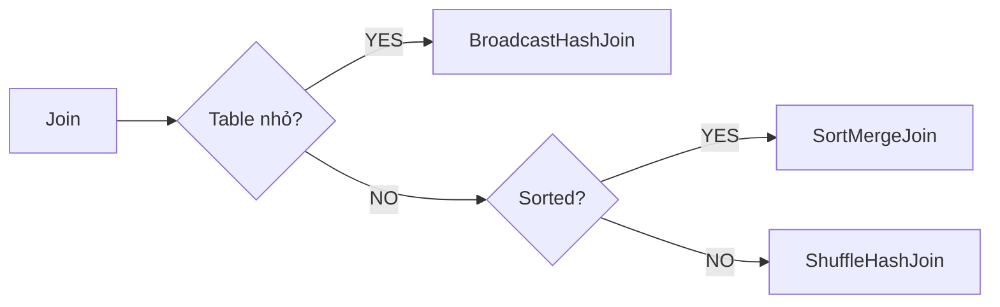
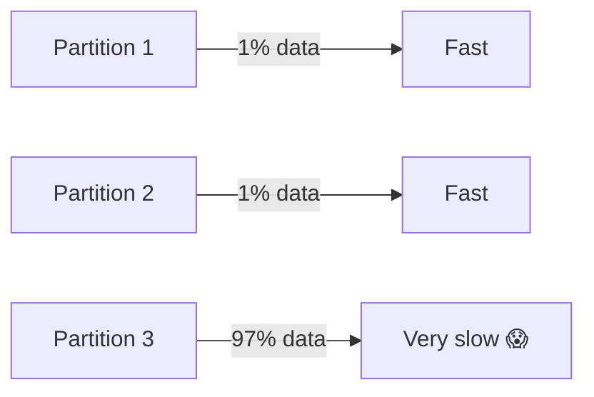
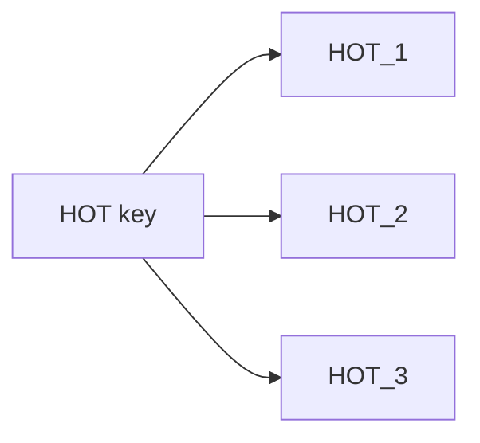
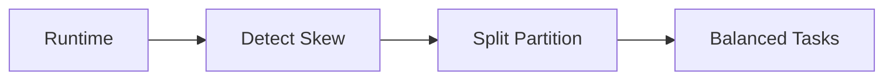

# 🧠 RECAP KIẾN TRÚC – SPARK LAB 4 → 5 → 6

(Shuffle – Join – Skew)

---

## 🧩 1️⃣ Big Picture: Spark thực sự chạy như thế nào?

📌 Mọi thứ chỉ xảy ra khi có ACTION

📌 Performance chết ở Stage boundary (shuffle)

---

## 🔀 2️⃣ LAB 4 – SHUFFLE (KẺ GIẾT SPARK)

Khi nào shuffle xảy ra?

**Vì sao shuffle nguy hiểm?**

-	Disk I/O
-	Network transfer
-	Memory pressure
-	Stage mới → block pipeline

> 📌 Mỗi Exchange = rủi ro

---

## 🔗 3️⃣ LAB 5 – JOIN STRATEGIES

Các chiến lược join

**Thứ tự ưu tiên (Spark):**

1.	BroadcastHashJoin ⭐
2.	SortMergeJoin
3.	ShuffleHashJoin ❌

> 📌 Join sai = cost + runtime + OOM

---

## 💥 4️⃣ LAB 6 – DATA SKEW (KẺ THÙ THẦM LẶNG)

Skew trông như thế nào?

> 📌 1 task chậm → cả stage đứng hình

---

## 🧂 5️⃣ SALTING vs AQE

### Salting (manual)

**✔ Chia tải**
❌ Code phức tạp

❌ Khó maintain

---

### AQE (Adaptive Query Execution)

✔ Tự động

✔ Clean code

✔ Bank thích 😄

❌ Không cứu được design sai nặng

---

## 🏦 6️⃣ BANK-GRADE RULES (CỰC QUAN TRỌNG)

### ❌ KHÔNG LÀM
-	Join nhiều bảng lớn ở Gold
-	Retry vô hạn
-	Broadcast table skew
-	Tin config cứu design

### ✅ PHẢI LÀM
-	Explain plan trước khi chạy
-	Detect skew sớm
-	AQE bật mặc định
-	Job < SLA / 2
-	Idempotent output

---

## 🧠 7️⃣ TƯ DUY KIẾN TRÚC SƯ (ĐINH NÃO)

Spark chậm không phải vì cluster yếu
→ Mà vì data shape & execution plan sai

---

## 🔜 BƯỚC TIẾP THEO – LAB 7 (THỰC CHIẾN TỔNG HỢP)

LAB 7 sẽ làm gì?

✔ Orders lớn (skew)

✔ Customers nhỏ

✔ Join đúng chiến lược

✔ AQE bật

✔ Explain & reasoning như production

✔ Phân tích “nếu job này chạy ở bank thì ổn chưa?”

