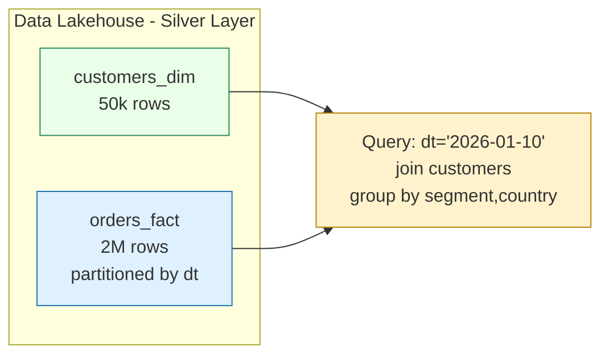
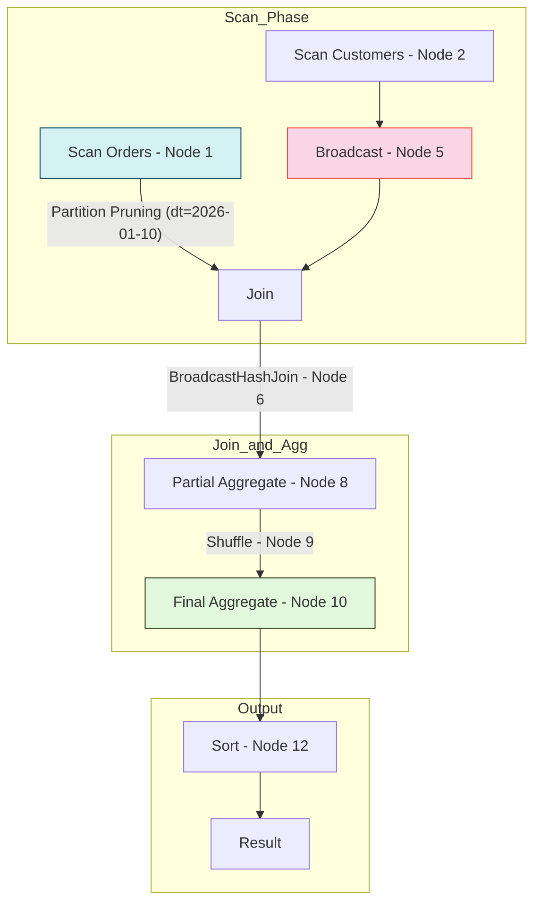
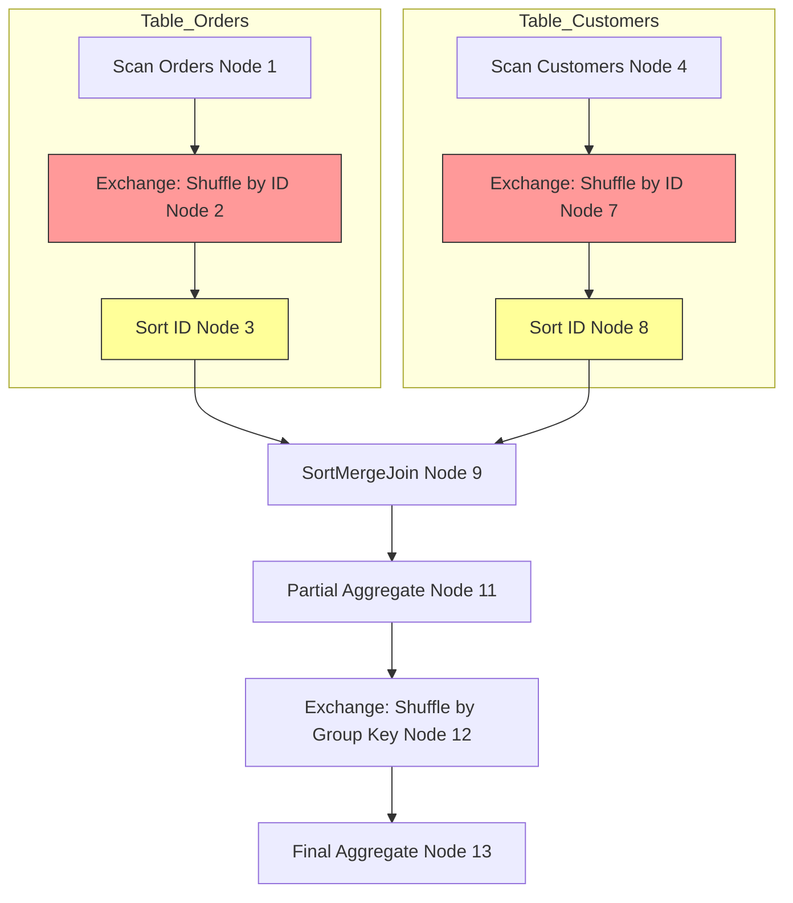
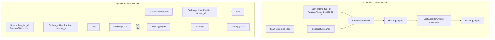
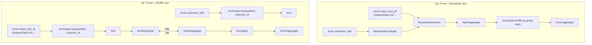

C
# LAB 3.1: Partitioned Fact Join + Pruning + Join Strategy

Lab này tập trung vào các kỹ thuật tối ưu hóa hiệu năng Spark trong môi trường thực tế (Data Lakehouse/Warehouse), bao gồm:

* **Partition Pruning**: Giảm IO bằng cách chỉ đọc dữ liệu cần thiết.
* **Join Strategies**: So sánh Broadcast Join và Shuffle Join.
* **AQE (Adaptive Query Execution)**: Tự động tối ưu hóa trong lúc thực thi.

## 1. Kiến trúc dữ liệu (Silver Layer)

Mô hình dữ liệu giả lập tình huống thực tế với bảng Fact lớn và bảng Dimension nhỏ.



**Ý tưởng thực tế:**
-	orders_fact là bảng lớn (fact)
-	customers_dim là bảng nhỏ (dimension)
-	Query phổ biến nhất: lọc theo ngày (dt) rồi join dim để ra báo cáo.

---

## 2. Giai đoạn A: Chuẩn bị dữ liệu (Data Preparation)

File này tạo ra dữ liệu mẫu có tính chất **Skew** (lệch dữ liệu) và được **Partition** theo ngày (`dt`).

### Mã nguồn: `lab3_1_prepare_fact_partitioned.py`

```python
from __future__ import annotations
from pyspark.sql import SparkSession
from pyspark.sql.functions import (
    col, rand, expr, element_at, pmod, date_sub, to_date
)

# Cấu hình đường dẫn lưu trữ
BASE = "data/silver_lab31"
CUSTOMERS_PATH = f"{BASE}/customers"
ORDERS_RAW_PATH = f"{BASE}/orders_raw"
ORDERS_FACT_PATH = f"{BASE}/orders_fact_dt"

N_CUSTOMERS = 50_000
N_ORDERS = 2_000_000

def build_spark(app: str) -> SparkSession:
    """Khởi tạo SparkSession với cấu hình tối ưu local."""
    return (
        SparkSession.builder
        .appName(app)
        .config("spark.sql.shuffle.partitions", "50") # Giảm partition để chạy nhanh trên máy cá nhân
        .config("spark.sql.adaptive.enabled", "true") # Bật AQE
        .getOrCreate()
    )

def main() -> None:
    spark = build_spark("lab3_1_prepare_fact_partitioned")

    # 1) Tạo bảng CUSTOMERS DIM (50k dòng)
    customers = (
        spark.range(0, N_CUSTOMERS)
        .select(
            (col("id") + 1).cast("string").alias("customer_id"),
            # pmod(id, 3) + 1: Tạo index 1, 2, 3 để lấy giá trị từ mảng
            element_at(expr("array('MASS','AFFLUENT','SME')"), 
                       (pmod(col("id"), 3) + 1).cast("int")).alias("segment"),
            element_at(expr("array('LOW','MED','HIGH')"), 
                       (pmod(col("id"), 3) + 1).cast("int")).alias("risk_tier"),
            date_sub(expr("date('2026-01-11')"), pmod(col("id"), 365).cast("int")).alias("created_date"),
        )
    )
    customers.write.mode("overwrite").parquet(CUSTOMERS_PATH)

    # 2) Tạo bảng ORDERS RAW (2M dòng) - Có gây SKEW
    orders = (
        spark.range(0, N_ORDERS)
        .select(
            (col("id") + 1).cast("string").alias("order_id"),
            # Kỹ thuật gây Skew: 25% dữ liệu sẽ có customer_id = '1'
            expr("CASE WHEN rand(7) < 0.25 THEN '1' ELSE cast(pmod(id * 17, 49999) + 2 as string) END").alias("customer_id"),
            (rand(11) * 5000).alias("amount"),
            expr("timestamp('2026-01-12 10:23:17')").alias("base_ts"),
            (pmod(col("id"), 30).cast("int")).alias("day_back"),
            element_at(expr("array('VN','SG','TH','ID','MY')"), 
                       (pmod(col('id'), 5) + 1).cast("int")).alias("country")
        )
        # Tính toán thời gian thực tế: base_ts - số ngày lùi lại
        .withColumn("order_ts", expr("base_ts - make_interval(0,0,0,day_back,0,0,0)"))
        .withColumn("dt", to_date(col("order_ts")))
        .drop("base_ts", "day_back")
    )

    # 3) Ghi dữ liệu theo PARTITION dt
    # Đây là bước quan quan trọng nhất để tối ưu Query Performance
    (orders.write.mode("overwrite").partitionBy("dt").parquet(ORDERS_FACT_PATH))
    
    spark.stop()

if __name__ == "__main__":
    main()

```

### Giải thích kỹ thuật:

#### Python kỹ thuật đang dùng
-	BASE, *_PATH: hằng số để tránh hardcode path trong nhiều file
-	build_spark(): tách hàm tạo SparkSession → dễ tái dùng ở nhiều lab
-	main() + if __name__ == "__main__"::
>-	chuẩn Python script
>-	chạy được từ terminal, không phụ thuộc notebook

#### Spark kỹ thuật cốt lõi
-	partitionBy("dt"): tạo layout dạng
-	.../orders_fact_dt/dt=2026-01-10/*.parquet
-	Skew có chủ đích: customer_id='1' chiếm ~25%

---
#### Các kỹ thuật quan trọng:


* **`pmod(col("id"), n)`**: Hàm lấy dư (modulo) giúp phân phối dữ liệu đều vào các nhóm (Ví dụ: tạo ra các phân khúc khách hàng luân phiên).
* **`partitionBy("dt")`**: Spark sẽ tạo thư mục riêng cho mỗi ngày (e.g., `dt=2026-01-10/`). Khi truy vấn lọc theo ngày này, Spark chỉ quét đúng thư mục đó thay vì toàn bộ 2 triệu dòng.
* **Skew**: Việc gán cố định 25% records cho `customer_id='1'` sẽ giúp chúng ta thấy được vấn đề "nút thắt cổ chai" khi thực hiện Shuffle Join ở các bài sau.

---

## 3. Giai đoạn B: Query 1 — Broadcast Join (Mặc định tối ưu)

### Mã nguồn: `lab3_1_q1_prune_broadcast.py`

```python
# ... (Phần import và spark config giữ nguyên)

def main() -> None:
    s = spark("lab3_1_q1_prune_broadcast")
    orders = s.read.parquet(FACT).alias("o")
    customers = s.read.parquet(DIM).alias("c")

    target_dt = "2026-01-10"

    q = (
        orders
        .where(col("dt") == target_dt)  # ✅ PARTITION PRUNING
        .join(customers, col("o.customer_id") == col("c.customer_id"), "left")
        .groupBy("dt", "country", "c.segment")
        .agg(_count("*").alias("txns"), _sum("amount").alias("total_amount"))
    )

    q.explain("formatted") # Xem kế hoạch thực thi
    q.show()

```

### Giải thích chi tiết từ Python đến Spark:

1. **`where(col("dt") == target_dt)`**:
* **Python**: Lệnh lọc dữ liệu thông thường.
* **Spark Engine**: Kích hoạt **Partition Pruning**. Spark nhìn vào cấu trúc thư mục trên ổ đĩa và chỉ nạp dữ liệu từ folder `dt=2026-01-10`.


2. **`join(customers, ...)`**:
* **Spark Engine**: Vì bảng `customers` nhỏ (50k dòng ~ vài MB), Spark tự động dùng **BroadcastHashJoin**. Nó copy toàn bộ bảng nhỏ sang RAM của tất cả các Worker.
* **Lợi ích**: Không phát sinh Shuffle cho bảng lớn, tốc độ cực nhanh.

### Giải thích từng dòng trọng điểm

#### orders.where(col("dt") == target_dt)
-	Vì dt là partition column, Spark sẽ tạo:
-	PartitionFilters: (dt = 2026-01-10)
-	Kết quả: đọc ít file hơn → giảm IO cực mạnh

#### .join(customers, ...)
-	customers 50k rows thường nhỏ → Spark sẽ chọn BroadcastHashJoin
-	Bạn sẽ thấy trong explain:
-	BroadcastExchange
-	BroadcastHashJoin ... BuildRight

#### .groupBy(...).agg(...)
-	Aggregate thường tạo Exchange (shuffle) để gom key về đúng partition
	Exchange này là “shuffle cần thiết” (khác với IO pruning)

### Kết qủa của Query 1:

```code
== Physical Plan ==                                                             
AdaptiveSparkPlan (13)
+- Sort (12)
   +- Exchange (11)
      +- HashAggregate (10)
         +- Exchange (9)
            +- HashAggregate (8)
               +- Project (7)
                  +- BroadcastHashJoin LeftOuter BuildRight (6)
                     :- Scan parquet  (1)
                     +- BroadcastExchange (5)
                        +- Project (4)
                           +- Filter (3)
                              +- Scan parquet  (2)


(1) Scan parquet 
Output [4]: [customer_id#1, amount#2, country#4, dt#7]
Batched: true
Location: InMemoryFileIndex [file:/Users/nptan2005/SourceCode/Python/spark401_colab/data/silver_lab31/orders_fact_dt]
PartitionFilters: [isnotnull(dt#7), (dt#7 = 2026-01-10)]
ReadSchema: struct<customer_id:string,amount:double,country:string>

(2) Scan parquet 
Output [3]: [customer_id#8, segment#9, risk_tier#10]
Batched: true
Location: InMemoryFileIndex [file:/Users/nptan2005/SourceCode/Python/spark401_colab/data/silver_lab31/customers]
PushedFilters: [IsNotNull(customer_id)]
ReadSchema: struct<customer_id:string,segment:string,risk_tier:string>

(3) Filter
Input [3]: [customer_id#8, segment#9, risk_tier#10]
Condition : isnotnull(customer_id#8)

(4) Project
Output [3]: [customer_id#8 AS c_customer_id#12, segment#9 AS c_segment#13, risk_tier#10 AS c_risk_tier#14]
Input [3]: [customer_id#8, segment#9, risk_tier#10]

(5) BroadcastExchange
Input [3]: [c_customer_id#12, c_segment#13, c_risk_tier#14]
Arguments: HashedRelationBroadcastMode(List(input[0, string, true]),false), [plan_id=31]

(6) BroadcastHashJoin
Left keys [1]: [customer_id#1]
Right keys [1]: [c_customer_id#12]
Join type: LeftOuter
Join condition: None

(7) Project
Output [5]: [amount#2, country#4, dt#7, c_segment#13, c_risk_tier#14]
Input [7]: [customer_id#1, amount#2, country#4, dt#7, c_customer_id#12, c_segment#13, c_risk_tier#14]

(8) HashAggregate
Input [5]: [amount#2, country#4, dt#7, c_segment#13, c_risk_tier#14]
Keys [4]: [dt#7, country#4, c_segment#13, c_risk_tier#14]
Functions [3]: [partial_count(1), partial_sum(amount#2), partial_avg(amount#2)]
Aggregate Attributes [4]: [count#34L, sum#35, sum#36, count#37L]
Results [8]: [dt#7, country#4, c_segment#13, c_risk_tier#14, count#38L, sum#39, sum#40, count#41L]

(9) Exchange
Input [8]: [dt#7, country#4, c_segment#13, c_risk_tier#14, count#38L, sum#39, sum#40, count#41L]
Arguments: hashpartitioning(dt#7, country#4, c_segment#13, c_risk_tier#14, 50), ENSURE_REQUIREMENTS, [plan_id=36]

(10) HashAggregate
Input [8]: [dt#7, country#4, c_segment#13, c_risk_tier#14, count#38L, sum#39, sum#40, count#41L]
Keys [4]: [dt#7, country#4, c_segment#13, c_risk_tier#14]
Functions [3]: [count(1), sum(amount#2), avg(amount#2)]
Aggregate Attributes [3]: [count(1)#31L, sum(amount#2)#32, avg(amount#2)#33]
Results [7]: [dt#7, country#4, c_segment#13, c_risk_tier#14, count(1)#31L AS txns#17L, sum(amount#2)#32 AS total_amount#18, avg(amount#2)#33 AS avg_amount#19]

(11) Exchange
Input [7]: [dt#7, country#4, c_segment#13, c_risk_tier#14, txns#17L, total_amount#18, avg_amount#19]
Arguments: rangepartitioning(country#4 ASC NULLS FIRST, c_segment#13 ASC NULLS FIRST, c_risk_tier#14 ASC NULLS FIRST, 50), ENSURE_REQUIREMENTS, [plan_id=39]

(12) Sort
Input [7]: [dt#7, country#4, c_segment#13, c_risk_tier#14, txns#17L, total_amount#18, avg_amount#19]
Arguments: [country#4 ASC NULLS FIRST, c_segment#13 ASC NULLS FIRST, c_risk_tier#14 ASC NULLS FIRST], true, 0

(13) AdaptiveSparkPlan
Output [7]: [dt#7, country#4, c_segment#13, c_risk_tier#14, txns#17L, total_amount#18, avg_amount#19]
Arguments: isFinalPlan=false


+----------+-------+---------+-----------+-----+--------------------+------------------+
|dt        |country|c_segment|c_risk_tier|txns |total_amount        |avg_amount        |
+----------+-------+---------+-----------+-----+--------------------+------------------+
|2026-01-10|TH     |AFFLUENT |MED        |16614|4.158147985775259E7 |2502.797631982219 |
|2026-01-10|TH     |MASS     |LOW        |33457|8.33218736782916E7  |2490.416764153738 |
|2026-01-10|TH     |SME      |HIGH       |16596|4.1406404070577055E7|2494.9628868749733|
+----------+-------+---------+-----------+-----+--------------------+------------------+
```

---

#### 🔍 Giải mã Physical Plan - LAB 3.1 (Query 1)

Kế hoạch thực thi của bạn cho thấy Spark đang hoạt động ở trạng thái tối ưu nhất. Hãy nhìn vào các con số đánh dấu (1) đến (13):

##### 1. Sự lợi hại của Partition Pruning

Tại node **(1) Scan parquet**:

* **Dòng quan trọng:** `PartitionFilters: [isnotnull(dt#7), (dt#7 = 2026-01-10)]`
* **Ý nghĩa:** Spark không đọc toàn bộ 2 triệu dòng. Nó nhìn vào ổ đĩa, thấy folder `dt=2026-01-10` và **chỉ nhảy vào đó đọc**. Đây là cách bạn tiết kiệm tiền và thời gian khi làm Big Data.

##### 2. Chiến thuật Join: BroadcastHashJoin

Tại node **(5)** và **(6)**:

* **(5) BroadcastExchange:** Spark nhận thấy bảng `customers` đủ nhỏ. Nó "phóng" (broadcast) bảng này đến tất cả các máy tính khác trong cụm (cluster).
* **(6) BroadcastHashJoin ... BuildRight:** * `BuildRight` nghĩa là bảng bên phải (`customers`) được dùng để tạo Hash Table trong bộ nhớ.
* **Lợi ích:** Không có node "Exchange" (Shuffle) cho bảng `orders`. Việc Join diễn ra ngay tại chỗ (local) trên mỗi máy.


##### 3. Cơ chế Aggregation 2 bước (Tối ưu hóa Shuffle)

Tại node **(8), (9), (10)**:

* **(8) HashAggregate (partial):** Spark tính toán "nháp" trước (tính tổng và đếm tạm thời) trên từng máy.
* **(9) Exchange (hashpartitioning):** Sau khi có kết quả nháp, Spark mới Shuffle dữ liệu về cùng một chỗ dựa trên các Key (`dt`, `country`, `segment`).
* **(10) HashAggregate (final):** Tính toán kết quả cuối cùng từ các bản nháp.
* **Tại sao làm vậy?** Để giảm lượng dữ liệu bay qua mạng (Network IO). Thay vì gửi 1 triệu dòng để group, nó chỉ gửi vài nghìn dòng kết quả tạm thời.

---

#### 📊 Sơ đồ luồng thực thi (Dựa trên log thực tế)



---

#### 💡 Diễn giải Code chi tiết (Dành cho bản tin của bạn)

Trong file Python bạn chạy, có các hàm Spark tương ứng trực tiếp với các node trong `explain`:

| Code Python (PySpark) | Node trong Plan | Giải thích kỹ thuật |
| --- | --- | --- |
| `.where(col("dt") == "2026-01-10")` | **(1) PartitionFilters** | Loại bỏ dữ liệu thừa ngay từ lớp vật lý (ổ đĩa). |
| `.join(customers, ...)` | **(6) BroadcastHashJoin** | Kết hợp 2 bảng bằng bộ nhớ RAM, tránh Shuffle bảng lớn. |
| `.groupBy(...).agg(...)` | **(8), (9), (10)** | Thực hiện gom nhóm qua 2 giai đoạn: Partial (tại chỗ) và Final (sau shuffle). |
| `.orderBy(...)` | **(11), (12)** | **RangePartitioning** và **Sort**. Spark chia vùng dữ liệu để sắp xếp song song. |

---

#### ✅ Nhận xét kết quả

Kết quả của bạn trả về `TH | AFFLUENT | MED | 16614 txns`. Điều này cho thấy dữ liệu giả lập đã chạy tốt.

* Số lượng `txns` khá lớn cho một ngày (`~16k` dòng cho một phân khúc tại Thái Lan), chứng tỏ bảng Fact 2 triệu dòng của bạn đã được phân bổ khá đều (ngoại trừ phần Skew `customer_id=1`).


---

## 4. Giai đoạn C: Query 2 — Ép Shuffle Join (So sánh)

### Mã nguồn: `lab3_1_q2_prune_shuffle_join.py`

```python
from __future__ import annotations

from pyspark.sql import SparkSession
from pyspark.sql.functions import col, sum as _sum, avg as _avg, count as _count

BASE = "data/silver_lab31"
FACT = f"{BASE}/orders_fact_dt"
DIM  = f"{BASE}/customers"

def spark(app: str) -> SparkSession:
    return (
        SparkSession.builder
        .appName(app)
        .config("spark.sql.shuffle.partitions", "50")
        .config("spark.sql.adaptive.enabled", "true")
        .config("spark.sql.autoBroadcastJoinThreshold", "-1")  # ❌ disable broadcast
        .getOrCreate()
    )

def main() -> None:
    s = spark("lab3_1_q2_prune_shuffle_join")

    o = s.read.parquet(FACT).alias("o")
    c = (
        s.read.parquet(DIM)
        .select(
            col("customer_id").alias("c_customer_id"),
            col("segment").alias("c_segment"),
            col("risk_tier").alias("c_risk_tier"),
        )
        .alias("c")
    )

    target_dt = "2026-01-10"

    q = (
        o.where(col("dt") == target_dt)
        .join(c, col("o.customer_id") == col("c.c_customer_id"), "left")
        .groupBy("dt", "country", "c_segment", "c_risk_tier")
        .agg(
            _count("*").alias("txns"),
            _sum("amount").alias("total_amount"),
            _avg("amount").alias("avg_amount"),
        )
    )

    q.explain("formatted")
    q.show(20, truncate=False)

    s.stop()

if __name__ == "__main__":
    main()

```

### Giải thích cơ chế:

* **Shuffle Join (SortMergeJoin)**: Spark sẽ băm (hash) `customer_id` của cả 2 bảng và đẩy các dòng có cùng hash về cùng một Worker qua mạng.
* **Chi phí**: Tốn tài nguyên mạng (Network IO) và CPU để sắp xếp (Sort) dữ liệu trước khi Join.

---

### Kết qủa query 2:

```code
== Physical Plan ==
AdaptiveSparkPlan (14)
+- HashAggregate (13)
   +- Exchange (12)
      +- HashAggregate (11)
         +- Project (10)
            +- SortMergeJoin LeftOuter (9)
               :- Sort (3)
               :  +- Exchange (2)
               :     +- Scan parquet  (1)
               +- Sort (8)
                  +- Exchange (7)
                     +- Project (6)
                        +- Filter (5)
                           +- Scan parquet  (4)


(1) Scan parquet 
Output [4]: [customer_id#1, amount#2, country#4, dt#7]
Batched: true
Location: InMemoryFileIndex [file:/Users/nptan2005/SourceCode/Python/spark401_colab/data/silver_lab31/orders_fact_dt]
PartitionFilters: [isnotnull(dt#7), (dt#7 = 2026-01-10)]
ReadSchema: struct<customer_id:string,amount:double,country:string>

(2) Exchange
Input [4]: [customer_id#1, amount#2, country#4, dt#7]
Arguments: hashpartitioning(customer_id#1, 50), ENSURE_REQUIREMENTS, [plan_id=28]

(3) Sort
Input [4]: [customer_id#1, amount#2, country#4, dt#7]
Arguments: [customer_id#1 ASC NULLS FIRST], false, 0

(4) Scan parquet 
Output [3]: [customer_id#8, segment#9, risk_tier#10]
Batched: true
Location: InMemoryFileIndex [file:/Users/nptan2005/SourceCode/Python/spark401_colab/data/silver_lab31/customers]
PushedFilters: [IsNotNull(customer_id)]
ReadSchema: struct<customer_id:string,segment:string,risk_tier:string>

(5) Filter
Input [3]: [customer_id#8, segment#9, risk_tier#10]
Condition : isnotnull(customer_id#8)

(6) Project
Output [3]: [customer_id#8 AS c_customer_id#12, segment#9 AS c_segment#13, risk_tier#10 AS c_risk_tier#14]
Input [3]: [customer_id#8, segment#9, risk_tier#10]

(7) Exchange
Input [3]: [c_customer_id#12, c_segment#13, c_risk_tier#14]
Arguments: hashpartitioning(c_customer_id#12, 50), ENSURE_REQUIREMENTS, [plan_id=29]

(8) Sort
Input [3]: [c_customer_id#12, c_segment#13, c_risk_tier#14]
Arguments: [c_customer_id#12 ASC NULLS FIRST], false, 0

(9) SortMergeJoin
Left keys [1]: [customer_id#1]
Right keys [1]: [c_customer_id#12]
Join type: LeftOuter
Join condition: None

(10) Project
Output [5]: [amount#2, country#4, dt#7, c_segment#13, c_risk_tier#14]
Input [7]: [customer_id#1, amount#2, country#4, dt#7, c_customer_id#12, c_segment#13, c_risk_tier#14]

(11) HashAggregate
Input [5]: [amount#2, country#4, dt#7, c_segment#13, c_risk_tier#14]
Keys [4]: [dt#7, country#4, c_segment#13, c_risk_tier#14]
Functions [3]: [partial_count(1), partial_sum(amount#2), partial_avg(amount#2)]
Aggregate Attributes [4]: [count#34L, sum#35, sum#36, count#37L]
Results [8]: [dt#7, country#4, c_segment#13, c_risk_tier#14, count#38L, sum#39, sum#40, count#41L]

(12) Exchange
Input [8]: [dt#7, country#4, c_segment#13, c_risk_tier#14, count#38L, sum#39, sum#40, count#41L]
Arguments: hashpartitioning(dt#7, country#4, c_segment#13, c_risk_tier#14, 50), ENSURE_REQUIREMENTS, [plan_id=36]

(13) HashAggregate
Input [8]: [dt#7, country#4, c_segment#13, c_risk_tier#14, count#38L, sum#39, sum#40, count#41L]
Keys [4]: [dt#7, country#4, c_segment#13, c_risk_tier#14]
Functions [3]: [count(1), sum(amount#2), avg(amount#2)]
Aggregate Attributes [3]: [count(1)#31L, sum(amount#2)#32, avg(amount#2)#33]
Results [7]: [dt#7, country#4, c_segment#13, c_risk_tier#14, count(1)#31L AS txns#17L, sum(amount#2)#32 AS total_amount#18, avg(amount#2)#33 AS avg_amount#19]

(14) AdaptiveSparkPlan
Output [7]: [dt#7, country#4, c_segment#13, c_risk_tier#14, txns#17L, total_amount#18, avg_amount#19]
Arguments: isFinalPlan=false


+----------+-------+---------+-----------+-----+--------------------+------------------+
|dt        |country|c_segment|c_risk_tier|txns |total_amount        |avg_amount        |
+----------+-------+---------+-----------+-----+--------------------+------------------+
|2026-01-10|TH     |MASS     |LOW        |33457|8.332187367829165E7 |2490.416764153739 |
|2026-01-10|TH     |SME      |HIGH       |16596|4.14064040705768E7  |2494.962886874958 |
|2026-01-10|TH     |AFFLUENT |MED        |16614|4.1581479857752666E7|2502.7976319822237|
+----------+-------+---------+-----------+-----+--------------------+------------------+
```


Dưới đây là phân tích chi tiết sự khác biệt của **Query 2** so với **Query 1**:

---

### 🔍 Phân tích "Nỗi đau" của Shuffle Join (SortMergeJoin)

Trong bản `explain` này, bạn hãy chú ý vào các node (2), (3), (7), (8) và (9). Đây là nơi chi phí tài nguyên tăng vọt.

#### 1. Xuất hiện Exchange (Shuffle) ở cả hai nhánh

* **Node (2) và (7):** Spark thực hiện `hashpartitioning(customer_id, 50)`.
* **Vấn đề:** Spark phải băm (hash) từng dòng dữ liệu và gửi chúng qua mạng (Network) để đảm bảo các dòng có cùng `customer_id` của cả hai bảng sẽ "hội quân" tại cùng một Worker.
* **Hậu quả:** Tốn băng thông mạng và I/O đĩa nếu dữ liệu tràn bộ nhớ (spill to disk).

#### 2. Chi phí sắp xếp (Sort)

* **Node (3) và (8):** Sau khi shuffle xong, Spark buộc phải **Sắp xếp** dữ liệu theo `customer_id`.
* **Lý do:** Thuật toán **SortMergeJoin** (Node 9) chỉ hoạt động khi dữ liệu hai bên đã được sắp xếp thứ tự. Việc sắp xếp này cực kỳ tốn CPU.

#### 3. SortMergeJoin (Node 9)

* Đây là một thuật toán join rất "trâu bò", nó có thể join được các bảng dữ liệu khổng lồ (vượt quá RAM). Tuy nhiên, vì bạn đã tắt Broadcast (`autoBroadcastJoinThreshold = -1`), Spark buộc phải dùng "xe tải" (Shuffle) để chở dữ liệu thay vì dùng "máy bay" (Broadcast).

---

### 📊 Bảng so sánh "Đắt giá" giữa Q1 và Q2

Dựa trên thực tế log bạn vừa gửi, chúng ta có bảng đối chiếu sau:

| Đặc điểm | Query 1 (Broadcast) | Query 2 (Shuffle) | Đánh giá |
| --- | --- | --- | --- |
| **Join Type** | `BroadcastHashJoin` | `SortMergeJoin` | Q1 nhanh hơn |
| **Số lần Shuffle (Exchange)** | 2 lần (cho Aggregation & Sort) | **4 lần** (2 cho Join + 2 cho Aggregation) | Q2 tốn Network gấp đôi |
| **Thao tác nặng nhất** | Quét dữ liệu (Scan) | **Sắp xếp (Sort)** | Q2 tốn CPU hơn |
| **Tính ổn định** | Dễ crash nếu bảng dim quá lớn so với RAM | Rất bền bỉ với dữ liệu cực lớn | Q2 an toàn cho Big Data |

---

### 💡 Giải thích Code Spark: Tại sao kết quả vẫn đúng?

Dù cách thực thi khác nhau, nhưng Spark vẫn giữ nguyên các bước tối ưu hóa khác:

* **Partition Pruning (Node 1):** Vẫn hoạt động! Spark vẫn đủ thông minh để chỉ đọc folder `dt=2026-01-10`. Đây là cứu cánh duy nhất giúp Q2 không bị chậm đi quá nhiều.
* **Partial Aggregation (Node 11):** Vẫn gom nhóm nháp tại chỗ trước khi gửi đi (Node 12).

---

### 🛠 Sơ đồ Pipeline của Query 2 (Shuffle Join)



---

### 🚀 Checklist suy ngẫm cho Data Engineer

Nếu đây là một dự án thực tế tại công ty:

1. **Khi nào dùng Q1?** Khi bảng Dimension (Customers) dưới 10-100MB. Luôn ưu tiên vì nó tránh được việc xáo trộn dữ liệu bảng Fact.
2. **Khi nào dùng Q2?** Khi bảng Dimension quá lớn (ví dụ bảng `customer_history` có 1 tỷ dòng). Khi đó Broadcast sẽ gây lỗi `OutOfMemory`.
3. **Tình trạng Skew:** Ở Q2, nếu `customer_id=1` chiếm 25%, bạn sẽ thấy một Worker chạy cực lâu trong khi các Worker khác đã xong. Đó là lỗi **Data Skew**.


---

## 5. So sánh Kế hoạch thực thi (Physical Plan)



## 6. Sơ đồ pipeline query 1 và 2:



---

## 7. Đọc explain("formatted"):

### 1) Pruning có xảy ra không?

#### Tìm dòng kiểu:
##### ✅ Có pruning:
-	PartitionFilters: [ ... (dt = 2026-01-10) ]
##### ❌ Không pruning:
-	không có PartitionFilters
-	hoặc filter xuất hiện sau scan (Filter node)

### 2) Join type là gì?

#### Bạn sẽ thấy 1 trong 2:

##### Broadcast join
-	BroadcastExchange
-	BroadcastHashJoin ... BuildRight

##### Shuffle join (SortMergeJoin)
-	Exchange hashpartitioning(...) ở cả 2 nhánh
-	Sort
-	SortMergeJoin

### 3) Shuffle ở đâu là “bắt buộc”?
#####	Aggregate gần như luôn có:
-	HashAggregate → Exchange → HashAggregate
-	Cái này là shuffle “đúng việc”, không phải do join.

---

## 8. Hướng dẫn chạy Lab

Thực hiện theo đúng thứ tự sau trong terminal:

1. **Tạo dữ liệu**:
```bash
python spark/lab/lab3_1_prepare_fact_partitioned.py

```


2. **Chạy Query tối ưu (Broadcast)**:
```bash
python spark/lab/lab3_1_q1_prune_broadcast.py

```


3. **Chạy Query Shuffle (Để so sánh)**:
```bash
python spark/lab/lab3_1_q2_prune_shuffle_join.py

```


---

## 9. Checklist đánh giá kết quả

Sau khi chạy, Tân hãy kiểm tra log `explain("formatted")` và xác nhận:

* [ ] **PartitionFilters**: Có xuất hiện `(dt = '2026-01-10')` trong phần `Scan parquet`.
* [ ] **Join Type**: Q1 phải là `BroadcastHashJoin`, Q2 phải là `SortMergeJoin`.
* [ ] **Thời gian**: Q1 thường sẽ nhanh hơn Q2 rõ rệt dù chạy local.

