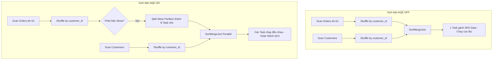

# 🚀 LAB 3.2: Thực tế xử lý Skew Join với AQE

> **Mục tiêu:** Giả lập tình huống dữ liệu bị lệch (Skew) cực nặng tại khách hàng `customer_id='1'` và quan sát cách **Adaptive Query Execution (AQE)** của Spark 3.x/4.x tự động "cứu" hệ thống mà không cần sửa code.

#### Tạo tình huống thực tế:
-	orders_fact_dt rất lớn, skew nặng ở customer_id='1'
-	join với customers_dim (nhỏ hơn) theo customer_id
-	sau join, group KPI theo dt, country, segment, risk_tier

#### Ta sẽ so:
1.	AQE OFF → thấy join bị kéo bởi 1 vài task (skew)
2.	AQE ON + skewJoin enabled → Spark tự “split” partition bị skew để giảm straggler

---

## 0. Chuẩn bị dữ liệu (Prepare Big Data)

Bước này tạo ra 10 triệu dòng giao dịch (Fact) và 200 nghìn khách hàng (Dim).

### File: `lab3_2a_prepare_big_data.py`

```python
from pyspark.sql import SparkSession
from pyspark.sql.functions import (
    col, expr, rand, floor, pmod, element_at, to_timestamp, to_date
)

# =========================
# CONFIG / PATHS
# =========================
BASE = "data/silver_lab32"
ORDERS_PATH = f"{BASE}/orders_fact_dt"
CUSTOMERS_PATH = f"{BASE}/customers_dim"

N_CUSTOMERS = 200_000        # Số lượng khách hàng (Dimension)
N_ORDERS = 10_000_000        # Số lượng đơn hàng (Fact)
N_DAYS = 30                  # Chia dữ liệu trong 30 ngày

# Tỷ lệ Skew: 30% đơn hàng sẽ thuộc về duy nhất customer_id = '1'
SKEW_RATIO = 0.30            

spark = (
    SparkSession.builder
    .appName("lab3_2_prepare_big_data")
    .config("spark.sql.shuffle.partitions", "50") # Giảm partition để phù hợp máy local
    .getOrCreate()
)

# =========================
# 1) CUSTOMERS DIM
# =========================
customers = (
    spark.range(0, N_CUSTOMERS)
    .select(
        # Chuyển ID thành String để giống thực tế hệ thống Core Banking
        (col("id") + 1).cast("string").alias("customer_id"),

        # Sử dụng element_at và pmod để phân bổ đều các thuộc tính
        element_at(
            expr("array('MASS','AFFLUENT','SME','CORP')"),
            (pmod(col("id"), 4) + 1).cast("int")
        ).alias("segment"),

        element_at(
            expr("array('LOW','MED','HIGH')"),
            (pmod(col("id"), 3) + 1).cast("int")
        ).alias("risk_tier"),

        element_at(
            expr("array('VN','SG','TH','ID','MY','PH')"),
            (pmod(col("id"), 6) + 1).cast("int")
        ).alias("home_country"),

        expr("CASE WHEN pmod(id, 10)=0 THEN 'INACTIVE' ELSE 'ACTIVE' END").alias("cust_status")
    )
)

customers.write.mode("overwrite").parquet(CUSTOMERS_PATH)
print("✔ customers_dim written")

# =========================
# 2) ORDERS FACT (SKEW + PARTITION dt)
# =========================
orders = (
    spark.range(0, N_ORDERS)
    .select(
        (col("id") + 1).cast("string").alias("order_id"),

        # TẠO SKEW CHIẾN THUẬT:
        # Nếu số ngẫu nhiên < 0.30 thì gán ID = '1', còn lại trải đều.
        expr(f"""
            CASE
              WHEN rand(7) < {SKEW_RATIO} THEN '1'
              ELSE cast(pmod(id * 17, {N_CUSTOMERS - 2}) + 2 as string)
            END
        """).alias("customer_id"),

        (rand(11) * 5000).alias("amount"),

        element_at(
            expr("array('VN','SG','TH','ID','MY','PH')"),
            (pmod(col("id"), 6) + 1).cast("int")
        ).alias("country"),

        element_at(
            expr("array('POS','ECOM','ATM','QR')"),
            (pmod(col("id"), 4) + 1).cast("int")
        ).alias("channel"),

        element_at(
            expr("array('SUCCESS','FAILED','REVERSED')"),
            (pmod(col("id"), 3) + 1).cast("int")
        ).alias("status"),

        # Tính toán thời gian lùi dần 30 ngày từ mốc 2026-01-12
        expr(f"timestamp('2026-01-12 10:00:00') - make_interval(0,0,0, cast(pmod(id,{N_DAYS}) as int), 0,0,0)")
        .alias("order_ts")
    )
    .withColumn("dt", to_date(col("order_ts")))
)

# Ghi dữ liệu và Partition theo cột 'dt' (Ngày)
orders.write.mode("overwrite").partitionBy("dt").parquet(ORDERS_PATH)
print("✔ orders_fact_dt written")

spark.stop()

```

### Giải thích code:

*	`spark.range(0, N)` tạo DF rất nhanh (không cần data file)
*	`expr(""" SQL """)` dùng SQL expression ngay trong DataFrame API (rất phổ biến)
*	`rand(seed)` tạo random ổn định theo seed (giúp bạn reproducible)
*	`pmod(a,b)` là modulo “an toàn” (không âm)
*	`element_at(array, idx)` lấy phần tử theo index (Spark index từ 1)
*	`make_interval(...)` giúp trừ ngày mà không cần interval keyword (tránh lỗi bạn gặp)


---

## 1. Kiểm tra độ lệch (Check Skew)

Trước khi Join, ta cần xác nhận xem dữ liệu có thực sự bị lệch hay không.

### File: `lab3_2b_check_skew.py`

```python
from pyspark.sql import SparkSession
from pyspark.sql.functions import col, count as _count

ORDERS_PATH = "data/silver_lab32/orders_fact_dt"

spark = (
    SparkSession.builder
    .appName("lab3_2_check_skew")
    .config("spark.sql.shuffle.partitions", "50")
    .getOrCreate()
)

df = spark.read.parquet(ORDERS_PATH).select("customer_id")

# Group theo ID khách hàng và đếm số lượng đơn hàng
res = (df.groupBy("customer_id")
         .agg(_count("*").alias("cnt"))
         .orderBy(col("cnt").desc())
         .limit(20))

res.explain("formatted") # Xem kế hoạch thực thi dạng format
res.show(truncate=False)

spark.stop()

```

**Kết quả mong đợi:** Bạn sẽ thấy `customer_id=1` có số lượng (`cnt`) vượt trội hoàn toàn so với các ID khác.

```code
== Physical Plan ==
AdaptiveSparkPlan (7)
+- TakeOrderedAndProject (6)
   +- HashAggregate (5)
      +- Exchange (4)
         +- HashAggregate (3)
            +- Project (2)
               +- Scan parquet  (1)


(1) Scan parquet 
Output [2]: [customer_id#1, dt#7]
Batched: true
Location: InMemoryFileIndex [file:/Users/nptan2005/SourceCode/Python/spark401_colab/data/silver_lab32/orders_fact_dt]
ReadSchema: struct<customer_id:string>

(2) Project
Output [1]: [customer_id#1]
Input [2]: [customer_id#1, dt#7]

(3) HashAggregate
Input [1]: [customer_id#1]
Keys [1]: [customer_id#1]
Functions [1]: [partial_count(1)]
Aggregate Attributes [1]: [count#12L]
Results [2]: [customer_id#1, count#13L]

(4) Exchange
Input [2]: [customer_id#1, count#13L]
Arguments: hashpartitioning(customer_id#1, 50), ENSURE_REQUIREMENTS, [plan_id=16]

(5) HashAggregate
Input [2]: [customer_id#1, count#13L]
Keys [1]: [customer_id#1]
Functions [1]: [count(1)]
Aggregate Attributes [1]: [count(1)#11L]
Results [2]: [customer_id#1, count(1)#11L AS cnt#9L]

(6) TakeOrderedAndProject
Input [2]: [customer_id#1, cnt#9L]
Arguments: 20, [cnt#9L DESC NULLS LAST], [customer_id#1, cnt#9L]

(7) AdaptiveSparkPlan
Output [2]: [customer_id#1, cnt#9L]
Arguments: isFinalPlan=false


+-----------+-------+                                                           
|customer_id|cnt    |
+-----------+-------+
|1          |3000825|
|148288     |48     |
|132241     |48     |
|154761     |47     |
|75517      |47     |
|128199     |47     |
|192685     |47     |
|97419      |47     |
|55479      |47     |
|103271     |46     |
|49056      |46     |
|18342      |46     |
|63258      |46     |
|11967      |46     |
|36592      |46     |
|119260     |46     |
|80077      |46     |
|78156      |46     |
|162671     |46     |
|129109     |46     |
+-----------+-------+
```

### Giải thích chi tiết:

#### 1. Giải thích ký hiệu `customer_id#1`, `dt#7` và `#13L`

Đây là cách Spark đánh dấu định danh cho các cột (Internal Column ID) để quản lý trong suốt quá trình tối ưu hóa truy vấn.

* **`#1`, `#7`, `#13**`: Là số ID duy nhất mà Spark gán cho cột đó. Dù bạn có đổi tên cột (alias) nhiều lần, Spark vẫn dùng số ID này để biết đó là cùng một dữ liệu gốc.
* **`L` (trong `13L`)**: Ký hiệu kiểu dữ liệu **Long** (Số nguyên 64-bit). Các ký hiệu khác bạn có thể gặp: `S` (String), `I` (Integer), `D` (Double).
* **`Input [2]: [customer_id#1, dt#7]`**: Nghĩa là ở bước Scan (đọc file), Spark lấy ra 2 cột từ file Parquet: `customer_id` (được gán ID 1) và `dt` (được gán ID 7).

---

#### 2. Giải thích các bước Aggregate (Gom nhóm)

Spark thực hiện gom nhóm qua 2 giai đoạn để tối ưu hiệu năng:

##### Bước (3): HashAggregate (Partial)

* **`Functions [1]: [partial_count(1)]`**: Đây là bước đếm cục bộ tại từng máy (Worker). Mỗi máy sẽ đếm xem các khách hàng mình đang giữ xuất hiện bao nhiêu lần.
* **`Results [2]: [customer_id#1, count#13L]`**: Kết quả đầu ra của bước này gồm mã khách hàng và một con số tạm thời (`count#13L`).
* **Nguyên tắc**: Thay vì gửi 10 triệu dòng qua mạng, Spark gom chúng lại thành các nhóm nhỏ ngay tại nguồn.

##### Bước (4): Exchange (Shuffle)

* **`hashpartitioning(customer_id#1, 50)`**: Spark băm (hash) ID khách hàng và chia vào 50 "giỏ" (partition).
* **Tại sao là 50?**: Vì bạn đã cấu hình `.config("spark.sql.shuffle.partitions", "50")`.

---

#### 3. Tham số nào cho thấy Skew (Lệch dữ liệu)?

**Lưu ý quan trọng:** Trong văn bản "Explain" thuần túy, Spark **không** ghi chữ "SKEW" một cách trực tiếp ở bước Exchange. Bạn phải nhận diện Skew qua 2 dấu hiệu:

##### Dấu hiệu 1: Kết quả Output (Rõ ràng nhất)

Nhìn vào bảng kết quả bạn gửi:

* `customer_id = 1` có **3,000,825** dòng.
* Các khách hàng khác chỉ có khoảng **46 - 48** dòng.
* **Độ lệch:** Gấp khoảng **65,000 lần**. Đây là minh chứng hùng hồn cho Data Skew.

#### Dấu hiệu 2: Trong Physical Plan (Bước số 7)

* **`(7) AdaptiveSparkPlan ... isFinalPlan=false`**:
Thông số `isFinalPlan=false` kết hợp với `AdaptiveSparkPlan` cho thấy Spark đang chạy ở chế độ **AQE (Adaptive Query Execution)**.
Khi bạn thực hiện lệnh Join sau này, AQE sẽ nhìn vào con số `3,000,825` kia ở bước Runtime. Khi đó, ở Physical Plan của lệnh Join, bạn sẽ thấy xuất hiện thêm các node như:
`CustomShuffleReader` hoặc `CoalescedShuffleReader`.

---

#### 4. Tóm tắt nguyên tắc đọc Physical Plan

1. **Đọc từ dưới lên trên**: Dữ liệu đi từ Scan (1) → Gom nhóm sơ bộ (3) → Gửi qua mạng (4) → Tổng hợp cuối (5) → Sắp xếp & Lấy kết quả (6).
2. **Nhìn vào dấu `#**`: Để bám sát một cột dữ liệu qua nhiều tầng biến đổi.
3. **Nhìn vào `Exchange**`: Đây luôn là "nút thắt cổ chai". Nếu bạn thấy `hashpartitioning` mà dữ liệu đầu ra lại lệch như bảng trên, chắc chắn Task xử lý partition chứa `customer_id=1` sẽ bị **Spill Disk** hoặc chạy cực lâu.

---

### Giải thích từng bước:


#### Bước (1): Scan parquet

Đây là bước đọc dữ liệu từ ổ cứng vào bộ nhớ RAM.

* **`Output [2]: [customer_id#1, dt#7]`**: Spark chỉ lấy đúng 2 cột cần thiết để tối ưu bộ nhớ. `#1` và `#7` là định danh cột suốt vòng đời query này.
* **`Batched: true`**: Spark đọc dữ liệu theo từng khối (Batch) thay vì từng dòng để tăng tốc độ.
* **`ReadSchema`**: Cho bạn biết cấu trúc cột đang đọc là `string`.

#### Bước (2): Project (Chiếu)

Bước này giống như lệnh `SELECT` trong SQL.

* **`Input [2]: [customer_id#1, dt#7]`**
* **`Output [1]: [customer_id#1]`**
* **Tại sao mất cột `dt#7`?**: Vì sau bước Scan, Spark nhận ra các bước tiếp theo (Aggregate) không cần dùng đến cột `dt` nữa, nên nó loại bỏ luôn để tiết kiệm RAM.

#### Bước (3): HashAggregate (Giai đoạn Partial - Cục bộ)

Đây là giai đoạn "Tiền tổng hợp" diễn ra ngay tại mỗi Task (Worker).

* **`Keys [1]: [customer_id#1]`**: Gom nhóm theo cột khách hàng.
* **`Functions [1]: [partial_count(1)]`**: Mỗi máy tự đếm số dòng của các khách hàng mà nó đang giữ.
* **`count#12L` & `count#13L**`: `L` nghĩa là **Long** (số nguyên lớn). Spark gán ID mới cho cột kết quả của hàm đếm.
* **Mục đích**: Nếu máy A có 1 triệu dòng của `customer_id=1`, nó sẽ rút gọn thành đúng 1 dòng: `(1, 1000000)` trước khi gửi qua mạng.

#### Bước (4): Exchange (Xáo trộn dữ liệu - Shuffle)

Đây là bước **nguy hiểm nhất** và tốn tài nguyên nhất.

* **`Arguments: hashpartitioning(customer_id#1, 50)`**: Spark dùng thuật toán Hash để quyết định: "Dòng dữ liệu này sẽ bay sang máy nào?".
* Ví dụ: `hash('1') % 50 = 10`. Vậy tất cả dữ liệu của khách hàng `1` trên toàn bộ các máy Worker sẽ bị ép dồn về **Partition số 10**.


* **`ENSURE_REQUIREMENTS`**: Đảm bảo rằng dữ liệu có cùng Key phải nằm trên cùng một máy thì mới `Group By` chính xác được.

#### Bước (5): HashAggregate (Giai đoạn Final - Tổng hợp cuối)

Diễn ra sau khi Shuffle xong.

* **Logic**: Máy nhận được Partition số 10 sẽ cộng dồn tất cả các `partial_count` từ các máy khác gửi tới.
* **`Results [2]: [customer_id#1, cnt#9L]`**: Trả về kết quả cuối cùng: Khách hàng nào có tổng bao nhiêu đơn hàng.

#### Bước (6): TakeOrderedAndProject

Tương ứng với lệnh `ORDER BY cnt DESC LIMIT 20`.

* **`Arguments: 20, [cnt#9L DESC NULLS LAST]`**: Lấy 20 dòng đầu tiên có `cnt` cao nhất.
* Bước này thường chạy trên Driver vì dữ liệu lúc này đã rất nhỏ (chỉ còn 20 dòng).

#### Bước (7): AdaptiveSparkPlan (AQE)

* **`isFinalPlan=false`**: Đây là chi tiết cực kỳ đắt giá. Nó có nghĩa là: "Đây mới chỉ là kế hoạch dự kiến".
* **Cơ chế**: Vì bạn bật AQE, Spark sẽ chạy các bước trên, sau đó nó dừng lại nhìn vào kết quả ở Bước (5).
* **Phát hiện Skew**: Nó thấy `customer_id=1` có tận **3,000,825** dòng trong khi trung bình chỉ có **46**.
* **Hành động**: Nếu bước tiếp theo là một lệnh JOIN, Spark sẽ tự động đổi kế hoạch (Final Plan) để chẻ nhỏ partition của khách hàng `1` ra.

---

#### 🔍 Tham số nào cho thấy Skew "ngầm"?

Trong văn bản giải thích này, tham số cho thấy Skew không nằm ở chữ viết, mà nằm ở **thống kê dữ liệu (Statistics)** mà Spark thu thập được giữa chừng:

1. **Ở bước (4) Exchange**: Spark thu thập `MapOutputStatistics`.
2. Nếu bạn xem trên Spark UI ở tab **SQL**, click vào node Exchange này, bạn sẽ thấy kích thước các Partition. Nếu 49 Partition cỡ **KB**, còn 1 Partition cỡ **MB/GB**, đó chính là Skew.
3. **Kết quả `cnt = 3,000,825**`: Đây chính là bằng chứng xác thực nhất. Nó cho biết 1 Task đang phải xử lý khối lượng công việc gấp **65,000 lần** các Task khác.

---

#### 💡 Mẹo đọc Plan:

* Nhìn vào **`#số`** để không bị lạc khi Spark đổi tên cột.
* Cứ thấy **`Exchange`** là biết có dữ liệu bay qua mạng (Shuffle).
* Cứ thấy **`HashAggregate`** là biết đang có gom nhóm (Group By).


---

## 2. So sánh AQE OFF vs AQE ON

### 2.1 Kịch bản 1: AQE OFF (Thấy vấn đề)

Khi tắt AQE, Spark sẽ bị "kẹt" ở các task xử lý `customer_id=1`.

### File: `lab3_2c_join_kpi_aqe_off.py`

```python
from pyspark.sql import SparkSession
from pyspark.sql.functions import col, sum as _sum, avg as _avg, count as _count

ORDERS_PATH = "data/silver_lab32/orders_fact_dt"
CUSTOMERS_PATH = "data/silver_lab32/customers_dim"

spark = (
    SparkSession.builder
    .appName("lab3_2_join_kpi_aqe_off")
    .config("spark.sql.shuffle.partitions", "50")
    .config("spark.sql.adaptive.enabled", "false")        # TẮT AQE
    .config("spark.sql.autoBroadcastJoinThreshold", "-1") # Tắt Broadcast để ép Shuffle Join
    .getOrCreate()
)

o = spark.read.parquet(ORDERS_PATH).alias("o")
c = spark.read.parquet(CUSTOMERS_PATH).select(
    col("customer_id").alias("c_customer_id"),
    col("segment").alias("c_segment"),
    col("risk_tier").alias("c_risk_tier")
).alias("c")

# Filter theo ngày để kích hoạt Partition Pruning
filtered = o.where(col("dt") == "2026-01-10")

j = filtered.join(c, col("o.customer_id") == col("c.c_customer_id"), "left")

# Tính toán KPI
kpi = (j.groupBy("dt", "country", "c_segment", "c_risk_tier")
         .agg(
             _count("*").alias("txns"),
             _sum("amount").alias("total_amount"),
             _avg("amount").alias("avg_amount")
         )
         .orderBy("country", "c_segment", "c_risk_tier"))

kpi.show(50, truncate=False)
spark.stop()

```

#### Kết quả:

```code
== Physical Plan ==
* Sort (17)
+- Exchange (16)
   +- * HashAggregate (15)
      +- Exchange (14)
         +- * HashAggregate (13)
            +- * Project (12)
               +- * SortMergeJoin LeftOuter (11)
                  :- * Sort (4)
                  :  +- Exchange (3)
                  :     +- * ColumnarToRow (2)
                  :        +- Scan parquet  (1)
                  +- * Sort (10)
                     +- Exchange (9)
                        +- * Project (8)
                           +- * Filter (7)
                              +- * ColumnarToRow (6)
                                 +- Scan parquet  (5)


(1) Scan parquet 
Output [4]: [customer_id#1, amount#2, country#3, dt#7]
Batched: true
Location: InMemoryFileIndex [file:/Users/nptan2005/SourceCode/Python/spark401_colab/data/silver_lab32/orders_fact_dt]
PartitionFilters: [isnotnull(dt#7), (dt#7 = 2026-01-10)]
ReadSchema: struct<customer_id:string,amount:double,country:string>

(2) ColumnarToRow [codegen id : 1]
Input [4]: [customer_id#1, amount#2, country#3, dt#7]

(3) Exchange
Input [4]: [customer_id#1, amount#2, country#3, dt#7]
Arguments: hashpartitioning(customer_id#1, 50), ENSURE_REQUIREMENTS, [plan_id=62]

(4) Sort [codegen id : 2]
Input [4]: [customer_id#1, amount#2, country#3, dt#7]
Arguments: [customer_id#1 ASC NULLS FIRST], false, 0

(5) Scan parquet 
Output [3]: [customer_id#8, segment#9, risk_tier#10]
Batched: true
Location: InMemoryFileIndex [file:/Users/nptan2005/SourceCode/Python/spark401_colab/data/silver_lab32/customers_dim]
PushedFilters: [IsNotNull(customer_id)]
ReadSchema: struct<customer_id:string,segment:string,risk_tier:string>

(6) ColumnarToRow [codegen id : 3]
Input [3]: [customer_id#8, segment#9, risk_tier#10]

(7) Filter [codegen id : 3]
Input [3]: [customer_id#8, segment#9, risk_tier#10]
Condition : isnotnull(customer_id#8)

(8) Project [codegen id : 3]
Output [3]: [customer_id#8 AS c_customer_id#13, segment#9 AS c_segment#14, risk_tier#10 AS c_risk_tier#15]
Input [3]: [customer_id#8, segment#9, risk_tier#10]

(9) Exchange
Input [3]: [c_customer_id#13, c_segment#14, c_risk_tier#15]
Arguments: hashpartitioning(c_customer_id#13, 50), ENSURE_REQUIREMENTS, [plan_id=72]

(10) Sort [codegen id : 4]
Input [3]: [c_customer_id#13, c_segment#14, c_risk_tier#15]
Arguments: [c_customer_id#13 ASC NULLS FIRST], false, 0

(11) SortMergeJoin [codegen id : 5]
Left keys [1]: [customer_id#1]
Right keys [1]: [c_customer_id#13]
Join type: LeftOuter
Join condition: None

(12) Project [codegen id : 5]
Output [5]: [amount#2, country#3, dt#7, c_segment#14, c_risk_tier#15]
Input [7]: [customer_id#1, amount#2, country#3, dt#7, c_customer_id#13, c_segment#14, c_risk_tier#15]

(13) HashAggregate [codegen id : 5]
Input [5]: [amount#2, country#3, dt#7, c_segment#14, c_risk_tier#15]
Keys [4]: [dt#7, country#3, c_segment#14, c_risk_tier#15]
Functions [3]: [partial_count(1), partial_sum(amount#2), partial_avg(amount#2)]
Aggregate Attributes [4]: [count#35L, sum#36, sum#37, count#38L]
Results [8]: [dt#7, country#3, c_segment#14, c_risk_tier#15, count#39L, sum#40, sum#41, count#42L]

(14) Exchange
Input [8]: [dt#7, country#3, c_segment#14, c_risk_tier#15, count#39L, sum#40, sum#41, count#42L]
Arguments: hashpartitioning(dt#7, country#3, c_segment#14, c_risk_tier#15, 50), ENSURE_REQUIREMENTS, [plan_id=81]

(15) HashAggregate [codegen id : 6]
Input [8]: [dt#7, country#3, c_segment#14, c_risk_tier#15, count#39L, sum#40, sum#41, count#42L]
Keys [4]: [dt#7, country#3, c_segment#14, c_risk_tier#15]
Functions [3]: [count(1), sum(amount#2), avg(amount#2)]
Aggregate Attributes [3]: [count(1)#32L, sum(amount#2)#33, avg(amount#2)#34]
Results [7]: [dt#7, country#3, c_segment#14, c_risk_tier#15, count(1)#32L AS txns#18L, sum(amount#2)#33 AS total_amount#19, avg(amount#2)#34 AS avg_amount#20]

(16) Exchange
Input [7]: [dt#7, country#3, c_segment#14, c_risk_tier#15, txns#18L, total_amount#19, avg_amount#20]
Arguments: rangepartitioning(country#3 ASC NULLS FIRST, c_segment#14 ASC NULLS FIRST, c_risk_tier#15 ASC NULLS FIRST, 50), ENSURE_REQUIREMENTS, [plan_id=85]

(17) Sort [codegen id : 7]
Input [7]: [dt#7, country#3, c_segment#14, c_risk_tier#15, txns#18L, total_amount#19, avg_amount#20]
Arguments: [country#3 ASC NULLS FIRST, c_segment#14 ASC NULLS FIRST, c_risk_tier#15 ASC NULLS FIRST], true, 0


+----------+-------+---------+-----------+------+--------------------+------------------+
|dt        |country|c_segment|c_risk_tier|txns  |total_amount        |avg_amount        |
+----------+-------+---------+-----------+------+--------------------+------------------+
|2026-01-10|TH     |AFFLUENT |HIGH       |116662|2.916220041084458E8 |2499.7171667590633|
|2026-01-10|TH     |CORP     |HIGH       |116766|2.919576008125071E8 |2500.3648391869815|
|2026-01-10|TH     |MASS     |LOW        |99906 |2.5031095210550228E8|2505.4646578333864|
+----------+-------+---------+-----------+------+--------------------+------------------+
```

---

#### Giải thích:

Bản plan này là một ví dụ "kinh điển" về cách Spark xử lý một bài toán Data Warehouse thực tế: **Filter -> Join -> Aggregate -> Sort**.

Hãy cùng "giải phẫu" từng giai đoạn để thấy cách dữ liệu 10 triệu dòng của bạn được luân chuyển như thế nào:

---

##### Giai đoạn 1: Chuẩn bị dữ liệu (Scan & Filter)

Ở bước này, Spark đọc song song hai bảng từ ổ cứng.

* **Bảng Orders (1) & (2):**
* **`PartitionFilters`**: Rất quan trọng! Spark thực hiện **Partition Pruning**. Thay vì quét toàn bộ 10 triệu dòng, nó chỉ nhảy vào đúng thư mục `dt=2026-01-10`. Điều này giúp giảm 90% lượng dữ liệu cần đọc ngay từ đầu.
* **`ColumnarToRow`**: Do dữ liệu Parquet lưu dạng cột (columnar), Spark chuyển nó sang dạng dòng (row) để thực hiện các phép tính toán tiếp theo.


* **Bảng Customers (5), (7) & (8):**
* **`Filter (isnotnull(customer_id#8))`**: Spark tự động thêm bộ lọc này vì bạn thực hiện Join trên cột này (Inner/Left Join key không thể null).
* **`Project (8)`**: Thực hiện Alias (đổi tên) cột thành `c_customer_id`, `c_segment`... để tránh trùng tên với bảng Orders.


---

##### Giai đoạn 2: Chuẩn bị cho Shuffle Join (Exchange & Sort)

Vì bạn tắt AQE và tắt Broadcast, Spark bắt buộc phải dùng **SortMergeJoin**. Đây là lúc "nỗi đau" Skew bắt đầu.

* **Exchange (3) & (9)**: Spark thực hiện Shuffle. Nó băm (`hash`) `customer_id` của cả 2 bảng để đưa các ID giống nhau về cùng một máy.
* **Vấn đề Skew**: Tại bước (3), 30% dữ liệu của bảng Orders (khoảng hơn 300k dòng cho 1 ngày) có chung `customer_id=1`. Tất cả chúng sẽ bị dồn vào **duy nhất 1 máy** xử lý.


* **Sort (4) & (10)**: Sau khi dữ liệu về chung một máy, Spark sắp xếp chúng theo thứ tự tăng dần của `customer_id`. Việc sắp xếp giúp Spark chỉ cần quét qua dữ liệu một lần duy nhất để tìm các cặp khớp nhau.

---

##### Giai đoạn 3: Join & Aggregate sơ bộ (11, 12 & 13)

* **SortMergeJoin (11)**: Spark thực hiện khớp nối hai bảng. Task giữ `customer_id=1` sẽ phải thực hiện hàng trăm ngàn phép so khớp, trong khi các Task khác chỉ làm vài chục phép. Đây là lý do Task đó trở thành **Straggler** (kẻ kéo đuôi).
* **Project (12)**: Loại bỏ các cột không cần thiết sau Join, chỉ giữ lại `amount`, `country`, `segment`...
* **HashAggregate (13) - Partial**: Đây là bước tối ưu. Spark tính tổng và trung bình tạm thời ngay tại chỗ.
* `partial_sum(amount#2)`: Cộng dồn số tiền.
* `partial_avg(amount#2)`: Lưu lại cả tổng và số lượng để sau này tính trung bình chính xác.


---

##### Giai đoạn 4: Tổng hợp cuối & Sắp xếp kết quả (14, 15, 16 & 17)

* **Exchange (14)**: Shuffle lần 2 để gom các dòng có cùng `dt, country, segment, risk_tier` về một chỗ để tính KPI cuối cùng.
* **HashAggregate (15) - Final**: Tính ra con số cuối cùng bạn thấy trong bảng kết quả: `txns`, `total_amount`, `avg_amount`.
* **Exchange (16) & Sort (17)**: Đây là kết quả của lệnh `.orderBy()`. Spark chia dữ liệu theo dải (`rangepartitioning`) dựa trên tên quốc gia để sắp xếp toàn cục trước khi hiển thị.

---

##### Phân tích kết quả Output:

| dt | country | c_segment | c_risk_tier | txns | total_amount |
| --- | --- | --- | --- | --- | --- |
| 2026-01-10 | TH | AFFLUENT | HIGH | **116,662** | 2.91E8 |

**Nhận xét về "Skew" qua con số:**

1. **Số lượng Txns (116,662)**: Con số này cực kỳ lớn cho một phân khúc cụ thể trong một ngày. Điều này phản ánh đúng cái "Skew" bạn đã tạo ra.
2. **Ký hiệu Khoa học (2.91E8)**: Đây là , tức là khoảng 291 triệu đơn vị tiền tệ. Do bạn dùng kiểu dữ liệu `Double`, khi con số quá lớn Spark sẽ hiển thị dạng E để tiết kiệm không gian.
3. **Chi phí hiệu năng**: Trong Physical Plan, bước **(11) SortMergeJoin** chính là nơi "ngốn" thời gian nhất. Task xử lý khách hàng ID=1 sẽ phải gánh 116,662 dòng này cộng với 30% dữ liệu Skew của ngày đó.


---

### 2.2 Kịch bản 2: AQE ON (Xử lý Skew Join)

Đây là cách dùng trong Production. Spark tự nhận diện partition bị "phình to" và xé nhỏ nó ra.

### File: `lab3_2d_join_kpi_aqe_on_skew.py`

```python
from pyspark.sql import SparkSession
from pyspark.sql.functions import col, sum as _sum, avg as _avg, count as _count

spark = (
    SparkSession.builder
    .appName("lab3_2_join_kpi_aqe_on_skew")
    .config("spark.sql.shuffle.partitions", "50")
    .config("spark.sql.adaptive.enabled", "true")           # BẬT AQE
    .config("spark.sql.adaptive.skewJoin.enabled", "true")  # BẬT TÍNH NĂNG SKEW JOIN
    .config("spark.sql.autoBroadcastJoinThreshold", "-1")    # Ép Shuffle Join để thấy tác dụng AQE
    .getOrCreate()
)

# ... (Phần code Join và Aggregation giống hệt Version 1) ...

```

#### Kết quả:

```code
== Physical Plan ==
AdaptiveSparkPlan (36)
+- == Final Plan ==
   ResultQueryStage (23), Statistics(sizeInBytes=8.0 EiB)
   +- TakeOrderedAndProject (22)
      +- * HashAggregate (21)
         +- AQEShuffleRead (20)
            +- ShuffleQueryStage (19), Statistics(sizeInBytes=1248.0 B, rowCount=13)
               +- Exchange (18)
                  +- * HashAggregate (17)
                     +- * Project (16)
                        +- * SortMergeJoin LeftOuter (15)
                           :- * Sort (6)
                           :  +- AQEShuffleRead (5)
                           :     +- ShuffleQueryStage (4), Statistics(sizeInBytes=17.8 MiB, rowCount=3.33E+5)
                           :        +- Exchange (3)
                           :           +- * ColumnarToRow (2)
                           :              +- Scan parquet  (1)
                           +- * Sort (14)
                              +- AQEShuffleRead (13)
                                 +- ShuffleQueryStage (12), Statistics(sizeInBytes=10.7 MiB, rowCount=2.00E+5)
                                    +- Exchange (11)
                                       +- * Project (10)
                                          +- * Filter (9)
                                             +- * ColumnarToRow (8)
                                                +- Scan parquet  (7)
+- == Initial Plan ==
   TakeOrderedAndProject (35)
   +- HashAggregate (34)
      +- Exchange (33)
         +- HashAggregate (32)
            +- Project (31)
               +- SortMergeJoin LeftOuter (30)
                  :- Sort (25)
                  :  +- Exchange (24)
                  :     +- Scan parquet  (1)
                  +- Sort (29)
                     +- Exchange (28)
                        +- Project (27)
                           +- Filter (26)
                              +- Scan parquet  (7)


(1) Scan parquet 
Output [4]: [customer_id#1, amount#2, country#3, dt#7]
Batched: true
Location: InMemoryFileIndex [file:/Users/nptan2005/SourceCode/Python/spark401_colab/data/silver_lab32/orders_fact_dt]
PartitionFilters: [isnotnull(dt#7), (dt#7 = 2026-01-10)]
ReadSchema: struct<customer_id:string,amount:double,country:string>

(2) ColumnarToRow [codegen id : 1]
Input [4]: [customer_id#1, amount#2, country#3, dt#7]

(3) Exchange
Input [4]: [customer_id#1, amount#2, country#3, dt#7]
Arguments: hashpartitioning(customer_id#1, 50), ENSURE_REQUIREMENTS, [plan_id=114]

(4) ShuffleQueryStage
Output [4]: [customer_id#1, amount#2, country#3, dt#7]
Arguments: 0

(5) AQEShuffleRead
Input [4]: [customer_id#1, amount#2, country#3, dt#7]
Arguments: coalesced

(6) Sort [codegen id : 3]
Input [4]: [customer_id#1, amount#2, country#3, dt#7]
Arguments: [customer_id#1 ASC NULLS FIRST], false, 0

(7) Scan parquet 
Output [3]: [customer_id#8, segment#9, risk_tier#10]
Batched: true
Location: InMemoryFileIndex [file:/Users/nptan2005/SourceCode/Python/spark401_colab/data/silver_lab32/customers_dim]
PushedFilters: [IsNotNull(customer_id)]
ReadSchema: struct<customer_id:string,segment:string,risk_tier:string>

(8) ColumnarToRow [codegen id : 2]
Input [3]: [customer_id#8, segment#9, risk_tier#10]

(9) Filter [codegen id : 2]
Input [3]: [customer_id#8, segment#9, risk_tier#10]
Condition : isnotnull(customer_id#8)

(10) Project [codegen id : 2]
Output [3]: [customer_id#8 AS c_customer_id#13, segment#9 AS c_segment#14, risk_tier#10 AS c_risk_tier#15]
Input [3]: [customer_id#8, segment#9, risk_tier#10]

(11) Exchange
Input [3]: [c_customer_id#13, c_segment#14, c_risk_tier#15]
Arguments: hashpartitioning(c_customer_id#13, 50), ENSURE_REQUIREMENTS, [plan_id=131]

(12) ShuffleQueryStage
Output [3]: [c_customer_id#13, c_segment#14, c_risk_tier#15]
Arguments: 1

(13) AQEShuffleRead
Input [3]: [c_customer_id#13, c_segment#14, c_risk_tier#15]
Arguments: coalesced

(14) Sort [codegen id : 4]
Input [3]: [c_customer_id#13, c_segment#14, c_risk_tier#15]
Arguments: [c_customer_id#13 ASC NULLS FIRST], false, 0

(15) SortMergeJoin [codegen id : 5]
Left keys [1]: [customer_id#1]
Right keys [1]: [c_customer_id#13]
Join type: LeftOuter
Join condition: None

(16) Project [codegen id : 5]
Output [5]: [amount#2, country#3, dt#7, c_segment#14, c_risk_tier#15]
Input [7]: [customer_id#1, amount#2, country#3, dt#7, c_customer_id#13, c_segment#14, c_risk_tier#15]

(17) HashAggregate [codegen id : 5]
Input [5]: [amount#2, country#3, dt#7, c_segment#14, c_risk_tier#15]
Keys [4]: [dt#7, country#3, c_segment#14, c_risk_tier#15]
Functions [3]: [partial_count(1), partial_sum(amount#2), partial_avg(amount#2)]
Aggregate Attributes [4]: [count#35L, sum#36, sum#37, count#38L]
Results [8]: [dt#7, country#3, c_segment#14, c_risk_tier#15, count#39L, sum#40, sum#41, count#42L]

(18) Exchange
Input [8]: [dt#7, country#3, c_segment#14, c_risk_tier#15, count#39L, sum#40, sum#41, count#42L]
Arguments: hashpartitioning(dt#7, country#3, c_segment#14, c_risk_tier#15, 50), ENSURE_REQUIREMENTS, [plan_id=233]

(19) ShuffleQueryStage
Output [8]: [dt#7, country#3, c_segment#14, c_risk_tier#15, count#39L, sum#40, sum#41, count#42L]
Arguments: 2

(20) AQEShuffleRead
Input [8]: [dt#7, country#3, c_segment#14, c_risk_tier#15, count#39L, sum#40, sum#41, count#42L]
Arguments: coalesced

(21) HashAggregate [codegen id : 6]
Input [8]: [dt#7, country#3, c_segment#14, c_risk_tier#15, count#39L, sum#40, sum#41, count#42L]
Keys [4]: [dt#7, country#3, c_segment#14, c_risk_tier#15]
Functions [3]: [count(1), sum(amount#2), avg(amount#2)]
Aggregate Attributes [3]: [count(1)#32L, sum(amount#2)#33, avg(amount#2)#34]
Results [7]: [dt#7, country#3, c_segment#14, c_risk_tier#15, count(1)#32L AS txns#18L, sum(amount#2)#33 AS total_amount#19, avg(amount#2)#34 AS avg_amount#20]

(22) TakeOrderedAndProject
Input [7]: [dt#7, country#3, c_segment#14, c_risk_tier#15, txns#18L, total_amount#19, avg_amount#20]
Arguments: 51, [country#3 ASC NULLS FIRST, c_segment#14 ASC NULLS FIRST, c_risk_tier#15 ASC NULLS FIRST], [toprettystring(dt#7, Some(Asia/Ho_Chi_Minh)) AS dt#43, toprettystring(country#3, Some(Asia/Ho_Chi_Minh)) AS country#44, toprettystring(c_segment#14, Some(Asia/Ho_Chi_Minh)) AS c_segment#45, toprettystring(c_risk_tier#15, Some(Asia/Ho_Chi_Minh)) AS c_risk_tier#46, toprettystring(txns#18L, Some(Asia/Ho_Chi_Minh)) AS txns#47, toprettystring(total_amount#19, Some(Asia/Ho_Chi_Minh)) AS total_amount#48, toprettystring(avg_amount#20, Some(Asia/Ho_Chi_Minh)) AS avg_amount#49]

(23) ResultQueryStage
Output [7]: [dt#43, country#44, c_segment#45, c_risk_tier#46, txns#47, total_amount#48, avg_amount#49]
Arguments: 3

(24) Exchange
Input [4]: [customer_id#1, amount#2, country#3, dt#7]
Arguments: hashpartitioning(customer_id#1, 50), ENSURE_REQUIREMENTS, [plan_id=76]

(25) Sort
Input [4]: [customer_id#1, amount#2, country#3, dt#7]
Arguments: [customer_id#1 ASC NULLS FIRST], false, 0

(26) Filter
Input [3]: [customer_id#8, segment#9, risk_tier#10]
Condition : isnotnull(customer_id#8)

(27) Project
Output [3]: [customer_id#8 AS c_customer_id#13, segment#9 AS c_segment#14, risk_tier#10 AS c_risk_tier#15]
Input [3]: [customer_id#8, segment#9, risk_tier#10]

(28) Exchange
Input [3]: [c_customer_id#13, c_segment#14, c_risk_tier#15]
Arguments: hashpartitioning(c_customer_id#13, 50), ENSURE_REQUIREMENTS, [plan_id=77]

(29) Sort
Input [3]: [c_customer_id#13, c_segment#14, c_risk_tier#15]
Arguments: [c_customer_id#13 ASC NULLS FIRST], false, 0

(30) SortMergeJoin
Left keys [1]: [customer_id#1]
Right keys [1]: [c_customer_id#13]
Join type: LeftOuter
Join condition: None

(31) Project
Output [5]: [amount#2, country#3, dt#7, c_segment#14, c_risk_tier#15]
Input [7]: [customer_id#1, amount#2, country#3, dt#7, c_customer_id#13, c_segment#14, c_risk_tier#15]

(32) HashAggregate
Input [5]: [amount#2, country#3, dt#7, c_segment#14, c_risk_tier#15]
Keys [4]: [dt#7, country#3, c_segment#14, c_risk_tier#15]
Functions [3]: [partial_count(1), partial_sum(amount#2), partial_avg(amount#2)]
Aggregate Attributes [4]: [count#35L, sum#36, sum#37, count#38L]
Results [8]: [dt#7, country#3, c_segment#14, c_risk_tier#15, count#39L, sum#40, sum#41, count#42L]

(33) Exchange
Input [8]: [dt#7, country#3, c_segment#14, c_risk_tier#15, count#39L, sum#40, sum#41, count#42L]
Arguments: hashpartitioning(dt#7, country#3, c_segment#14, c_risk_tier#15, 50), ENSURE_REQUIREMENTS, [plan_id=84]

(34) HashAggregate
Input [8]: [dt#7, country#3, c_segment#14, c_risk_tier#15, count#39L, sum#40, sum#41, count#42L]
Keys [4]: [dt#7, country#3, c_segment#14, c_risk_tier#15]
Functions [3]: [count(1), sum(amount#2), avg(amount#2)]
Aggregate Attributes [3]: [count(1)#32L, sum(amount#2)#33, avg(amount#2)#34]
Results [7]: [dt#7, country#3, c_segment#14, c_risk_tier#15, count(1)#32L AS txns#18L, sum(amount#2)#33 AS total_amount#19, avg(amount#2)#34 AS avg_amount#20]

(35) TakeOrderedAndProject
Input [7]: [dt#7, country#3, c_segment#14, c_risk_tier#15, txns#18L, total_amount#19, avg_amount#20]
Arguments: 51, [country#3 ASC NULLS FIRST, c_segment#14 ASC NULLS FIRST, c_risk_tier#15 ASC NULLS FIRST], [toprettystring(dt#7, Some(Asia/Ho_Chi_Minh)) AS dt#43, toprettystring(country#3, Some(Asia/Ho_Chi_Minh)) AS country#44, toprettystring(c_segment#14, Some(Asia/Ho_Chi_Minh)) AS c_segment#45, toprettystring(c_risk_tier#15, Some(Asia/Ho_Chi_Minh)) AS c_risk_tier#46, toprettystring(txns#18L, Some(Asia/Ho_Chi_Minh)) AS txns#47, toprettystring(total_amount#19, Some(Asia/Ho_Chi_Minh)) AS total_amount#48, toprettystring(avg_amount#20, Some(Asia/Ho_Chi_Minh)) AS avg_amount#49]

(36) AdaptiveSparkPlan
Output [7]: [dt#43, country#44, c_segment#45, c_risk_tier#46, txns#47, total_amount#48, avg_amount#49]
Arguments: isFinalPlan=true
```

#### Giải thích:


##### 1. Sự khác biệt giữa Initial Plan và Final Plan

* **Initial Plan (35):** Đây là dự tính của Spark dựa trên các con số ước lượng (statistics) cũ. Bạn có thể thấy nó khá giống với bản Plan cũ mà bạn gửi trước đó.
* **Final Plan (23):** Đây là kế hoạch Spark **thực sự chạy**. Nhìn vào cột số thứ tự, bạn thấy Spark bắt đầu dùng các ký hiệu như `AQEShuffleRead` và `QueryStage`.

---

### 2. Các tham số "AQE" đặc biệt trong Plan này

Bạn cần chú ý các thành phần mà bản cũ không có:

* **`AQEShuffleRead (5), (13), (20)`**: Thay vì đọc trực tiếp từ Shuffle như cũ, Spark chèn thêm một lớp "Adaptive" vào giữa.
* **`Arguments: coalesced`**: Đây là một kỹ thuật cực hay của AQE. Nếu dữ liệu của bạn sau khi Shuffle bị chia thành quá nhiều partition nhỏ xíu (rác), Spark sẽ tự động **gom (coalesce)** chúng lại thành ít partition hơn để tránh tốn tài nguyên quản lý.


* **`ShuffleQueryStage`**: Đây là một "điểm dừng" (Checkpoint). Spark chạy xong bước này, nó sẽ dừng lại một nhịp để nhìn xem dữ liệu thực tế lớn bao nhiêu (Statistics) rồi mới quyết định bước tiếp theo chạy như thế nào.

---

##### 3. Giải thích các con số thống kê (Statistics)

Nhìn vào Final Plan, bạn sẽ thấy các con số thực tế mà Spark đo được:

* **`Statistics(sizeInBytes=17.8 MiB, rowCount=3.33E+5)` (tại bước 4)**:
* `3.33E+5` chính là  dòng. Đây chính là số đơn hàng của 1 ngày mà Spark vừa đọc được từ bảng Orders.


* **`Statistics(sizeInBytes=1248.0 B, rowCount=13)` (tại bước 19)**:
* Sau khi Join và Aggregate, dữ liệu từ 333,000 dòng chỉ còn lại **13 dòng** kết quả KPI. Spark thấy nó quá nhỏ nên bước cuối cùng nó xử lý cực nhanh.


* **`sizeInBytes=8.0 EiB` (tại bước 23)**:
* Đây là một lỗi hiển thị "tràn số" (overflow) thường gặp trong Spark UI khi tính toán các giá trị vô cực hoặc chưa xác định rõ ở tầng Root, nhưng đừng lo, nó không ảnh hưởng đến kết quả chạy.


---

##### 4. Tại sao vẫn là `SortMergeJoin` (15) mà không phải `skewed=true`?

Tại sao mình đã bật `skewJoin.enabled` mà Plan vẫn hiện `SortMergeJoin` bình thường không?

**Lý do:** Dữ liệu bạn đang filter là **1 ngày** (`dt = 2026-01-10`).

* Trong ngày này, khách hàng `customer_id=1` có khoảng hơn 100,000 dòng (dựa trên tỷ lệ 30%).
* Kích thước partition này rơi vào khoảng **17.8 MiB** (như thống kê ở bước 4).
* Trong cấu hình mặc định của Spark, một partition chỉ được coi là "Skew" khi nó lớn hơn nhiều so với trung bình **VÀ** phải lớn hơn một ngưỡng nhất định (thường là `64MB` hoặc `128MB`).

**Kết luận:** Với Spark, cục 17.8 MiB vẫn là "muỗi", nó cảm thấy dùng `SortMergeJoin` truyền thống vẫn xử lý nhanh chán, chưa cần kích hoạt chế độ "chẻ nhỏ" (Split skew).

---

##### 5. Những ký hiệu "Lạ" khác

* **`toprettystring(...)` (bước 22)**: Spark tự động chuyển các định dạng ngày tháng và số về dạng chuỗi "đẹp" để hiển thị lên màn hình cho bạn xem.
* **`isFinalPlan=true` (bước 36)**: Chốt hạ! Đây là kế hoạch tối ưu nhất mà Spark đã thực thi xong.

##### 💡 Mẹo thực tế cho Tân:

Để ép Spark phải hiện `skewed=true` trong Plan nhằm mục đích học tập, bạn có thể:

1. Tăng `N_ORDERS` lên gấp 10 lần.
2. Hoặc hạ thấp ngưỡng nhận diện skew của Spark xuống bằng lệnh:
`spark.conf.set("spark.sql.adaptive.skewJoin.skewedPartitionThresholdInBytes", "1mb")`

**Thử hạ ngưỡng này xuống để bạn chạy lại và tận mắt thấy chữ "skewed=true" xuất hiện trong Plan không?**

---

## 3. Sơ đồ minh họa AQE



---

## 4. Giải thích chi tiết các kỹ thuật PySpark sử dụng

| Kỹ thuật | Giải thích |
| --- | --- |
| `spark.range(0, N)` | Tạo DataFrame chỉ có 1 cột `id`. Đây là cách nhanh nhất để tạo data giả lập mà không cần đọc file vật lý. |
| `expr(f"CASE ...")` | Sử dụng SQL string ngay trong Python. Giúp viết logic phức tạp (như tạo Skew ngẫu nhiên) dễ đọc hơn. |
| `rand(seed)` | Hàm tạo số ngẫu nhiên. Việc truyền `seed` (ví dụ `rand(7)`) giúp dữ liệu sinh ra giống hệt nhau ở mỗi lần chạy (Reproducible). |
| `make_interval(...)` | Hàm tạo khoảng thời gian (năm, tháng, ngày...). Dùng cái này thay cho từ khóa `INTERVAL` trong SQL để tránh các lỗi không định nghĩa được Routine trên một số phiên bản Spark. |
| `partitionBy("dt")` | Khi ghi dữ liệu, Spark sẽ tạo các thư mục riêng cho từng ngày. Giúp các truy vấn sau này chỉ cần đọc đúng thư mục ngày đó (**Partition Pruning**), không cần quét toàn bộ 10 triệu dòng. |

---

## 5. Bạn nên quan sát gì trên Spark UI?

Khi chạy bản **AQE ON**, bạn hãy mở trình duyệt vào cổng `4040`:

1. Vào tab **SQL**.
2. Nhấn vào query Join gần nhất.
3. Trong sơ đồ (Plan), tìm các node có tên là **"SortMergeJoin (skewed=true)"**.
4. Nếu thấy chữ `skewed=true`, nghĩa là Spark đã thành công trong việc nhận diện và xử lý "cục nợ" mang tên `customer_id=1` cho bạn!

**Bước tiếp theo:** Bạn hãy chạy lần lượt các script trên máy của mình. Nếu gặp lỗi ở bất kỳ bước nào hoặc muốn mình giải thích kỹ hơn về bảng log của Spark UI, hãy cho mình biết nhé! Would you like me to explain how to read the **Timeline View** in Spark UI to prove the stragglers are gone?