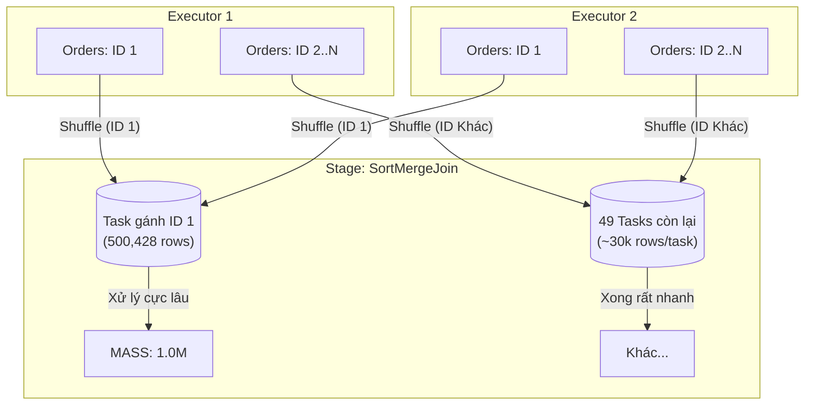
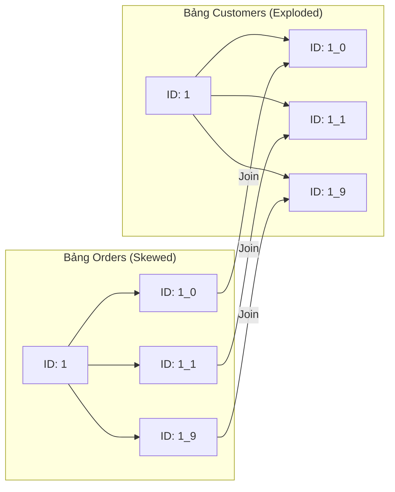

# LAB 3B: “Join with skew” + nhìn Stage/Tasks

#### Code:

```python
from pyspark.sql import SparkSession
from pyspark.sql.functions import col, count as _count

ORDERS_PATH = "data/silver/orders"       # 2M rows
CUSTOMERS_PATH = "data/silver/customers" # 50k rows

spark = (
    SparkSession.builder
    .appName("lab3b_join_skew_shuffle")
    .config("spark.sql.shuffle.partitions", "50")
    .config("spark.sql.autoBroadcastJoinThreshold", "-1")  # ép shuffle để thấy skew rõ
    .getOrCreate()
)

o = spark.read.parquet(ORDERS_PATH).alias("o")
c = spark.read.parquet(CUSTOMERS_PATH).select(
    col("customer_id").alias("c_customer_id"),
    col("segment").alias("c_segment")
).alias("c")

j = o.join(c, col("o.customer_id") == col("c.c_customer_id"), "left")

# làm một aggregation để tạo workload
res = (j.groupBy("c_segment")
         .agg(_count("*").alias("txns")))

res.explain("formatted")
res.show()

spark.stop()
```

#### Kết quà:

```code
== Physical Plan ==
AdaptiveSparkPlan (14)
+- HashAggregate (13)
   +- Exchange (12)
      +- HashAggregate (11)
         +- Project (10)
            +- SortMergeJoin LeftOuter (9)
               :- Sort (3)
               :  +- Exchange (2)
               :     +- Scan parquet  (1)
               +- Sort (8)
                  +- Exchange (7)
                     +- Project (6)
                        +- Filter (5)
                           +- Scan parquet  (4)


(1) Scan parquet 
Output [1]: [customer_id#1]
Batched: true
Location: InMemoryFileIndex [file:/Users/nptan2005/SourceCode/Python/spark401_colab/data/silver/orders]
ReadSchema: struct<customer_id:string>

(2) Exchange
Input [1]: [customer_id#1]
Arguments: hashpartitioning(customer_id#1, 50), ENSURE_REQUIREMENTS, [plan_id=28]

(3) Sort
Input [1]: [customer_id#1]
Arguments: [customer_id#1 ASC NULLS FIRST], false, 0

(4) Scan parquet 
Output [2]: [customer_id#7, segment#8]
Batched: true
Location: InMemoryFileIndex [file:/Users/nptan2005/SourceCode/Python/spark401_colab/data/silver/customers]
PushedFilters: [IsNotNull(customer_id)]
ReadSchema: struct<customer_id:string,segment:string>

(5) Filter
Input [2]: [customer_id#7, segment#8]
Condition : isnotnull(customer_id#7)

(6) Project
Output [2]: [customer_id#7 AS c_customer_id#11, segment#8 AS c_segment#12]
Input [2]: [customer_id#7, segment#8]

(7) Exchange
Input [2]: [c_customer_id#11, c_segment#12]
Arguments: hashpartitioning(c_customer_id#11, 50), ENSURE_REQUIREMENTS, [plan_id=29]

(8) Sort
Input [2]: [c_customer_id#11, c_segment#12]
Arguments: [c_customer_id#11 ASC NULLS FIRST], false, 0

(9) SortMergeJoin
Left keys [1]: [customer_id#1]
Right keys [1]: [c_customer_id#11]
Join type: LeftOuter
Join condition: None

(10) Project
Output [1]: [c_segment#12]
Input [3]: [customer_id#1, c_customer_id#11, c_segment#12]

(11) HashAggregate
Input [1]: [c_segment#12]
Keys [1]: [c_segment#12]
Functions [1]: [partial_count(1)]
Aggregate Attributes [1]: [count#26L]
Results [2]: [c_segment#12, count#27L]

(12) Exchange
Input [2]: [c_segment#12, count#27L]
Arguments: hashpartitioning(c_segment#12, 50), ENSURE_REQUIREMENTS, [plan_id=36]

(13) HashAggregate
Input [2]: [c_segment#12, count#27L]
Keys [1]: [c_segment#12]
Functions [1]: [count(1)]
Aggregate Attributes [1]: [count(1)#25L]
Results [2]: [c_segment#12, count(1)#25L AS txns#15L]

(14) AdaptiveSparkPlan
Output [2]: [c_segment#12, txns#15L]
Arguments: isFinalPlan=false


+---------+-------+                                                             
|c_segment|   txns|
+---------+-------+
|     MASS|1000032|
|      SME| 500092|
| AFFLUENT| 499876|
+---------+-------+
```

---

Bài lab này là một kịch bản "ác mộng" thực tế trong xử lý dữ liệu lớn. Bạn đã cố tình tắt Broadcast Join để ép Spark sử dụng **SortMergeJoin**, lộ diện rõ ràng vấn đề **Data Skew** khi xử lý ID khách hàng số 1 (chiếm 25% dữ liệu).

Dưới đây là phân tích chi tiết bằng sơ đồ và các chỉ số kỹ thuật:

---

### 1. Sơ đồ luồng dữ liệu (Data Flow)

Sơ đồ này mô tả cách dữ liệu bị dồn vào một nút thắt cổ chai tại bước Shuffle (Exchange):



---

### 2. Phân tích Physical Plan (Explain)

Bạn hãy chú ý các node **(2)** và **(9)** trong log của bạn:

* **(2) Exchange (hashpartitioning)**: Đây là nơi Spark băm (hash) ID khách hàng. Vì bạn có 500,428 dòng có cùng ID là `1`, hàm băm sẽ trả về cùng một kết quả cho tất cả chúng. Điều này buộc Spark phải gửi **toàn bộ nửa triệu dòng** này về đúng một partition (trong tổng số 50).
* **(9) SortMergeJoin**:
* **Tại 49 task bình thường**: Spark lấy vài chục đơn hàng, so khớp với 1 khách hàng -> Xong trong vài mili giây.
* **Tại task bị Skew**: Spark phải sắp xếp (Sort) 500,000 dòng ID `1` của bảng `orders`, sau đó đem "merge" với khách hàng ID `1`. Bước Sort này trên một lượng dữ liệu lớn đột biến sẽ gây nghẽn CPU.


---

### 3. Phân tích kết quả thực thi

```text
|    MASS|1000032| -> Chứa 500k đơn hàng của ID '1' (Skew)
|     SME| 500092|
|AFFLUENT| 499876|

```

* **Tại sao MASS lại lớn nhất?** Bởi vì ID `1` (kẻ gây lệch dữ liệu) thuộc phân khúc `MASS`.
* **Hậu quả trên Spark UI:** Nếu bạn mở Spark UI lúc này, bạn sẽ thấy cột "Timeline" hiển thị 1 vạch màu xanh rất dài (Task bị Skew) trong khi các vạch khác ngắn ngủn.

---

### 4. Giải pháp: Kỹ thuật Salting (Thêm muối)

Vì ta không thể dùng Broadcast (giả sử bảng Customers cũng rất lớn), ta phải dùng "Salting" để bẻ gãy ID `1` thành nhiều phần nhỏ.

**Nguyên lý:**

1. **Bảng Orders:** Thay vì giữ ID `1`, ta đổi ngẫu nhiên thành `1_0`, `1_1`, `1_2`... `1_9`.
2. **Bảng Customers:** Ta nhân bản dòng khách hàng ID `1` thành 10 dòng: `1_0` đến `1_9`.
3. **Join:** Bây giờ ID `1` sẽ được chia cho 10 task xử lý thay vì 1 task.

**Sơ đồ Mermaid cho Salting:**



---

### 5. Kết luận rút ra

* **Tắt Broadcast là một cách test Skew tốt:** Trong môi trường Production, nếu bảng nhỏ, **hãy luôn để Broadcast bật** vì nó là "thuốc trị skew" tốt nhất và đơn giản nhất.
* **Dấu hiệu Skew:** Khi `Max task time` gấp nhiều lần `Median task time`.
* **Cấu hình partitions:** Con số `50` bạn đặt là khá nhỏ cho 2 triệu dòng, nhưng dù bạn tăng lên `1000`, task bị Skew vẫn sẽ chậm vì 1 key không thể tự chia ra nhiều partition nếu không có Salting.
