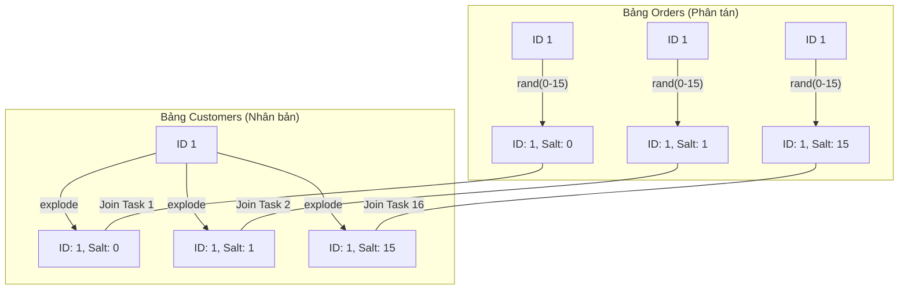

# LAB 3C: JOIN SKEW SALT

#### Code:

```python
from pyspark.sql import SparkSession
from pyspark.sql.functions import col, expr, floor, rand, count as _count

ORDERS_PATH = "data/silver/orders"
CUSTOMERS_PATH = "data/silver/customers"

SALT_N = 16

spark = (
    SparkSession.builder
    .appName("lab3c_join_skew_salt")
    .config("spark.sql.shuffle.partitions", "50")
    .config("spark.sql.autoBroadcastJoinThreshold", "-1")  # ép shuffle
    .getOrCreate()
)

o = spark.read.parquet(ORDERS_PATH)
c = spark.read.parquet(CUSTOMERS_PATH).select(
    col("customer_id").alias("c_customer_id"),
    col("segment").alias("c_segment")
)

# 1) Salt orders
o_s = o.withColumn("salt", floor(rand(7) * SALT_N).cast("int")).alias("o_s")

# 2) Expand customers
c_exp = c.withColumn("salt", expr(f"explode(sequence(0, {SALT_N-1}))")).alias("c_exp")

# 3) Join on (customer_id, salt)
j = o_s.join(
    c_exp,
    (col("o_s.customer_id") == col("c_exp.c_customer_id")) &
    (col("o_s.salt") == col("c_exp.salt")),
    "left"
)

res = (j.groupBy("c_segment")
         .agg(_count("*").alias("txns")))

res.explain("formatted")
res.show()

spark.stop()
```

#### Kết qủa:

```code
== Physical Plan ==
AdaptiveSparkPlan (16)
+- HashAggregate (15)
   +- Exchange (14)
      +- HashAggregate (13)
         +- Project (12)
            +- SortMergeJoin LeftOuter (11)
               :- Sort (4)
               :  +- Exchange (3)
               :     +- Project (2)
               :        +- Scan parquet  (1)
               +- Sort (10)
                  +- Exchange (9)
                     +- Generate (8)
                        +- Project (7)
                           +- Filter (6)
                              +- Scan parquet  (5)


(1) Scan parquet 
Output [1]: [customer_id#1]
Batched: true
Location: InMemoryFileIndex [file:/Users/nptan2005/SourceCode/Python/spark401_colab/data/silver/orders]
ReadSchema: struct<customer_id:string>

(2) Project
Output [2]: [customer_id#1, cast(FLOOR((rand(7) * 16.0)) as int) AS salt#15]
Input [1]: [customer_id#1]

(3) Exchange
Input [2]: [customer_id#1, salt#15]
Arguments: hashpartitioning(customer_id#1, salt#15, 50), ENSURE_REQUIREMENTS, [plan_id=34]

(4) Sort
Input [2]: [customer_id#1, salt#15]
Arguments: [customer_id#1 ASC NULLS FIRST, salt#15 ASC NULLS FIRST], false, 0

(5) Scan parquet 
Output [2]: [customer_id#7, segment#8]
Batched: true
Location: InMemoryFileIndex [file:/Users/nptan2005/SourceCode/Python/spark401_colab/data/silver/customers]
PushedFilters: [IsNotNull(customer_id)]
ReadSchema: struct<customer_id:string,segment:string>

(6) Filter
Input [2]: [customer_id#7, segment#8]
Condition : isnotnull(customer_id#7)

(7) Project
Output [2]: [customer_id#7 AS c_customer_id#11, segment#8 AS c_segment#12]
Input [2]: [customer_id#7, segment#8]

(8) Generate
Input [2]: [c_customer_id#11, c_segment#12]
Arguments: explode(org.apache.spark.sql.catalyst.expressions.UnsafeArrayData@f1dd012b), [c_customer_id#11, c_segment#12], false, [salt#17]

(9) Exchange
Input [3]: [c_customer_id#11, c_segment#12, salt#17]
Arguments: hashpartitioning(c_customer_id#11, salt#17, 50), ENSURE_REQUIREMENTS, [plan_id=35]

(10) Sort
Input [3]: [c_customer_id#11, c_segment#12, salt#17]
Arguments: [c_customer_id#11 ASC NULLS FIRST, salt#17 ASC NULLS FIRST], false, 0

(11) SortMergeJoin
Left keys [2]: [customer_id#1, salt#15]
Right keys [2]: [c_customer_id#11, salt#17]
Join type: LeftOuter
Join condition: None

(12) Project
Output [1]: [c_segment#12]
Input [5]: [customer_id#1, salt#15, c_customer_id#11, c_segment#12, salt#17]

(13) HashAggregate
Input [1]: [c_segment#12]
Keys [1]: [c_segment#12]
Functions [1]: [partial_count(1)]
Aggregate Attributes [1]: [count#31L]
Results [2]: [c_segment#12, count#32L]

(14) Exchange
Input [2]: [c_segment#12, count#32L]
Arguments: hashpartitioning(c_segment#12, 50), ENSURE_REQUIREMENTS, [plan_id=42]

(15) HashAggregate
Input [2]: [c_segment#12, count#32L]
Keys [1]: [c_segment#12]
Functions [1]: [count(1)]
Aggregate Attributes [1]: [count(1)#30L]
Results [2]: [c_segment#12, count(1)#30L AS txns#18L]

(16) AdaptiveSparkPlan
Output [2]: [c_segment#12, txns#18L]
Arguments: isFinalPlan=false


+---------+-------+                                                             
|c_segment|   txns|
+---------+-------+
|     MASS|1000032|
|      SME| 500092|
| AFFLUENT| 499876|
+---------+-------+
```

---

Đây là kỹ thuật **Salting** – "vũ khí" hạng nặng để xử lý Skew khi cả hai bảng đều quá lớn không thể Broadcast. Bạn đã thực hiện rất chuẩn xác các bước để chia nhỏ "nút thắt cổ chai".

Dưới đây là phân tích chi tiết cách thuật toán này vận hành bên dưới Spark:

---

### 1. Phân tích Kỹ thuật Salting (Giải mã Code)

Ý tưởng cốt lõi là **"Chia để trị"**:

1. **`o_s` (Salt orders)**: Bạn thêm một cột `salt` ngẫu nhiên từ  đến  cho mỗi dòng đơn hàng.
* *Kết quả:* 500,428 dòng của khách hàng ID `1` trước đây dồn vào 1 chỗ, nay được chia đều ra khoảng 16 "túi" nhỏ (mỗi túi ~31,000 dòng).


2. **`c_exp` (Expand customers)**: Bạn dùng `explode(sequence(0, 15))`.
* *Kết quả:* Mỗi khách hàng (bao gồm cả khách hàng ID `1`) sẽ được nhân bản lên 16 lần, mỗi bản ghi đi kèm với một mã `salt` từ  đến .


3. **Join (customer_id + salt)**: Bây giờ Spark Join dựa trên cặp khóa này.
* *Kết quả:* Túi đơn hàng có `salt=0` của khách hàng `1` sẽ khớp với bản ghi khách hàng `1` có `salt=0`. Vì dữ liệu đã được bẻ nhỏ, 16 túi này sẽ bay về **16 Task khác nhau** thay vì dồn vào 1 Task duy nhất.


---

### 2. Giải mã Physical Plan (Explain)

Hãy nhìn vào những điểm khác biệt so với bài lab trước (chưa Salt):

* **Node (2) Project**: Xuất hiện biểu thức `cast(FLOOR((rand(7) * 16.0)) as int) AS salt#15`. Spark tính toán giá trị "muối" ngay khi đọc dữ liệu.
* **Node (8) Generate**: Đây chính là bước `explode`. Bạn sẽ thấy `UnsafeArrayData` – đây là cách Spark lưu trữ mảng  trong bộ nhớ trước khi nhân bản các dòng khách hàng.
* **Node (3) & (9) Exchange**: Điểm quan trọng nhất! `hashpartitioning(customer_id, salt, 50)`.
* Trước đây: Chỉ hash theo `customer_id` -> tất cả ID `1` về cùng 1 chỗ.
* Bây giờ: Hash theo `(customer_id, salt)` -> ID `1` muối `0` sẽ ở partition khác với ID `1` muối `1`.


* **Node (11) SortMergeJoin**: Phép Join diễn ra trên 2 keys. Tại Spark UI, bạn sẽ thấy thời gian chạy của các Task bây giờ **đồng đều nhau**. Không còn Task nào chạy "lê lết" 10 phút trong khi các Task khác xong sau 1 giây.

---

### 3. Sơ đồ Mermaid: Salting Flow



---

### 4. Đánh giá Đánh đổi (Trade-off)

Kỹ thuật Salting không phải là "miễn phí", bạn đã đổi tài nguyên lấy thời gian:

| Lợi ích | Chi phí / Đánh đổi |
| --- | --- |
| **Hết nghẽn (Skew):** Job chạy ổn định, không bị treo ở 99%. | **Tăng dung lượng bảng nhỏ:** Bảng `customers` bị nhân bản lên 16 lần trong bộ nhớ. |
| **Tận dụng CPU:** Tất cả các core đều làm việc thay vì chỉ 1 core gánh team. | **Tốn CPU hơn:** Phép Join phức tạp hơn vì phải so khớp thêm cột `salt`. |

---

### 5. Kết luận & Bài học rút ra

1. **Chọn SALT_N bao nhiêu?** Thông thường chọn bằng số lượng Core của cụm Spark hoặc một bội số của nó (16, 32, 64). Nếu chọn quá lớn, bảng nhỏ bị nhân bản quá nhiều gây tràn RAM.
2. **Chỉ Salt khi cần thiết:** Nếu bảng nhỏ có thể Broadcast, hãy dùng **Broadcast Join** trước vì nó hiệu quả hơn nhiều. Chỉ dùng Salting khi cả 2 bảng đều khổng lồ và bị lệch dữ liệu.
3. **Kết quả nhất quán:** Như bạn thấy, `txns` của `MASS` vẫn là `1,000,032`. Thuật toán chỉ thay đổi cách tính, không thay đổi bản chất dữ liệu.

---

# Bonus:

Đây là một câu hỏi rất hay! Đây chính là "bí thuật" của kỹ thuật Salting. Để hiểu tại sao hai cột `salt` ở hai bảng khác nhau lại có thể khớp được với nhau, bạn hãy tưởng tượng đây là một trò chơi **"Chia bài vào các túi"**.

Hãy cùng bóc tách từng phần:

---

### 1. Phân tích cú pháp `floor(rand(7) * 16)`

Cú pháp này dùng để tạo ra một **số nguyên ngẫu nhiên** trong khoảng từ  đến .

* **`rand(7)`**: Hàm này tạo ra một số thực ngẫu nhiên () nằm trong khoảng .
* *Số 7 ở trong ngoặc (`seed`) giúp kết quả ngẫu nhiên này có thể tái lập được nếu bạn chạy lại code.*


* **`* 16`**: Nhân số ngẫu nhiên đó với 16. Kết quả sẽ là một số thực nằm trong khoảng . (Ví dụ:  hoặc ).
* **`floor(...)`**: Hàm lấy phần nguyên bên dưới (làm tròn xuống).
*  trở thành .
*  trở thành .


* **`.cast("int")`**: Chuyển kiểu dữ liệu về số nguyên để Join cho nhanh.

---

### 2. Cơ chế "Khớp nối" (Tại sao Join được?)

Bạn thắc mắc làm sao hai cột `salt` này đồng nhất? Câu trả lời là: **Chúng không cần đồng nhất một cách ngẫu nhiên, mà chúng ta chủ động tạo ra mọi khả năng có thể để chúng "va" vào nhau.**

#### Tại bảng Orders (Bảng bị lệch dữ liệu)

Chúng ta tung xúc xắc cho từng dòng đơn hàng.

* Đơn hàng A của khách hàng ID 1 rơi vào túi (salt) số 5.
* Đơn hàng B của khách hàng ID 1 rơi vào túi (salt) số 12.
* Việc này giúp **chia nhỏ** 500.000 dòng của khách hàng ID 1 ra 16 túi khác nhau.

#### Tại bảng Customers (Bảng nhỏ hơn/Bảng danh mục)

Chúng ta không dùng `rand()`. Thay vào đó, chúng ta dùng `explode(sequence(0, 15))`.
Lệnh này biến **1 dòng** khách hàng ID 1 thành **16 dòng** khách hàng ID 1.

* Dòng 1: ID 1, Salt 0
* Dòng 2: ID 1, Salt 1
* ...
* Dòng 16: ID 1, Salt 15

#### Khi thực hiện Join:

Khi bạn Join theo điều kiện: `(o.id == c.id) AND (o.salt == c.salt)`:

* Đơn hàng A (ID 1, Salt 5) sẽ tìm thấy dòng khách hàng (ID 1, Salt 5) trong 16 dòng đã nhân bản. **Khớp!**
* Đơn hàng B (ID 1, Salt 12) sẽ tìm thấy dòng khách hàng (ID 1, Salt 12). **Khớp!**

**Kết quả:** Mọi đơn hàng đều tìm thấy "bản sao" khách hàng tương ứng của nó, nhưng quan trọng là các đơn hàng có `salt` khác nhau sẽ được Spark đẩy về các **máy thợ (Tasks) khác nhau** để xử lý song song.

---

### 3. Sơ đồ minh họa trực quan

Hãy nhìn vào cách khách hàng ID 1 được xử lý:

| Bảng Orders (Sau khi Salt) |  | Bảng Customers (Sau khi Explode) | Kết quả Join |
| --- | --- | --- | --- |
| Đơn hàng #101 (ID:1, **Salt:0**) |  | Khách hàng (ID:1, **Salt:0**) | Khớp tại Task 0 |
| Đơn hàng #102 (ID:1, **Salt:1**) |  | Khách hàng (ID:1, **Salt:1**) | Khớp tại Task 1 |
| ... |  | ... | ... |
| Đơn hàng #500k (ID:1, **Salt:15**) |  | Khách hàng (ID:1, **Salt:15**) | Khớp tại Task 15 |

---

### tóm lại:

* Bảng **Orders**: Dùng `rand()` để **phân tán** dữ liệu bị lệch.
* Bảng **Customers**: Dùng `explode()` để **phủ kín** tất cả các giá trị salt có thể có, đảm bảo dù đơn hàng rơi vào "muối" nào cũng tìm thấy khách hàng ở "muối" đó.
* Đây **không phải chỉ là test**, đây là kỹ thuật xử lý dữ liệu thực tế khi bạn đối mặt với các Key cực khủng (ví dụ: khách hàng "Guest" trong các hệ thống thương mại điện tử).

**Bạn đã thấy cách "nhân bản" bảng nhỏ để "chia lửa" cho bảng lớn chưa? Bạn có muốn tôi giải thích thêm về việc chọn con số SALT_N bao nhiêu là tối ưu không?**

---

Dưới đây là phân tích 3 đoạn test của bạn (skew check → join shuffle thường → join shuffle có salting). Mình viết Markdown như bạn yêu cầu.

⸻

1) Skew check: groupBy(customer_id).count().orderBy(desc(count)).limit(20)

Kết quả bạn thấy
	•	customer_id = 1 có 500,428 records.
	•	Các customer_id khác chỉ ~ 38–40 records.

✅ Đây là skew cực nặng (một key chiếm ~25% tổng 2,000,000 orders).

Plan

Bạn thấy:
	•	HashAggregate → Exchange hashpartitioning(customer_id, 50) → HashAggregate → TakeOrderedAndProject

Giải thích:
	•	Exchange là bắt buộc vì groupBy(customer_id) cần gom tất cả bản ghi cùng key về cùng partition (shuffle).
	•	TakeOrderedAndProject là do bạn lấy top 20.

👉 Đoạn này xác nhận dataset của bạn đủ “skew” để test Lab 3 (rất tốt).

⸻

2) Join shuffle thường (không salting)

Plan bạn thấy (rút gọn)
	•	Scan orders
	•	Exchange hashpartitioning(customer_id, 50)
	•	Sort
	•	Scan customers
	•	Exchange hashpartitioning(c_customer_id, 50)
	•	Sort
	•	SortMergeJoin
	•	groupBy(segment).count() (lại có Exchange vì aggregate)

Ý nghĩa chính

Vì sao bị “nghẽn” khi skew?

Vì customer_id=1 sẽ bị hash vào 1 partition nào đó (ví dụ partition #k).
Partition đó sẽ phải xử lý ~500k rows → chạy lâu hơn hẳn các partition khác → straggler (task kéo đuôi).

Dấu hiệu trong UI/History (nếu bạn mở)
	•	Ở stage join shuffle: sẽ có 1 task runtime rất lớn / input records cực cao.
	•	Còn các task khác nhỏ và chạy nhanh.

👉 Đây là baseline để so sánh với salting.

⸻

3) Join shuffle có Salting (SALT_N=16)

Plan bạn thấy
	•	Orders: tạo thêm salt = floor(rand(7)*16)
→ Exchange hashpartitioning(customer_id, salt, 50) → Sort
	•	Customers: explode(sequence(0,15)) để nhân bản
→ Exchange hashpartitioning(c_customer_id, salt, 50) → Sort
	•	SortMergeJoin trên (customer_id, salt)

Điều salting “cải thiện” ở đâu?

Trước salting
	•	Key skew: (customer_id=1) → dồn vào 1 partition.

Sau salting
	•	Key skew được “bẻ” thành 16 key khác nhau:
	•	(1,0), (1,1), …, (1,15)
	•	Vì vậy ~500k rows của customer=1 sẽ được rải ra khoảng 16 nhóm → load được chia đều hơn → giảm straggler rõ rệt.

✅ Đây chính là mục tiêu của salting.

⸻

4) Nhưng tại sao output cuối giống nhau?

Bạn thấy cả 2 join (không salt / có salt) đều ra:
	•	MASS: 1,000,032
	•	SME: 500,092
	•	AFFLUENT: 499,876

✅ Điều này đúng vì salting chỉ thay đổi cách phân phối để join, không thay đổi logic join.

⸻

5) Điều bạn nên kiểm tra thêm để “thấy hiệu quả” rõ ràng

Plan text giống nhau chưa đủ; hiệu quả nằm ở runtime / skew metrics.

Bạn nên nhìn ở Spark UI (Stages của Join stage)

So sánh 2 case:

Case A: no-salt
	•	Có 1 task:
	•	input records cực lớn (tầm 500k+)
	•	duration rất lâu
	•	Nhiều task khác rất nhỏ

Case B: salted
	•	Thay vì 1 task cực lớn, bạn sẽ thấy:
	•	nhiều task “to” hơn mức trung bình, nhưng không còn 1 task quá dị.
	•	runtime tổng thể thường giảm (tùy máy)

⸻

6) Gợi ý code “đo đúng” (để bạn tự tin qua Lab 3)

Nếu bạn muốn đo rõ, bạn chạy 2 job và lấy Spark UI:
	•	No salt: o.join(c, on="customer_id")...
	•	Salt: như bạn đã làm

Và thêm:
	•	.count() hoặc .write.mode("overwrite")... để force action (đảm bảo job chạy đủ nặng).

⸻

Nếu bạn muốn, gửi mình:
	•	Spark UI Stage detail (task time / input size) của join stage ở 2 case
=> mình sẽ chỉ đúng chỗ “skew task” và xác nhận salting đã giảm skew như thế nào (rất dễ nhìn).