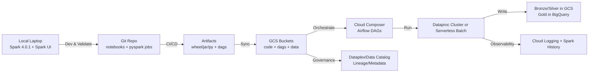
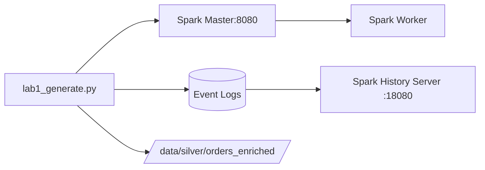

# LAB: SETUP PLAN

Hướng dẫn chuẩn bị môi trường thực hiện spark trên local theo hướng:
- linh động codespace, colab, local
- có thể xem spark UI

---

## 0) Sơ đồ tổng thể lộ trình (local → cloud)



---

## 1) Setup môi trường Spark 4.0.1 trên local (để xem Spark UI)

Đề xuất 2 cách. Cách A (Docker) thường “nhanh gọn – ít lỗi” nhất. Cách B (cài native) phù hợp nếu bạn muốn Spark “thuần máy”.

### Cách A — Docker (khuyến nghị để học + lab)

#### B1. Cài Docker Desktop (macOS/Windows).

#### B2. Tạo docker-compose.yml (Spark master + worker + history server)
- Bạn sẽ chạy Spark local theo chế độ standalone cluster nhỏ, có UI:
-		Spark Master UI: http://localhost:8080
- Spark App UI (khi chạy job): thường http://localhost:4040
- 	Spark History UI: http://localhost:18080

#### B3. Run
- docker compose up -d
- 	Mở UI, đảm bảo Spark Master/Worker “alive”.

#### B4. Dev code
-	Dùng VS Code local + Python venv.
-	Kết nối spark://localhost:7077 (master) hoặc chạy local[*] tùy lab.

---

### Cách B — Cài native (nếu bạn muốn chạy “thuần máy”)

#### B1. Java
- Spark 4.x thường chạy tốt với Java mới (tuỳ build), nhưng để “ổn định cho học” bạn có thể dùng Java LTS.
- 	Cài Java + set JAVA_HOME.

#### B2. Cài Spark 4.0.1
- Download Spark 4.0.1 prebuilt (Hadoop3).
-	Set env:
*	SPARK_HOME
*		PATH=$SPARK_HOME/bin:$PATH

#### B3. PySpark
-	Dùng pip install pyspark==4.0.1 (hoặc đúng version bạn đang luyện).
-	Chạy thử:
*	pyspark
*	hoặc notebook + SparkSession.builder.getOrCreate().

#### B4. Spark UI
-	Khi chạy job: mở http://localhost:4040.

---

## 2) Bộ LAB theo hướng 1 (local-first, có Spark UI)

#### Mỗi lab mình sẽ trình bày đúng format bạn yêu cầu:
1.	Tạo data mẫu
2.	Xử lý
3.	Giải thích
4.	Code demo
5.	Có/không dùng numpy/pandas (dùng khi “đúng chỗ”)
6.	Công cụ, lib thực tế

### Lab 1–6 (nhẹ, nắm nền)
- Lab 1: DataFrame fundamentals + lazy evaluation + explain
-	Lab 2: Partitioning 101 + repartition/coalesce + tác động lên UI
-	Lab 3: Shuffle cơ bản (groupBy, join) + đọc Exchange
-	Lab 4: Join strategies (broadcast vs sort-merge) + when/why
-	Lab 5: Skew fundamentals + detect skew trong UI
-	Lab 6: Cache/persist đúng cách + spill to disk + memory model

### Lab 7–10 (vừa, “bank-like” hơn)
-	Lab 7: Bronze→Silver chuẩn hoá schema + quality checks
-		Lab 8: Silver→Gold aggregation + window functions + incremental
- Lab 9: Idempotent output + atomic commit pattern (write temp → promote)
-	Lab 10: Observability: log + metrics + explain plan snapshot

Các lab này chạy local, và bạn luôn xem Spark UI để hiểu “vì sao”.

---

## 3) Sau lab nhẹ → lab nặng “data thật” (local → GCP, có masking/token + governance)

### Data thật (gợi ý 3 lựa chọn, bạn chọn 1)
1.	NYC TLC Trip Record Data (rất lớn, chuẩn big data)
-	Có nguồn chính thức TLC.  
-	Có cả registry/open data (dễ lấy đường dẫn bucket/object).  
> **Bài toán bank-like:** tạo “travel spending profile”, fraud-ish rules, daily aggregates, late arriving data.

2.	Olist e-commerce (vừa, dễ làm end-to-end)
-	Có repo tổng hợp dataset (thường trỏ về Kaggle).  

> **Bài toán bank-like:** khách hàng/đơn hàng/hoàn tiền, cohort, RFM, merchant performance.

3.	Fraud dataset (IEEE-CIS Fraud Detection)
-	Thường dùng để mô phỏng fraud scoring pipeline.  

> **Bài toán bank-like:** feature engineering, drift checks, lineage.

### Masking/Tokenization “đảm bảo policy”
- Local (on-prem)
-	Mask PII: email/phone/name/address.
-	Tokenization theo deterministic hash (HMAC) để join cross-table vẫn được mà không lộ raw PII.
-	Cloud (GCP)
-	Lưu mapping trong vault/secret manager (tuỳ mức bài).
-	**Trên BigQuery:** dùng view/row-level masking nếu cần (phase sau).

### Governance/Provenance từng bước
1.	**Giai đoạn đầu:**
-	Metadata chuẩn hoá: schema, owner, SLA, tags (PII).
2.	**Giai đoạn lên cloud:**
-	Đưa vào Dataplex / Data Catalog cho quản trị dữ liệu & metadata.  

---

## 4) “Linh hoạt công cụ” (local / codespace / colab)
-	**Local:** lab chính, vì có Spark UI + debug nhanh.
-	**Colab:** chỉ dùng khi cần notebook test nhanh / demo nhỏ (không phụ thuộc UI).
-	**Codespace:** dùng khi cần git workflow tiện, nhưng bạn đang bị quota giới hạn → mình ưu tiên local + colab trước.

---

# SETUP GUIDE

---

## LAB #1 — Local Spark “chuẩn nghề” + Spark UI + tạo data mẫu + explain

### AIM
-	Chạy Spark local mà xem được Spark UI
-		Biết cách bật event log để xem lại trên History Server
- Tạo data mẫu (customers/orders) đúng kiểu, tránh lỗi type như bạn gặp
-	**Làm 1 pipeline mini:** `generate → transform → explain → write parquet`

---

## 1) Setup môi trường local (khuyến nghị nhanh + ít đau đầu)

### Bạn chọn 1 trong 2 cách:

**Cách A (khuyến nghị):** Docker Compose (ổn định, giống production)

**Ưu:** không lệ thuộc Java/Python local; có sẵn Spark UI + History Server

**Nhược:** cần cài Docker Desktop

#### B1 — tạo folder

```bash
mkdir -p spark-lab/{data,warehouse,logs,notebooks}
cd spark-lab
```

#### B2 — tạo file docker-compose.yml

```yaml
services:
  spark-master:
    image: bitnami/spark:latest
    environment:
      - SPARK_MODE=master
      - SPARK_MASTER_WEBUI_PORT=8080
    ports:
      - "8080:8080"
      - "7077:7077"
    volumes:
      - ./data:/data
      - ./warehouse:/warehouse
      - ./logs:/logs

  spark-worker:
    image: bitnami/spark:latest
    depends_on: [spark-master]
    environment:
      - SPARK_MODE=worker
      - SPARK_MASTER_URL=spark://spark-master:7077
    ports:
      - "8081:8081"
    volumes:
      - ./data:/data
      - ./warehouse:/warehouse
      - ./logs:/logs

  spark-history:
    image: bitnami/spark:latest
    command: >
      bash -lc "
      mkdir -p /tmp/spark-events &&
      /opt/bitnami/spark/sbin/start-history-server.sh &&
      tail -f /opt/bitnami/spark/logs/*"
    environment:
      - SPARK_HISTORY_OPTS=-Dspark.history.fs.logDirectory=/logs/spark-events -Dspark.history.ui.port=18080
    ports:
      - "18080:18080"
    volumes:
      - ./logs:/logs
```

#### B3 — chạy

```bash
docker compose up -d
```

#### B4 — mở UI
-	Spark Master UI: http://localhost:8080
-	Spark History UI: http://localhost:18080

> History Server dùng event log của Spark. Spark support event logging và History Server theo docs chính thức.

---

## Cách B: Cài native (nếu bạn muốn “thuần local”)

---

## 2) Tạo notebook / script chạy Spark (local)

**Option chạy nhanh:** dùng spark-submit trong container

Tạo file `lab1_generate.py` trong folder `spark/lab/`:

```python
from pathlib import Path
from pyspark.sql import SparkSession,functions as F


EVENTS_DIR = (Path.cwd() / "Users" / "nptan2005" / "SourceCode" / "Python" / "spark-4.0.1-bin-hadoop3" / "logs" / "spark-events").resolve()
EVENTS_URI = f"file://{EVENTS_DIR}"

WH_DIR = (Path.cwd() / "warehouse").resolve()
WH_URI = f"file://{WH_DIR}"


DATA_DIR = (Path.cwd() / "data").resolve()
SILVER_DIR = (DATA_DIR / "silver" / "orders_enriched").resolve()
SILVER_URI = f"file://{SILVER_DIR}"


spark = (
    SparkSession.builder
    .appName("lab1-generate")
    # event log để History Server đọc
    .config("spark.eventLog.enabled", "true")
    .config("spark.eventLog.dir", EVENTS_URI)
    .config("spark.sql.warehouse.dir", WH_URI)
    .getOrCreate()
)

print("Event log dir:", EVENTS_URI)
print("Spark UI:", spark.sparkContext.uiWebUrl)

spark.sparkContext.setLogLevel("WARN")

# -----------------------
# 1) customers (50k)
# -----------------------
n_customers = 50_000
segments = ["MASS", "AFFLUENT", "SME"]
risk = ["LOW", "MED", "HIGH"]

seg_arr = F.array(*[F.lit(x) for x in segments])
risk_arr = F.array(*[F.lit(x) for x in risk])

# element_at cần index kiểu INT (Spark báo lỗi BIGINT như bạn gặp)
seg_idx = (F.pmod(F.col("id"), F.lit(len(segments))) + F.lit(1)).cast("int")
risk_idx = (F.pmod(F.col("id"), F.lit(len(risk))) + F.lit(1)).cast("int")

customers = (
    spark.range(0, n_customers)
    .select(
        (F.col("id") + 1).cast("string").alias("customer_id"),
        F.element_at(seg_arr, seg_idx).alias("segment"),
        F.element_at(risk_arr, risk_idx).alias("risk_tier"),
        (F.current_date() - F.expr("INTERVAL 1 DAYS") - F.pmod(F.col("id"), F.lit(365)).cast("int")).alias("created_date"),
    )
)

# -----------------------
# 2) orders (2M) + skew hot key
# -----------------------
n_orders = 2_000_000
channels = ["POS", "ECOM", "ATM"]
countries = ["VN", "SG", "TH", "ID", "MY"]
statuses = ["SUCCESS", "FAILED", "REVERSED"]

HOT_CUSTOMER = "1"
HOT_RATIO = 0.25

ch_arr = F.array(*[F.lit(x) for x in channels])
cty_arr = F.array(*[F.lit(x) for x in countries])
st_arr = F.array(*[F.lit(x) for x in statuses])

ch_idx = (F.pmod(F.col("id"), F.lit(len(channels))) + F.lit(1)).cast("int")
cty_idx = (F.pmod(F.col("id"), F.lit(len(countries))) + F.lit(1)).cast("int")
st_idx = (F.pmod(F.col("id"), F.lit(len(statuses))) + F.lit(1)).cast("int")

orders = (
    spark.range(0, n_orders)
    .select(
        (F.col("id") + 1).cast("string").alias("order_id"),
        F.when(F.rand(seed=7) < F.lit(HOT_RATIO), F.lit(HOT_CUSTOMER))
         .otherwise((F.pmod(F.col("id") * 17, F.lit(n_customers - 1)) + 2).cast("string"))
         .alias("customer_id"),
        (F.rand(seed=11) * 5000).cast("double").alias("amount"),
        (F.current_timestamp() - (F.pmod(F.col("id"), F.lit(30)).cast("int") * F.expr("INTERVAL 1 DAYS"))).alias("order_ts"),
        F.element_at(ch_arr, ch_idx).alias("channel"),
        F.element_at(cty_arr, cty_idx).alias("country"),
        F.element_at(st_arr, st_idx).alias("status"),
    )
)

customers.cache()
orders.cache()

print("customers =", customers.count())
print("orders    =", orders.count())

customers.show(5, truncate=False)
orders.show(5, truncate=False)

# -----------------------
# 3) mini pipeline
# -----------------------
# NOTE: cố tình tạo 1 join có skew để lab sau xử lý
silver = (
    orders.join(customers, "customer_id", "left")
    .withColumn("amount_bucket", F.when(F.col("amount") < 1000, "LOW")
                              .when(F.col("amount") < 3000, "MID")
                              .otherwise("HIGH"))
)

print("\n=== EXPLAIN (formatted) ===")
silver.explain("formatted")

# write parquet
silver.write.mode("overwrite").parquet(SILVER_URI)
print("Wrote:", SILVER_URI)

spark.stop()
```

#### Chạy job

```bash
docker compose exec spark-master spark-submit /data/../lab1_generate.py
```
Nếu bạn đặt file ở `spark-lab/lab1_generate.py`, thì mount chưa có. *Cách nhanh:* copy file vào container hoặc mount thêm volume.

**Cách dễ nhất:** sửa compose để mount `./:/work` rồi chạy `spark-submit /work/lab1_generate.py`.


## 3) Bạn sẽ quan sát gì trên Spark UI (LAB #1)

**Sau khi chạy:**

1.	Mở http://localhost:4040 → tab Applications → click app lab1-generate
2.	Vào SQL / DAG Visualization / Stages
3.	Bạn sẽ thấy:
-	`count()` tạo jobs
-	`join()` có khả năng tạo Exchange/shuffle
-	`Event log` được ghi → `http://localhost:18080` sẽ xem lại app sau khi job kết thúc

---

## 4) Mermaid sơ đồ lab (để bạn đưa vào doc)



---

## 5) “Thực tế có áp dụng numpy/pandas không?”

**Có, nhưng đúng chỗ:**
-	**Pandas/Numpy:** dùng cho EDA nhỏ, sampling, kiểm tra quality nhanh, feature engineering nhẹ trong notebook.
-	**Spark:** dùng cho dataset lớn, join/agg nặng, pipeline batch/streaming.

Trong LAB #1 này mình chủ động chưa dùng pandas/numpy để bạn nắm Spark core trước. Sang LAB #2 mình sẽ thêm “sampling sang pandas” một cách đúng chuẩn (không làm chết RAM).

---

## 6) Data thật cho chặng #2 (E2E)

Bạn chọn NYC TLC là đúng: có data rất lớn, nhiều file theo tháng. Trang chính thức của TLC cung cấp trip record data và hướng dẫn/structure.

---

Lộ trình lab (đúng theo note “nhẹ → nặng”)

### Nhẹ (local-first)
-	**LAB #1** (xong ở trên): setup + UI + generate + explain + parquet
-	**LAB #2:** partitions & shuffle căn bản (groupBy, explain, spark.sql.shuffle.partitions)
-	**LAB #3:** join strategies (broadcast / sort-merge) + đọc plan “như architect”
-	**LAB #4:** skew thật (HOT key) + AQE + salting
- **LAB #5:** incremental + idempotent output (bank-grade)
-	**LAB #6:** quality checks + logging + metrics (chuẩn production)

### Nặng (data thật + E2E on-prem → GCP)
-	Download NYC TLC → mask/token (mô phỏng SBV policy) → upload GCS → Dataproc/BigQuery → lineage/governance (Dataplex)  

---

# Phân tích và hướng dẫn check

---

## 1) LAB 1 — Bạn vừa làm được gì?

### 1.1 Data đã tạo đúng như thiết kế
-	customers = 50,000
-	orders = 2,000,000
-	Hot key: customer_id = 1 có 500,428 giao dịch (≈ 25.02%) → skew rõ ràng

Đây là cái “mồi” để các lab sau học: join/groupBy gặp skew thì chuyện gì xảy ra.

---

### 1.2 Spark UI bạn thấy là “đúng”

Spark báo UI: http://172.20.10.5:4040

---

### 1.3 Vì sao EXPLAIN của LAB1 lại là BroadcastHashJoin?

Trong plan:

	•	Orders (2M) là bên trái
	•	Customers (50k) là bên phải
	•	Spark chọn BroadcastHashJoin buildRight tức là:
	•	Customers nhỏ → broadcast sang executors
	•	Orders lớn → stream qua và join với bảng broadcast

✅ Đây là best practice: dimension nhỏ (customer) broadcast, fact lớn (orders) không shuffle.

Ý nghĩa: LAB1 join “nhẹ” vì Spark broadcast. Bạn chưa “đau” vì skew ở join (vì join không shuffle).

---

### 1.4 Nhưng skew vẫn tồn tại trong data

Skew không biến mất. Nó chỉ “chưa gây đau” ở join kiểu broadcast.

Nó sẽ gây đau khi:

	•	groupBy(customer_id) (như bạn làm ở LAB2)
	•	hoặc join không broadcast (VD: 2 bảng lớn)

⸻

## 2) LAB 2 — Bạn vừa học được gì qua EXPLAIN?

### 2.1 Top customer check: skew đúng bài

Bạn thấy:

	•	1 : 500428
	•	các customer khác ~39–40

=> đúng pattern: 25% vào 1 key, phần còn lại phân tán.

---

### 2.2 EXPLAIN của LAB2 có Exchange → đây là Shuffle

Plan LAB2:

```code
Scan parquet -> Project(dt) -> HashAggregate(partial) -> Exchange -> HashAggregate(final)
```

Điểm mấu chốt:

	•	Exchange = shuffle boundary
	•	Nghĩa là Spark phải “chia lại dữ liệu theo key” để aggregate đúng.

Và bạn thấy rõ:

```code
hashpartitioning(..., 200)
```

Tức là Spark shuffle thành 200 partitions.

---

### 2.3 Vì sao groupBy gây shuffle?

Vì aggregation theo key (dt, segment, risk_tier, country, channel) cần gom tất cả record cùng key về cùng reducer.

Spark làm 2 phase:

	•	partial aggregate trước shuffle (giảm data)
	•	shuffle
	•	final aggregate sau shuffle

=> Đây là “công thức sống” của groupBy.

---

## 3) Kết luận quan trọng từ LAB 1–2

Kết luận A: Broadcast join giúp bạn né shuffle

LAB1 join chạy “êm” vì dimension nhỏ → broadcast.

Kết luận B: Aggregation luôn có shuffle (trừ vài case hiếm)

LAB2 groupBy có Exchange → shuffle.

Kết luận C: Skew sẽ “giết” khi key skew rơi vào shuffle

Hiện tại LAB2 groupBy không theo customer_id, nên skew customer_id chưa làm bạn đau.

Nhưng nếu bạn groupBy theo customer_id hoặc join 2 bảng lớn theo customer_id, bạn sẽ thấy:

	•	1 partition “ôm” 500k records
	•	nhiều partition còn lại ít

→ stage chạy lâu vì straggler (1 task kéo cả job).

---

## 4) Trước khi đi tiếp: bạn nên xem gì trên Spark UI để “cảm” được?

Lần sau chạy LAB2 hoặc làm 1 phép groupBy/customer_id:

	1.	SQL / DataFrame tab

	•	xem DAG, có “Exchange” node không

	2.	Stages tab

	•	click stage có shuffle
	•	nhìn “Summary Metrics” (task time, input size)

	3.	Executors tab

	•	coi task time có lệch mạnh không (straggler)

---


# Spark History Server 

---

## 1️⃣ Spark UI vs Spark History Server (phải phân biệt rõ)

Thành phần	Dùng khi nào	URL

Spark UI (4040)	Job đang chạy	http://localhost:4040

Spark History Server	Job đã chạy xong	http://localhost:18080

👉 Bạn cần History Server để:

	•	Xem lại LAB 1, LAB 2 đã chạy xong
	•	Đọc DAG, Stage, Task, Shuffle không bị mất
	•	So sánh giữa các lab

---

## 2️⃣ Xác nhận: bạn đã bật Event Log đúng (✅ RẤT TỐT)

Trong code LAB 1 bạn có:

```python
.config("spark.eventLog.enabled", "true")
.config("spark.eventLog.dir", EVENTS_URI)
```


Và output:

```code
Event log dir: file:///Users/nptan2005/SourceCode/Python/spark401_colab/logs/spark-events
```

👉 Điều này có nghĩa:

	•	Spark đã ghi lại toàn bộ lịch sử job
	•	Chỉ còn thiếu History Server để đọc

Kiểm tra nhanh:

```bash
ls -lah logs/spark-events
```

Bạn sẽ thấy file dạng:

```code
application_170xxxxxx_0001
```

---

## 3️⃣ Khởi động Spark History Server (native Mac)

### 3.1 Xác định SPARK_HOME

```bash
echo $SPARK_HOME
```

Nếu rỗng (thường gặp trên Mac brew):

```bash
brew --prefix apache-spark
```

Ví dụ ra:

```code
/opt/homebrew/Cellar/apache-spark/4.0.1/libexec
```

Set tạm cho terminal:

```bash
export SPARK_HOME=/opt/homebrew/Cellar/apache-spark/4.0.1/libexec
```

---

## 3.2 Tạo config cho History Server (rất quan trọng)

```bash
cp $SPARK_HOME/conf/spark-defaults.conf.template \
   $SPARK_HOME/conf/spark-defaults.conf
```

Mở file:

```bash
vim $SPARK_HOME/conf/spark-defaults.conf
```

Thêm đúng đường dẫn event log của bạn:

```code
spark.eventLog.enabled           true
spark.eventLog.dir               file:///Users/nptan2005/SourceCode/Python/spark401_colab/logs/spark-events
spark.history.fs.logDirectory    file:///Users/nptan2005/SourceCode/Python/spark401_colab/logs/spark-events

```

⚠️ Bắt buộc file:/// (3 dấu /)

---

### 3.3 Start History Server

```bash
$SPARK_HOME/sbin/start-history-server.sh
```

Kiểm tra port:

```bash
lsof -nP -iTCP:18080 -sTCP:LISTEN
```

Nếu thấy java LISTEN 18080 → OK.

---

### 3.4 Mở History UI

👉 Trình duyệt:

```code
http://localhost:18080
```

Bạn sẽ thấy danh sách application:

	•	lab1-generate
	•	spark_lab2 (hoặc tên app bạn đặt)

---

## 4️⃣ Cách đọc LAB 1 trong Spark History (rất quan trọng)

### 4.1 Click vào LAB 1 application

Xem theo thứ tự này:

```code
(A) DAG Visualization
	•	Nhìn thấy:
	•	Range → Project → BroadcastExchange → BroadcastHashJoin → Write
	•	Hiểu:
	•	BroadcastHashJoin (dimension nhỏ)
	•	Không có shuffle lớn
```

👉 LAB1 là join tối ưu

---

```code
(B) Stages tab
	•	Ít stage
	•	Không có stage nào “kéo dài bất thường”
```

👉 Join broadcast = không đau

---


## 5️⃣ Cách đọc LAB 2 trong Spark History

### 5.1 DAG Visualization

Bạn sẽ thấy rõ:

```code
Scan parquet
  ↓
Project (dt)
  ↓
HashAggregate (partial)
  ↓
Exchange (SHUFFLE)
  ↓
HashAggregate (final)
```

👉 Exchange = shuffle boundary

---

### 5.2 Stages tab (quan trọng nhất)

	•	Tìm stage có chữ:
	•	ShuffleMapStage
	•	ResultStage
	•	Click vào stage shuffle

Quan sát:

	•	Task duration có lệch không
	•	Input size / shuffle read

👉 Đây là chuẩn textbook của aggregation

---

## 6️⃣ Vì sao bạn PHẢI hiểu LAB 1–2 xong mới làm LAB 3?

Bạn đang đi đúng thứ tự Senior Data Engineer:


1️⃣ LAB 1

→ Join đúng cách (broadcast)

2️⃣ LAB 2

→ Aggregate → shuffle là gì

3️⃣ LAB 3 (sắp tới)

→ Skew + shuffle = thảm họa
→ Fix skew bằng kỹ thuật thật

Nếu không hiểu LAB 1–2:

	•	LAB 3 sẽ chỉ là “copy trick”
	•	Không hiểu vì sao nó chạy nhanh hơn

---

# Fix config xem Spark History

---

# A. Tạo đúng config cho History Server

## 1) Tạo file spark-defaults.conf (nếu chưa có)

```bash
cd $SPARK_HOME/conf
ls -lah
```

Nếu chưa có spark-defaults.conf:

```bash
cp spark-defaults.conf.template spark-defaults.conf
```

## 2) Mở file và thêm các dòng bắt buộc

```bash
nano $SPARK_HOME/conf/spark-defaults.conf
```

Thêm ở cuối file (đúng path repo của bạn):

```code
spark.eventLog.enabled           true
spark.eventLog.dir               file:///Users/nptan2005/SourceCode/Python/spark401_colab/logs/spark-events
spark.history.fs.logDirectory    file:///Users/nptan2005/SourceCode/Python/spark401_colab/logs/spark-events
spark.history.ui.port            18080
```

Lưu ý: file:/// 3 dấu /

---

# B. Đảm bảo thư mục event log tồn tại (cực quan trọng)

```bash
mkdir -p /U```sers/nptan2005/SourceCode/Python/spark401_colab/logs/spark-events
ls -lah /Users/nptan2005/SourceCode/Python/spark401_colab/logs/spark-events
```

Bạn đã chạy LAB1/LAB2 rồi nên trong này thường sẽ có file kiểu local-... hoặc application_....

---

# C. Start History Server + kiểm tra log

## 1) Start

```bash
$SPARK_HOME/sbin/start-history-server.sh
```

## 2) Kiểm tra process

```bash
ps aux | grep -i HistoryS```erver | grep -v grep
```

## 3) Kiểm tra port 18080

```bash
lsof -nP -iTCP:18080 -sTCP:LISTEN
```

Nếu vẫn trống → History Server start bị lỗi. Ta xem log.

## 4) Xem log History Server

Spark sẽ ghi log vào: `$SPARK_HOME/logs`

```bash
ls -lah $SPARK_HOME/logs | tail
```

Tìm file có chữ history-server rồi tail:

```bash
tail -n 200 $SPARK_HOME/logs/*history-server*.out
```
👉 Copy 20–50 dòng cuối paste cho mình là mình chỉ đúng lỗi ngay.

---

# D. Mở History UI

Khi lsof đã thấy LISTEN 18080, mở:

	•	http://localhost:18080

---

# E. Nếu bạn muốn “chạy thử History Server bằng tay” để thấy lỗi rõ hơn (debug nhanh)

```code
$SPARK_HOME/bin/spark-class org.apache.spark.deploy.history.HistoryServer
```

Nó sẽ in thẳng lỗi ra terminal (rất dễ bắt bệnh).

---

# Xem Spark History

---

## 1) Mở Spark History UI

Mở trình duyệt:

	•	http://localhost:18080

Bạn sẽ thấy trang Spark History Server → tab Applications.

---

## 2) Mapping: 3 eventlog kia là gì?

Bạn đang có 3 folder:

```code
	•	...7861xxx (khoảng 10:17) → lần chạy lab1 trước (có thể fail write)
	•	...8194xxx (10:23) → LAB1 chạy OK (bạn đã ghi parquet thành công)
	•	...8334xxx (10:25) → LAB2 (kpi_daily)
```


Trong History UI, bạn sẽ thấy 3 Applications tương ứng theo thời gian.

👉 Bạn click vào app theo thời gian để mở chi tiết.

---

## 3) Bạn cần xem gì trong History để “hiểu Spark” (LAB1, LAB2)

Khi click vào 1 Application, bạn sẽ thấy các mục chính:

### A. Jobs

	•	Mỗi “action” tạo ra job: count(), show(), write.parquet(), …
	•	Trong LAB1:
	•	customers.count() là 1 job
	•	orders.count() là 1 job
	•	silver.write.parquet(...) là 1 job (thường nặng nhất)

👉 Click từng job → xem nó gồm mấy stages, stage nào lâu.

### B. Stages

	•	Mỗi stage là 1 “khúc” của DAG.
	•	Trong LAB2 (groupBy KPI) bạn chắc chắn thấy:
	•	stage map-side partial aggregate
	•	stage shuffle + final aggregate

👉 Nhìn Shuffle Read/Write, Task time để hiểu “tốn ở đâu”.

### C. SQL / DataFrame tab

Đây là phần rất quan trọng cho lab 1-2 vì bạn dùng Spark SQL:

	•	LAB1: join orders + customers
	•	LAB2: groupBy dt, segment, risk, country, channel

Trong tab SQL, bạn sẽ thấy:

	•	query plan (DAG)
	•	thời gian
	•	số rows
	•	metrics (scan size, shuffle, spilled…)

---

## 4) LAB1 phân tích đúng theo kết quả bạn gửi

Bạn gửi EXPLAIN của LAB1 có:

BroadcastHashJoin LeftOuter BuildRight + BroadcastExchange customers

Nghĩa là Spark chọn chiến lược:

	•	orders (2M) làm “left”
	•	customers (50k) đủ nhỏ → broadcast sang executors
	•	Join sẽ né shuffle lớn (rất tốt)

✅ Đây là lý do LAB1 chạy nhanh và “ổn”.

Trong History UI → SQL tab, bạn sẽ nhìn ra rõ broadcast.

---

## 5) LAB2 phân tích đúng theo kết quả bạn gửi

EXPLAIN LAB2 có:

```code
	•	HashAggregate → Exchange hashpartitioning(..., 200) → HashAggregate
```

Nghĩa là:

1.	aggregate sơ bộ (partial)
2.	shuffle theo keys (dt, segment, risk, country, channel) về 200 partitions
3.	aggregate final

✅ Đây chính là “Spark sống bằng shuffle”, và KPI chính là case “shuffle chuẩn”.

Trong History UI, bạn sẽ thấy:

	•	stage có Shuffle Write
	•	stage sau có Shuffle Read

---


## 6) Checklist “bạn đã xong lab 1-2” khi nào?

Bạn mở History và trả lời được 3 câu này là OK:
	1.	LAB1: Job write.parquet có mấy stages? stage nào lâu nhất?
	2.	LAB1: Join strategy là gì? (Broadcast hay SortMerge?)
	3.	LAB2: Có shuffle không? Shuffle Read/Write ~ bao nhiêu?

---


# 🧠 ĐỌC SPARK HISTORY – LAB 2 (KPI DAILY)

```code
Bạn đang xem SQL / DataFrame → Query 2
Thời gian: 0.8s – 2M rows → KPI Gold
Đây là job quan trọng nhất của LAB 2
```

---

## 1️⃣ Tổng quan pipeline (đọc từ trên xuống)

Scan parquet (2,000,000 rows)

```code
→ Project
→ HashAggregate (partial)
→ Exchange (shuffle)
→ AQEShuffleRead
→ HashAggregate (final)
→ WriteFiles
```

👉 Đây chính là mô hình chuẩn của Spark aggregation

```code
Map → Shuffle → Reduce
```

⸻

## 2️⃣ Scan parquet – hiểu đúng tầng IO

Scan parquet

```code
	•	Files read: 12
	•	Total size: 35.4 MB
	•	Output rows: 2,000,000
	•	Scan time (max): ~59 ms
```

🧠 Ý nghĩa:

	•	Parquet rất hiệu quả
	•	2M rows nhưng chỉ ~35MB → columnar + compression
	•	IO không phải bottleneck

👉 Trong bank:

	•	Nếu scan > 5–10s → data layout sai / partition sai / file quá nhỏ

---

## 3️⃣ WholeStageCodegen (1) – Spark “tăng tốc”

ColumnarToRow → Project → HashAggregate (partial)

```code
	•	Aggregation build time: ~4.6s (max 398 ms / task)
	•	Output rows: 1,080 (từ 2M)
	•	Peak memory: ~3MB
```

🧠 Ý nghĩa:

	•	Đây là partial aggregation (map-side)
	•	Spark gom dữ liệu trước khi shuffle
	•	Giảm dữ liệu shuffle từ 2M → 1,080 rows

👉 Đây là lý do Spark sống
👉 Nếu không có bước này → shuffle chết người

---

## 4️⃣ Exchange – nơi shuffle xảy ra (rất quan trọng)

Exchange

```code
	•	Shuffle records written: 1,080
	•	Partitions: 200
	•	Shuffle bytes: ~129 KB
	•	Shuffle write time (max): 74 ms
```

🧠 Ý nghĩa:

	•	Bạn group theo:

```code
dt,``` segment, risk, country, channel
```

	•	Cardinality thấp → rất ít group

	•	Shuffle nhẹ, sạch, predictable

👉 Trong bank:

	•	Shuffle > GB → phải redesign
	•	Shuffle mà records ≈ input → design fail

---

## 5️⃣ AQEShuffleRead – Adaptive Query Execution

AQEShuffleRead

	•	Original partitions: 200
	•	Coalesced to: 1
	•	Partition size: ~137 KB

🧠 Ý nghĩa:

	•	Spark tự nhận ra:

“Dữ liệu nhỏ → không cần 200 tasks”
	•	AQE gộp lại → 1 partition
	•	Giảm overhead task scheduling

👉 Đây là Spark 3+ / 4 rất mạnh
👉 Nhưng trong bank: không nên phụ thuộc AQE mù quáng

---


## 6️⃣ HashAggregate (final) – reduce side
	•	Output rows: 90
	•	Time: 4 ms
	•	Peak memory: 2.2 MB

🧠 Ý nghĩa:

	•	Final KPI rows rất ít
	•	Đây là Gold layer chuẩn
	•	Không skew, không spill, không OOM

---

## 7️⃣ WriteFiles – output Gold
	•	Ghi ra:

```code
data/gold/kpi_daily
```

👉 Bạn đã:
```code
	•	Silver → Gold
	•	Aggregation đúng layer
	•	Output nhỏ, idempotent
```
---

## ✅ KẾT LUẬN LAB 2 (RẤT QUAN TRỌNG)

LAB 2 đạt chuẩn BANK-GRADE

|**Tiêu chí**|**Trạng thái**|
|------------|--------------|
|Shuffle	|Có, nhưng nhỏ & kiểm soát|
|Skew|	❌ Không|
|Runtime|	< 1s|
|AQE	|Có, hợp lý|
|Gold| design	Đúng|
|Cost|	Predictable|

👉 Đây là job được phép chạy hàng ngày trong bank

---

## 🧠 SO SÁNH NHANH LAB 1 vs LAB 2

|**Lab**|**Pattern**|**Risk**|
|-------|-----------|--------|
|LAB 1|Broadcast Join|	⚠️ sai broadcast → OOM|
|LAB 2|Shuffle Aggregate|⚠️ skew keys|

👉 Bạn đã thấy tận mắt cả 2 pattern chuẩn của Spark

---

