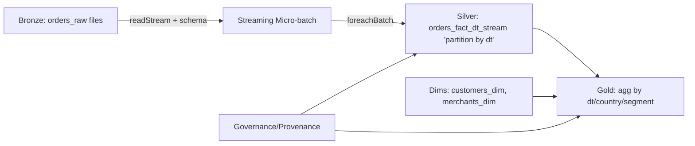
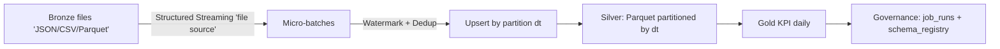

# Streaming


---

# ✅ LAB 3.3 – Streaming → Silver (late data + incremental + overwrite partition)

## 0) Sơ đồ tổng quan (đúng “real-life”)



---

## 1) Tạo dữ liệu Bronze theo “micro-batch” (giả lập stream)

Tạo file: `spark/prepare_data/lab_bronze_generate_orders.py`

```python
# spark/lab/lab_bronze_generate_orders.py
import os
import json
import time
import random
from datetime import datetime, timedelta

BRONZE_DIR = "data/bronze_lab33/orders_raw"
os.makedirs(BRONZE_DIR, exist_ok=True)

def gen_batch(batch_id: int, n: int, base_event_time: datetime, late_ratio: float = 0.15):
    rows = []
    for i in range(n):
        order_id = str(batch_id * 1000000 + i)
        customer_id = str(1 if random.random() < 0.25 else random.randint(2, 50000))  # skew nhẹ
        merchant_id = str(random.randint(1, 3000))
        amount = round(random.random() * 5000, 6)
        country = random.choice(["VN", "TH", "SG", "ID", "MY"])
        channel = random.choice(["POS", "ECOM", "ATM"])
        status = random.choice(["SUCCESS", "FAILED", "REVERSED"])

        # event_ts: phần lớn là ngày “hôm nay”, một phần là late data (lùi 1-3 ngày)
        if random.random() < late_ratio:
            event_ts = base_event_time - timedelta(days=random.randint(1, 3))
        else:
            event_ts = base_event_time

        ingest_ts = datetime.now()
        dt = event_ts.date().isoformat()

        rows.append({
            "order_id": order_id,
            "customer_id": customer_id,
            "merchant_id": merchant_id,
            "amount": amount,
            "event_ts": event_ts.strftime("%Y-%m-%d %H:%M:%S"),
            "channel": channel,
            "country": country,
            "status": status,
            "ingest_ts": ingest_ts.strftime("%Y-%m-%d %H:%M:%S"),
            "dt": dt
        })
    return rows

def write_batch_json(batch_id: int, rows: list[dict]):
    path = os.path.join(BRONZE_DIR, f"batch_{batch_id:04d}.json")
    with open(path, "w", encoding="utf-8") as f:
        for r in rows:
            f.write(json.dumps(r) + "\n")
    print(f"✅ wrote {path} rows={len(rows)}")

if __name__ == "__main__":
    random.seed(7)
    base = datetime(2026, 1, 10, 10, 0, 0)

    # 6 micro-batches, mỗi batch 20k rows (tuỳ máy bạn tăng/giảm)
    for b in range(6):
        rows = gen_batch(batch_id=b, n=20000, base_event_time=base, late_ratio=0.20)
        write_batch_json(b, rows)
        time.sleep(1)  # tạo cảm giác “file đến theo thời gian”
```

--- 

Chạy

```bash
rm -rf data/bronze_lab33/orders_raw
mkdir -p data/bronze_lab33/orders_raw

python spark/lab/lab_bronze_generate_orders.py
ls -lah data/bronze_lab33/orders_raw | head
```

---

## 2) Streaming ingest Bronze → Silver (Upsert theo partition dt)

Vì sao bạn từng bị lỗi FILE_NOT_EXIST?

Bạn đã làm kiểu “đọc silver partition cũ + overwrite partition đó” ngay trong foreachBatch, rồi lại .count() trên DF có thể trigger đọc/scan file đang bị thay thế → local FS rất dễ “đứt file”.

#### ✅ Fix thực tế cho local Parquet: ghi ra tmp/ trước → swap (replace) thư mục partition (atomic-ish).

Tạo file: `spark/lab/lab_stream_to_silver_orders_v2.py`

```python
# spark/lab/lab_stream_to_silver_orders_v2.py
import os
import shutil
from datetime import datetime

from pyspark.sql import SparkSession
from pyspark.sql.types import (
    StructType, StructField, StringType, DoubleType, TimestampType, DateType
)
from pyspark.sql.functions import col, to_timestamp, to_date, lit, row_number
from pyspark.sql.window import Window

BRONZE_ORDERS_PATH = "data/bronze_lab33/orders_raw"
SILVER_OUT = "data/silver/orders_fact_dt_stream"
CHECKPOINT = "checkpoints/orders_to_silver_v2"

TMP_ROOT = "data/tmp/orders_upsert"

os.makedirs(SILVER_OUT, exist_ok=True)
os.makedirs(CHECKPOINT, exist_ok=True)
os.makedirs(TMP_ROOT, exist_ok=True)

spark = (
    SparkSession.builder
    .appName("lab_stream_to_silver_orders_v2")
    .config("spark.sql.shuffle.partitions", "50")
    # streaming không dùng AQE: Spark sẽ tự warning & disable
    .getOrCreate()
)

spark.sparkContext.setLogLevel("WARN")

# 1) Streaming file source bắt buộc schema (bạn gặp lỗi này lần đầu)
schema = StructType([
    StructField("order_id", StringType(), True),
    StructField("customer_id", StringType(), True),
    StructField("merchant_id", StringType(), True),
    StructField("amount", DoubleType(), True),
    StructField("event_ts", StringType(), True),   # bronze là string
    StructField("channel", StringType(), True),
    StructField("country", StringType(), True),
    StructField("status", StringType(), True),
    StructField("ingest_ts", StringType(), True),
    StructField("dt", StringType(), True),         # bronze dt string
])

def atomic_replace_dir(src_dir: str, dst_dir: str):
    """
    Thao tác “an toàn tương đối” trên local:
    - Xoá dst nếu tồn tại
    - Move src -> dst (rename/move là atomic hơn copy)
    """
    if os.path.exists(dst_dir):
        shutil.rmtree(dst_dir)
    os.makedirs(os.path.dirname(dst_dir), exist_ok=True)
    shutil.move(src_dir, dst_dir)

def upsert_batch(batch_df, batch_id: int):
    """
    foreachBatch: chạy trên mỗi micro-batch (DataFrame tĩnh).
    Mục tiêu:
    - watermark + dedup theo order_id (giả lập idempotent)
    - upsert theo dt: rewrite từng dt partition bằng swap folder
    """
    if batch_df.rdd.isEmpty():
        print(f"ℹ️ batch={batch_id} empty")
        return

    # 2) Chuẩn hoá kiểu dữ liệu
    df = (
        batch_df
        .withColumn("event_ts", to_timestamp(col("event_ts")))
        .withColumn("ingest_ts", to_timestamp(col("ingest_ts")))
        .withColumn("dt", to_date(col("dt")))
    )

    # 3) Dedup thực tế: giữ record mới nhất theo ingest_ts cho mỗi order_id
    w = Window.partitionBy("order_id").orderBy(col("ingest_ts").desc())
    dedup = (
        df
        .withColumn("rn", row_number().over(w))
        .where(col("rn") == 1)
        .drop("rn")
    )

    # Lấy danh sách dt trong batch để upsert từng partition
    dts = [r["dt"] for r in dedup.select("dt").distinct().collect()]

    # Tính rows trước khi write để không trigger đọc sau khi replace
    rows_in_batch = dedup.count()
    print(f"✅ batch={batch_id} rows_after_dedup={rows_in_batch} partitions={len(dts)} dts={dts}")

    for dtv in dts:
        dt_str = dtv.isoformat()
        part_path = os.path.join(SILVER_OUT, f"dt={dt_str}")
        tmp_path = os.path.join(TMP_ROOT, f"batch={batch_id}", f"dt={dt_str}")

        # (a) lọc partition dt của batch
        part_new = dedup.where(col("dt") == lit(dtv))

        # (b) nếu partition đã tồn tại → đọc cũ, union, dedup lại theo order_id
        if os.path.exists(part_path):
            old = spark.read.parquet(part_path)
            merged = old.unionByName(part_new)

            w2 = Window.partitionBy("order_id").orderBy(col("ingest_ts").desc())
            final_part = (
                merged
                .withColumn("rn", row_number().over(w2))
                .where(col("rn") == 1)
                .drop("rn")
            )
        else:
            final_part = part_new

        # (c) write ra tmp (không đụng partition thật)
        if os.path.exists(tmp_path):
            shutil.rmtree(tmp_path)
        os.makedirs(tmp_path, exist_ok=True)

        (
            final_part
            .coalesce(1)   # local lab: 1 file/partition cho dễ nhìn (production: KHÔNG làm vậy)
            .write
            .mode("overwrite")
            .parquet(tmp_path)
        )

        # (d) swap folder: tmp -> dt=...
        atomic_replace_dir(tmp_path, part_path)
        print(f"   ↪ upserted dt={dt_str} ok")

# 4) Đọc stream từ file source
stream_df = (
    spark.readStream
    .schema(schema)
    .json(BRONZE_ORDERS_PATH)
)

# 5) Start streaming
query = (
    stream_df
    .writeStream
    .foreachBatch(upsert_batch)
    .option("checkpointLocation", CHECKPOINT)
    .trigger(processingTime="5 seconds")
    .start()
)

print("🚀 Streaming started. Spark UI:", query.sparkSession.sparkContext.uiWebUrl)

query.awaitTermination()

```

---


Chạy (đúng thứ tự)

```bash
rm -rf data/silver/orders_fact_dt_stream
rm -rf checkpoints/orders_to_silver_v2
rm -rf data/tmp/orders_upsert
mkdir -p data/silver/orders_fact_dt_stream checkpoints/orders_to_silver_v2 data/tmp/orders_upsert

python spark/lab/lab_stream_to_silver_orders_v2.py
```

Dừng đúng cách: thay vì Ctrl+C “gắt”, bạn có thể để chạy hết batch rồi dừng. Nếu vẫn cần Ctrl+C, đôi khi Py4J sẽ báo “reentrant call” (trên mac terminal hay gặp). Không sao — miễn dữ liệu đã ghi xong.

---

## 3) Cách kiểm tra “đã sạch warning dt chưa”

Sau khi chạy xong stream v2:

#### A) Check folder partition

```bash
find data/silver/orders_fact_dt_stream -maxdepth 2 -type d | head
```

#### B) Check schema không warning

```bash
python - <<'PY'
from pyspark.sql import SparkSession
spark = SparkSession.builder.getOrCreate()
df = spark.read.parquet("data/silver/orders_fact_dt_stream")
print("columns:", df.columns)
df.printSchema()
print("sample:", df.orderBy("ingest_ts", ascending=False).limit(5).toPandas())
spark.stop()
PY
```

#### ✅ Nếu bạn không còn thấy:

```code
WARN DataSource: [COLUMN_ALREADY_EXISTS] The column dt already exists
```

thì dataset đã “chuẩn”.

Nếu warning còn xuất hiện: 99% là do vẫn còn “rác” file từ run cũ trong cùng path. Khi đó: rm -rf data/silver/orders_fact_dt_stream rồi chạy lại là dứt điểm.

---

### ✅ Tiếp: Governance/Provenance (fix luôn warning dt ở Gold)

Bạn đang chạy lab_gov_kpi_daily.py và thấy warning dt already exists — cái này không phải do code join, mà do GOLD_OUT đã từng được ghi theo layout khác (lúc không partition, lúc partition).

Bạn đã thêm đoạn xoá GOLD_OUT trước khi write rồi, đúng hướng.

Cách xác định “đã hết warning thật sự chưa?”

Sau khi bạn “đập sạch” gold:

```bash
rm -rf data/gold/kpi_daily
python spark/lab/lab_gov_kpi_daily.py
```

Rồi kiểm tra:


```bash
python - <<'PY'
from pyspark.sql import SparkSession
spark = SparkSession.builder.getOrCreate()
df = spark.read.parquet("data/gold/kpi_daily")
print("columns:", df.columns)
df.printSchema()
spar
```

✅ Nếu schema chỉ có 1 cột dt và lúc read không warning → OK.

---

### ✅ Bước tiếp theo của bạn (gợi ý “đúng flow lab”)

1.	Generate bronze:

```bash
python spark/lab/lab_bronze_generate_orders.py
```

2.	Run streaming v2 (upsert ổn định):

```bash
python spark/lab/lab_stream_to_silver_orders_v2.py
```

3.	Run gold KPI + governance:

```bash
rm -rf data/gold/kpi_daily
python spark/lab/lab_gov_kpi_daily.py
```

4.	Verify:

*	`spark.read.parquet("data/silver/orders_fact_dt_stream")` không warning dt
*	`spark.read.parquet("data/gold/kpi_daily")` không warning dt

