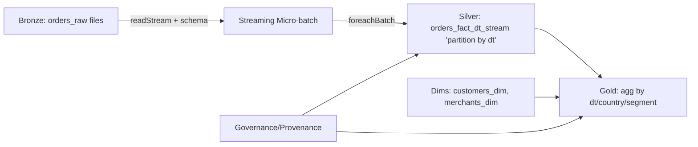

# Streaming

```mermaid
flowchart LR
  A[Bronze: orders_raw files] -->|readStream + schema| B[Streaming Micro-batch]
  B -->|foreachBatch| C[Silver: orders_fact_dt_stream 'partition by dt']
  C --> D[Gold: agg by dt/country/segment]
  E[Dims: customers_dim, merchants_dim] --> D
  F[Governance/Provenance] --> C
  F --> D
```