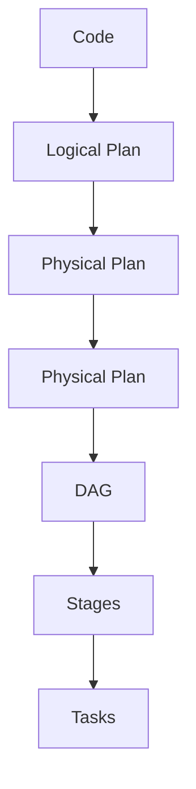

# 🚀 Spark Level 3 – Internals

## Bài 1: DAG – Stage – Task (CỐT LÕI CỦA SPARK)

❗ Nếu hiểu phần này → bạn vượt 90% người dùng Spark

---

### 1️⃣ Tổng quan kiến trúc thực thi Spark

**Spark Execution Flow:**



---

### 2️⃣ DAG là gì?

**DAG (Directed Acyclic Graph) là:**
- Đồ thị biểu diễn toàn bộ pipeline tính toán
- Các node = transformation
- Các cạnh = dependency
- Không có vòng lặp

> 📌 DAG được tạo KHI CÓ ACTION

---

### 3️⃣ Stage là gì?

**Stage là:**
- Một tập các task có thể chạy song song
- Bị chia cắt bởi SHUFFLE

**Quy tắc VÀNG:**

> Mỗi lần shuffle → tạo stage mới

** Ví dụ:**

```python
df.filter(...).select(...)   # Stage 1
df.groupBy(...).count()      # Stage 2 (shuffle)
```

---

### 4️⃣ Task là gì?

**Task là:**
- Đơn vị nhỏ nhất Spark có thể thực thi
- Một task xử lý một partition
- Chạy trên một executor

> 📌 Số task = số partition trong stage

---

### 5️⃣ Ví dụ THỰC TẾ

```python
df = spark.read.parquet("data")

df2 = df.filter("amount > 1000")      # Transformation
df3 = df2.groupBy("customer_id").sum("amount")  # Shuffle

df3.show()   # Action
```

#### DAG sẽ là:

**Stage 0:**
- Read
- Filter

**Stage 1:**
- Exchange (shuffle)
- HashAggregate

---

### 6️⃣ Vì sao hiểu Stage quan trọng?

|**Vấn đề**|**Liên quan**|
|----------|-------------|
|Job chạy chậm|Stage skew|
|Executor OOM|Task quá lớn|
|Shuffle nhiều|Stage split|
|Tuning Spark|Stage-based|

---

## 🧠 CÂU HỎI BẮT BUỘC – LEVEL 3 / BÀI 1

1. Khi nào DAG được tạo?
> DAG được tạo khi Spark gặp một ACTION
>>(ví dụ: show(), collect(), count(), write). Trước đó, Spark chỉ xây dựng Logical Plan và chưa thực thi bất kỳ phép tính nào.
2. Điều gì quyết định số stage?
> Số stage được quyết định bởi số lần shuffle.
>>Mỗi phép toán gây shuffle (Exchange) sẽ tạo ra một stage mới.

> 📌 Từ khóa chuẩn: Stage boundary = Shuffle boundary
3. Số task phụ thuộc vào yếu tố nào?
> Số task trong một stage bằng số partition của dữ liệu trong stage đó.
>> Mỗi task xử lý đúng 1 partition.
4. Vì sao Spark không thể chia nhỏ một task đang chạy?
> Spark không thể chia nhỏ một task đang chạy vì:
>>- Task là đơn vị thực thi nhỏ nhất của Spark
>>- Task đã được gán cho một executor
>>- Spark không có cơ chế preempt hoặc split task
>>>→ Nếu task bị skew, toàn bộ stage phải chờ

> 📌 Từ khóa chuẩn: Straggler task
5. Vì sao giảm shuffle giúp Spark nhanh hơn?
> Giảm shuffle giúp Spark nhanh hơn vì:
>>- Shuffle gây I/O lớn (disk + network)
>>- Shuffle tạo thêm stage (barrier)
>>- Shuffle tạo nhiều task nhỏ, tốn overhead
>>- Shuffle dễ gây skew và OOM

>📌 Shuffle là kẻ thù số 1 của hiệu năng Spark

---

## 🏁 TỔNG KẾT LEVEL 3 – BÀI 1

👉 Bạn đã nắm CỐT LÕI **internals Spark**

👉 Chỉ cần nhớ:

* DAG → Stage → Task
*	Shuffle = Stage boundary
*	Task = đơn vị không chia nhỏ

---

# 🔥 LEVEL 3 – BÀI 2

## Logical Plan vs Physical Plan

### ❗ Đây là phần giúp bạn đọc explain() như senior / architect

---

## 1️⃣ Logical Plan là gì?

**Logical Plan là:**
- Mô tả **"LÀM GÌ"**
- Độc lập với cách thực thi
- Được xây từ DataFrame / SQL

**Ví dụ:**

```python
df.filter("amount > 1000").groupBy("country").sum()
```

**👉 Logical plan chỉ nói:**

>Lọc → Group → Sum

---

## 2️⃣ Physical Plan là gì?

**Physical Plan là:**
- Mô tả **"LÀM NHƯ THẾ NÀO"**
- Chọn thuật toán & chiến lược thực thi
- Có Exchange, Join strategy, Aggregate

**Ví dụ:**

```code
HashAggregate
Exchange
SortMergeJoin
```

---

## 3️⃣ Catalyst Optimizer làm gì?

**Catalyst:**
- Rewrite Logical Plan
- Push filter xuống sớm
- Loại bỏ cột dư
- Reorder joins

> 📌 Catalyst chỉ tối ưu LOGICAL

---

## 4️⃣ Adaptive Query Execution (AQE)

***AQE*** **tối ưu PHYSICAL plan tại runtime:**
- Thay đổi join strategy
- Giảm shuffle partitions
- Chia skew partition

---

## 5️⃣ explain() có những mode nào?

```python
df.explain()                 # Simple
df.explain(True)             # Extended
df.explain("formatted")      # Dễ đọc nhất
```

---

## 6️⃣ Cách đọc explain() như kiến trúc sư

**Ưu tiên đọc theo thứ tự:**

1. Có Exchange không?
2. Join strategy là gì?
3. Aggregate có 2 phase không?
4. Số partition bao nhiêu?
5. Có Broadcast không?

---

## 7️⃣ Ví dụ THỰC TẾ

```python
orders.join(customers, "customer_id").explain("formatted")
```

**Kết quả:**

```code
== Physical Plan ==
BroadcastHashJoin
:- Scan orders
+- BroadcastExchange
   +- Scan customers
```

**👉 Kết luận:**

*	Có shuffle? ❌
*	Có broadcast? ✅
*	Join nhanh

---

# 🧠 CÂU HỎI BẮT BUỘC – LEVEL 3 / BÀI 2

1.	Logical plan khác physical plan ở điểm nào?

| Logical Plan | Physical Plan |
|--------------|---------------|
| Mô tả *LÀM GÌ* | Mô tả *LÀM NHƯ THẾ NÀO* |
| Độc lập thuật toán | Gắn với thuật toán thực thi |
| Do Catalyst tối ưu | Do AQE & planner quyết định |
| Chưa có Exchange | Có Exchange / Join strategy |

**📌 Key insight:**

>Logical = business logic

>Physical = execution strategy

2.	Catalyst vs AQE khác nhau thế nào?

| Catalyst Optimizer | Adaptive Query Execution (AQE) |
|-------------------|--------------------------------|
| Tối ưu Logical Plan | Điều chỉnh Physical Plan |
| Trước khi job chạy | Trong lúc job đang chạy |
| Rule-based | Runtime adaptive |
| Pushdown, prune | Change join, split skew |

**📌 Architect mindset:**

>* Catalyst = compile time
>* AQE = runtime intelligence

3.	Vì sao Exchange xuất hiện trong physical plan?

>Exchange xuất hiện trong Physical Plan vì:
>>- Dữ liệu cần được phân phối lại giữa executors
>>- Spark phải đảm bảo các record có cùng key nằm trên cùng partition
>>- Exchange chính là biểu hiện của SHUFFLE

**📌 Exchange = Shuffle boundary**

4.	Khi nào Spark chọn SortMergeJoin?

>Spark chọn SortMergeJoin khi:
>>- Không thể broadcast (dataset lớn)
>>- Join key có thể sort được
>>- spark.sql.join.preferSortMergeJoin = true (default)

📌 SortMergeJoin = **ổn định, scalable, nhưng tốn shuffl**

5.	BroadcastExchange có phải shuffle không?

> BroadcastExchange KHÔNG phải shuffle vì:
>>- Dữ liệu nhỏ được gửi đến tất cả executors
>>- Không có partition lại dữ liệu lớn
>>- Không có network shuffle 2 chiều

📌 Broadcast = **fan-out**, không phải redistribute

## 🏁 KẾT LUẬN LEVEL 3 – BÀI 2

**👉 Cần đã đạt mức:**

*	Đọc explain() không sợ

*	Hiểu planner Spark đang nghĩ gì

*	Phân biệt được optimization tầng nào

---

# 🔥 LEVEL 3 – BÀI 3

## Memory & Executor Model (RẤT QUAN TRỌNG)

---

## 1️⃣ Executor là gì?

**Executor là:**
- JVM process chạy trên worker node
- Chứa CPU cores + memory
- Chạy nhiều task song song

📌 1 executor ≠ 1 task

📌 1 executor = nhiều task theo số cores

---

## 2️⃣ Bộ nhớ Spark được chia thế nào?

**(Spark ≥ 2.x – Unified Memory)**

```text
+----------------------+
|   Executor Memory    |
|----------------------|
| Execution Memory     |  ← shuffle, join, agg
|----------------------|
| Storage Memory       |  ← cache(), persist()
|----------------------|
| User Memory          |
+----------------------+
```

---

## 3️⃣ Execution Memory vs Storage Memory

**Execution Memory:**
- Dùng cho shuffle, join, aggregation
- Quan trọng cho performance

**Storage Memory:**
- Dùng cho cache/persist
- Có thể bị đẩy ra nếu execution cần

📌 Execution ưu tiên hơn Storage

---

## 4️⃣ Vì sao cache nhiều có thể làm job chậm?

**Vì:**
- Storage chiếm memory
- Execution thiếu memory → spill disk
- Shuffle chậm → job chậm

> 👉 Cache KHÔNG phải lúc nào cũng tốt

---

## 5️⃣ Executor memory thực tế KHÔNG = spark.executor.memory

Executor memory thực dùng =
spark.executor.memory
- memoryOverhead

**📌 memoryOverhead dùng cho:**
*	Python
*	JVM overhead
*	Native libs


---

## ⚙️ TUNING

### 1️⃣ Luật vàng tuning

1. Giảm shuffle
2. Kiểm soát partition
3. Không over-cache
4. Executor vừa đủ, không quá to

---

### 2️⃣ Những config CỐT LÕI

```python
spark.conf.set("spark.sql.shuffle.partitions", 200)  # default
spark.conf.set("spark.executor.memory", "4g")
spark.conf.set("spark.executor.cores", 4)
spark.conf.set("spark.sql.adaptive.enabled", "true")
```

---

### 3️⃣ Dấu hiệu cần tuning

- Job chạy chậm dù CPU rảnh
- Stage stuck 99%
- Spill to disk nhiều
- Một task chạy rất lâu

---

### 4️⃣ Debug chuẩn kiến trúc

1. explain()
2. Spark UI → Stage → Task
3. Xem skew
4. Xem spill
5. Điều chỉnh partition

---

## 🧠 CÂU HỎI BẮT BUỘC – LEVEL 3 / BÀI 3

1.	Vì sao executor quá to lại phản tác dụng?
> Executor quá to phản tác dụng vì:
>>- Executor là 1 JVM process → GC pause dài
>>- Nhiều cores trong 1 executor → task tranh chấp CPU
>>- Spill lớn hơn khi shuffle
>>- Khó tận dụng parallelism của cluster

>**📌 Rule of thumb:**

>>Nhiều executor vừa phải > ít executor rất to

2.	Khi nào nên cache, khi nào KHÔNG?
>**NÊN cache khi:**
>>- Dataset được dùng lại nhiều lần
>>- Dataset nhỏ / vừa
>>- Tránh đọc lại từ disk / network

>**KHÔNG nên cache khi:**
>>- Dataset dùng 1 lần
>>- Dataset rất lớn
>>- Execution memory đang thiếu

>📌 Cache sai → job chậm hơn

3.	Spill to disk xảy ra khi nào?
>Spill to disk xảy ra khi:
>>- Execution memory không đủ
>>- Shuffle / join / aggregation lớn
>>- Task giữ quá nhiều intermediate data

> 📌 Spill = **memory pressure**, không chỉ do partition

4.	Vì sao tăng executor memory không luôn giải quyết chậm?
>Tăng executor memory không luôn hiệu quả vì:
>>- Memory tăng → GC lâu hơn
>>- Execution/Storage share chung
>>- Bottleneck có thể là CPU / shuffle / skew
>>- Không giảm số Exchange

> 📌 Performance ≠ chỉ memory

5.	spark.executor.cores nên bao nhiêu là hợp lý?
> **spark.executor.cores** hợp lý: **3–5** (thường là **4**)

>**Vì:**
>>- Tránh GC quá lớn
>>- Tối ưu parallelism
>>- Dễ scale executor

> 📌 8–16 cores/executor = **anti-pattern**

---

## 🏁 TỔNG KẾT LEVEL 3 – BÀI 3

###👉 Mục tiêu:
* Hiểu executor như JVM thật
*	Không cache mù
*	Biết spill là symptom chứ không phải root cause

### 🔥 Đây là tư duy Production-ready

---

# 🔥 LEVEL 3 – BÀI 4

## Spark UI đọc trong 5 phút (CỰC QUAN TRỌNG)

---

## 1️⃣ Spark UI = dashboard debug

Bạn cần đọc **4 tab chính:**

```text
Jobs → Stages → Tasks → Storage
```

---

## 2️⃣ Jobs tab – nhìn gì?

- Job chạy bao lâu?
- Job có nhiều stage không?
- Stage nào chiếm thời gian?

> 📌 Nhiều job = nhiều action

---

## 3️⃣ Stages tab – QUAN TRỌNG NHẤT

- Shuffle Read / Write
- Task time skew
- Stage stuck 99%

### 🚨 Red flag:
-	1 task chạy gấp 10× task khác
-	Shuffle Read rất lớn

---

## 4️⃣ Tasks tab – bắt skew

Nhìn:

- Duration phân bố có đều không?
- Task nào chậm bất thường?
- Spill (memory/disk) bao nhiêu?

📌 Task chậm = key skew / partition skew

---

## 5️⃣ Storage tab – cache đúng hay sai

- Dataset nào đang cache?
- Memory usage bao nhiêu?
- Cache có bị evict không?

🚨 Cache nhưng không reuse = sai

---

## 6️⃣ Debug workflow chuẩn

1. explain()
2. Spark UI → Stage
3. Xem shuffle
4. Xem skew
5. Điều chỉnh partition / join

---

## 🧠 CÂU HỎI BẮT BUỘC – LEVEL 3 / BÀI 4

1.	Khi nào stage stuck 99%?
> Stage stuck 99% khi:
>> - Một hoặc vài task chạy rất lâu (data skew)
>> - Shuffle read/write lớn
>> - Một task giữ phần lớn dữ liệu của stage

> 📌 Bản chất: không phải Spark treo → mất cân bằng task

2.	Nhìn đâu để phát hiện skew?
> Phát hiện skew bằng cách:
>> - Vào Spark UI → Stages → Tasks
>> - Quan sát task duration phân bố không đều
>> - Một task chạy gấp nhiều lần task khác

> 📌 Tasks tab > Stages tab

3.	Shuffle Read lớn nói lên điều gì?
>Shuffle Read lớn cho thấy:
>> - Có Exchange (data movement)
>> - GroupBy / Join / Repartition
>> - Nguy cơ skew và spill

> 📌 Shuffle ≠ xấu, shuffle lớn + skew mới xấu

4.	Cache nhưng job vẫn chậm → vì sao?
> Cache nhưng job vẫn chậm vì:
>>- Dataset không được reuse
>>- Dataset quá lớn gây eviction
>>- Cache chiếm execution memory
>>- Shuffle vẫn xảy ra

> 📌 Cache không giảm shuffle

5.	UI giúp quyết định tuning như thế nào?
> Spark UI giúp quyết định:
>>- Repartition / coalesce
>>- Join strategy (broadcast / sort-merge)
>>- Cache hay không cache
>>- Tuning shuffle partitions

> 📌 UI = la bàn tuning

