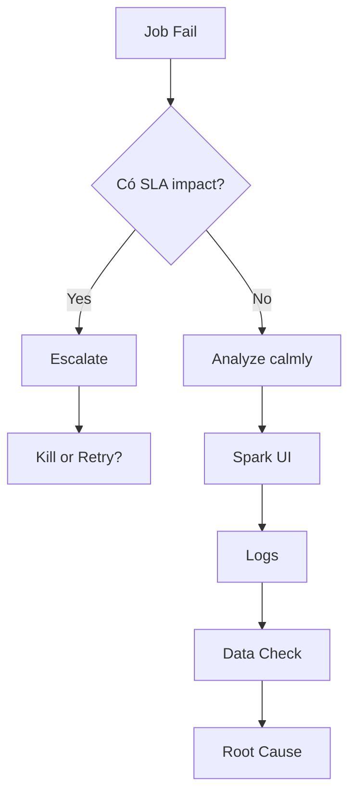

# 🏦 LEVEL 4 – PRODUCTION SPARK (BANK-GRADE)

---

## 1️⃣ Spark trong bank KHÔNG tối ưu cho speed

Ưu tiên:
1. Stability
2. Predictability
3. Cost control
4. Auditability

---

## 2️⃣ Nguyên tắc thiết kế job

- Job nhỏ, rõ ràng
- Ít shuffle
- Ít state
- Retry an toàn

---

## 3️⃣ Data layer chuẩn

```code
Bronze → Raw, append-only
Silver → Clean, dedup
Gold → Business metrics
```

> 📌 Không join lung tung ở Gold

---

## 4️⃣ Operational rules (bank-grade)

- Limit executor
- Limit memory
- Timeout rõ ràng
- SLA rõ

---

## 5️⃣ Anti-pattern trong bank

- ❌ Cache toàn bộ data lake
- ❌ Join nhiều fact lớn
- ❌ Dynamic resource vô hạn
- ❌ Không monitor UI

---
# 🔥 LEVEL 4 – BÀI 2

## Cost Control & Quota (Bank-grade Spark)

---

## 🎯 Mục tiêu

- Không vượt quota
- Không surprise bill
- Predictable cost

---

## 1️⃣ Vì sao Spark trong bank hay fail quota?

- Shuffle quá nhiều
- Executor quá to
- Auto scale không kiểm soát
- Broadcast sai

> **📌 Fail quota = design sai**

---

## 2️⃣ Nguyên tắc kiểm soát chi phí

1. Giới hạn executor cores
2. Giới hạn executor instances
3. Fix shuffle partitions
4. Tránh dynamic explosion

## 3️⃣ Config tối thiểu an toàn (ví dụ)

```python
spark.conf.set("spark.sql.shuffle.partitions", 64)
spark.conf.set("spark.executor.cores", 4)
spark.conf.set("spark.executor.instances", 4)
```

> **📌 Predictable > auto**

---

## 4️⃣ Cost control theo layer

|**Layer**|**Cost rule**|
|---------|-------------|
|Bronze|I/O|
|Silver|Compute|
|Gold|Stability|

---

## 🧠 CÂU HỎI BẮT BUỘC – LEVEL 4 / BÀI 2

1.	Vì sao auto scale nguy hiểm trong bank?
>Auto scale nguy hiểm trong bank vì:
>>- Tăng tài nguyên không kiểm soát → vượt quota
>>- Cost không predictable
>>- Job retry có thể scale lại lần nữa → double cost
>>- Vi phạm governance & budget control

>**📌 Key insight**

>>Bank ưu tiên **predictability > performance**

2.	Vì sao broadcast sai gây bùng cost?
> Broadcast sai gây bùng cost vì:
>>- Dataset lớn bị replicate lên mọi executor
>>- Tăng memory pressure → spill
>>- Executor bị OOM → retry → nhân cost

>📌 Lưu ý:

>>Broadcast không gây shuffle, nhưng gây memory explosion

3.	Shuffle partitions nên cố định hay dynamic?
>Trong ngân hàng:
>>- Ưu tiên shuffle partitions cố định
>>- Tránh dynamic gây unpredictable runtime & cost
>>- Chỉ dùng AQE khi đã kiểm soát tốt data pattern

>**📌 Architect mindset**

>>Stable > Smart

4.	Khi nào nên chấp nhận job chậm hơn để tiết kiệm tiền?
>Nên chấp nhận job chậm hơn khi:
>>- Job không SLA critical
>>- Chạy batch đêm
>>- Ưu tiên không vượt quota
>>- Job chỉ phục vụ internal analytics

>📌 Trong bank:

>>Fail quota còn nguy hiểm hơn fail SLA

5.	Làm sao biết job đang “đốt tiền”?
>Dấu hiệu job đang đốt tiền:
>>- Shuffle Read/Write lớn
>>- Task retry nhiều
>>- Executor idle nhưng job vẫn chạy lâu
>>- Stage stuck 95–99%
>>- BroadcastExchange bất thường

> 📌 Spark UI = cost dashboard

---

## 🏁 TỔNG KẾT BÀI 2 – LEVEL 4

**👉 Bạn đã:**
>*	Biết đọc cost từ Spark UI
>*	Hiểu vì sao auto ≠ tốt
>*	Tư duy như người chịu trách nhiệm bill

---

# 🔥 LEVEL 4 – BÀI 3

## Spark Failure Patterns (Bank-grade)

---

## 🎯 Mục tiêu

- Nhìn log là đoán được nguyên nhân
- Phân biệt lỗi design vs lỗi hạ tầng
- Không retry mù

---

## 1️⃣ Pattern 1 – OOM nhưng cluster còn RAM

Nguyên nhân:
- Broadcast quá lớn
- Executor quá to
- Python memory ngoài JVM

**📌 Sai lầm thường gặp**

>“Tăng memory là xong” ❌

---

## 2️⃣ Pattern 2 – Stage stuck 99%

Nguyên nhân:
- Data skew
- Shuffle key lệch
- 1 task xử lý quá nhiều records

> 📌 Retry không cứu được

---

## 3️⃣ Pattern 3 – Job chạy nhanh lúc test, chậm lúc prod

Nguyên nhân:
- Test data nhỏ
- Prod skew / null / dirty data
- Broadcast threshold khác

---

## 4️⃣ Pattern 4 – Job fail sau vài giờ

Nguyên nhân:
- Spill liên tục
- Disk I/O bottleneck
- Lineage quá dài (no checkpoint)

---

## 🧠 CÂU HỎI BẮT BUỘC – LEVEL 4 / BÀI 3

1.	Vì sao retry không cứu được skew?
>Retry không cứu được skew vì:
>>- Skew là vấn đề data distribution, không phải transient failure
>>- Task xử lý key lớn vẫn là task đó → vẫn chậm
>>- Retry chỉ lặp lại cùng 1 lỗi thiết kế

>**📌 Architect insight**

>>Retry chỉ dành cho hạ tầng, không dành cho thiết kế

2.	Vì sao OOM thường đến từ broadcast hơn shuffle?
>OOM thường đến từ broadcast vì:
>>- Broadcast dataset được load toàn bộ vào memory mỗi executor
>>- Memory usage tăng theo số executor
>>- Không có spill safety như shuffle

>**📌 So sánh nhanh**
>>- Broadcast → Memory pressure
>>- Shuffle   → Disk + Network pressure

3.	Khi nào lỗi là do data, không phải code?
>Lỗi do data khi:
>>- Volume đột biến
>>- Key distribution thay đổi
>>- Null / unexpected values xuất hiện
>>- Job chạy ổn nhiều ngày rồi tự nhiên fail

>**📌 Rule ngân hàng**

>>Code ổn định + fail bất thường → kiểm tra data trước

4.	Vì sao test local không đại diện prod?
>Test local không đại diện prod vì:
>>- Data size nhỏ
>>- Không có skew
>>- Broadcast threshold khác
>>- Không có network & shuffle pressure

>**📌 Kết luận**

>>Local test = correctness, không phải performance

5.	Khi nào nên kill job sớm thay vì chờ?
> Nên kill job sớm khi:
>>- Spill tăng không ngừng
>>- Stage stuck 95–99% lâu
>>- Task retry lặp lại
>>- Cost đang tăng nhanh

>📌 Trong bank:

>>Kill sớm = giảm thiệt hại

---

## 🏁 TỔNG KẾT LEVEL 4 – BÀI 3

**👉 Cần:**

*	Phân biệt được design bug vs data issue

*	Biết khi nào retry là vô nghĩa

*	Có tư duy cost + incident

---

# 🔥 LEVEL 4 – BÀI 4

## Incident Handling & RCA (Root Cause Analysis)

---

## 🎯 Mục tiêu

- Không panic khi job fail
- Có quy trình xử lý chuẩn
- Trả lời được câu hỏi của quản lý & audit

---

## 1️⃣ Quy trình xử lý incident Spark (chuẩn ngân hàng)



---

## 2️⃣ RCA cần trả lời 5 câu hỏi

1. What failed?
2. When did it start?
3. Why did it fail?
4. Why not detected earlier?
5. How to prevent recurrence?

---

## 3️⃣ Ví dụ RCA chuẩn

Incident: Orders Gold job failed

Root cause:
- Data skew on customer_id
- Broadcast threshold misconfigured

Impact:
- Gold table delayed 2h

Fix:
- Disable auto broadcast
- Add salting

Prevention:
- Add skew detection metric

---

## 🧠 CÂU HỎI BẮT BUỘC – LEVEL 4 / BÀI 4

1.	Khi nào KHÔNG retry job?
>KHÔNG retry job khi:
>>- Lỗi do design (skew, join sai, broadcast sai)
>>- Retry chắc chắn lặp lại cùng lỗi
>>- Retry làm tăng cost nhưng không cải thiện kết quả

>📌 Rule

>>Retry chỉ dùng cho lỗi tạm thời, không dùng cho lỗi thiết kế

2.	Vì sao fix code ngay trong incident là nguy hiểm?
>Fix code ngay trong incident nguy hiểm vì:
>>- Chưa hiểu root cause thật
>>- Có thể tạo bug mới
>>- Không test đầy đủ
>>- Làm mất dấu vết phân tích RCA

>📌 Bank rule

>>Incident = stabilize → analyze → fix sau

3.	SLA vs Cost: ưu tiên cái nào?
> Trong ngân hàng:
>>- SLA > Cost (ngắn hạn)
>>- Cost > SLA (dài hạn, khi thiết kế lại)

>📌 Câu trả lời chuẩn

>>- Khi incident xảy ra → ưu tiên SLA
>>- Sau incident → tối ưu cost

4.	Incident do config khác gì do code?
>Incident do config:
>>- Xảy ra đột ngột
>>- Job từng chạy ổn
>>- Fix nhanh, ít rủi ro

>Incident do code:
>>- Lặp lại nhiều lần
>>- Có logic sai
>>- Cần test, review, deploy

>**📌 Hint**

>>80% incident production là do config + data

5.	Một RCA tốt cần tránh điều gì?
>RCA tốt cần tránh:
>>- Đổ lỗi cá nhân
>>- Hotfix không ghi nhận
>>- Không có prevention plan
>>- Chỉ mô tả triệu chứng, không nói nguyên nhân

>📌 Audit rule

>>RCA không phải để “chữa cháy”, mà để “không cháy lại”

---

## 🏁 TỔNG KẾT LEVEL 4

- Phân biệt incident vs fix

-	Hiểu SLA – Cost tradeoff

-	Có tư duy RCA đúng chuẩn bank


